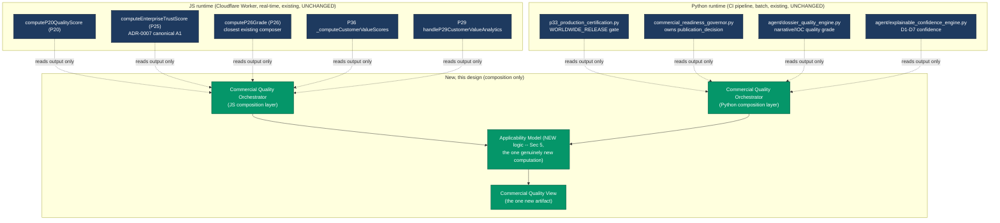
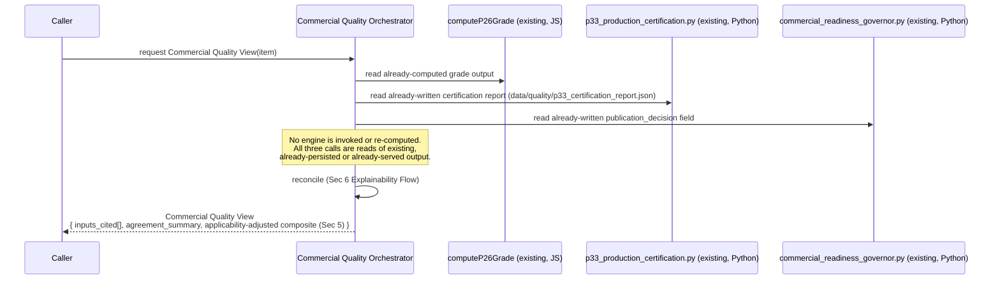
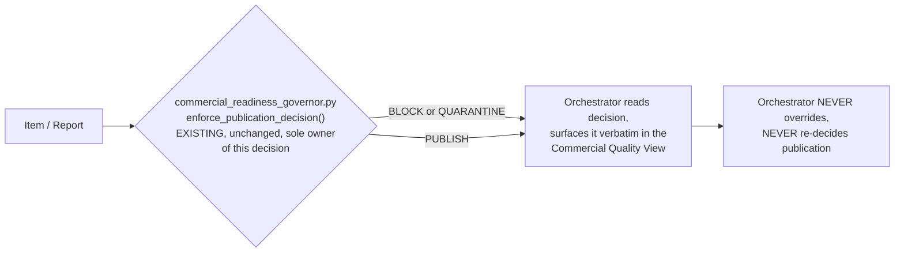
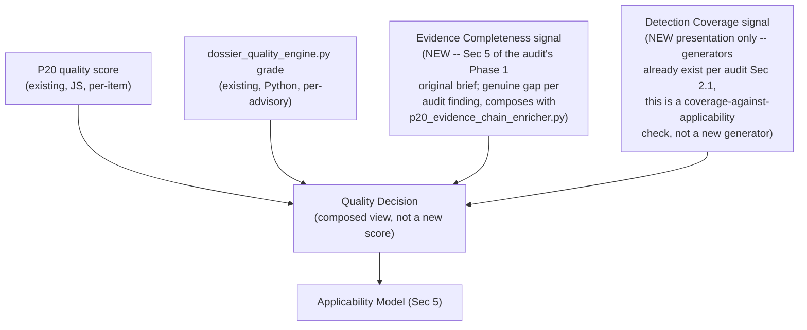
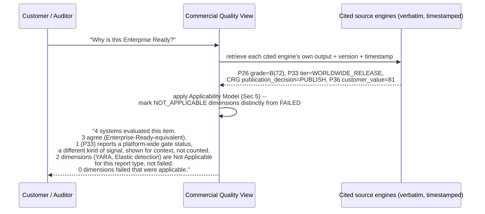
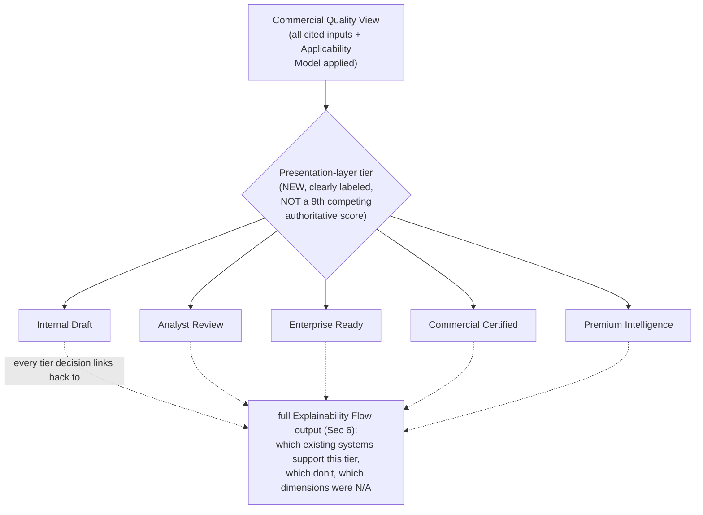

# Commercial Quality Orchestrator — Architecture (Design Only)

## Phase B — No Implementation in This Document

**Program:** Architecture Governance (originally requested as "Project TITAN Stage 20" — see
`COMMERCIAL_QUALITY_GOVERNANCE_AUDIT.md` §0.1 for why this document does not use that name)
**Date:** 2026-08-07
**Status:** **Design only. Zero lines of implementation code accompany this document.** Every
diagram below describes a proposed composition over already-existing, already-verified engines
(see the companion audit document for the evidence). Placement, naming, and final scope remain
open questions for executive approval (§8) before any code is written.

**Prerequisite reading:** `COMMERCIAL_QUALITY_GOVERNANCE_AUDIT.md` — this document's every design
choice is a direct consequence of that audit's findings and is cited back to it throughout.

---

## 0. Design Principles (non-negotiable, carried over from the audit's mandate)

1. **The orchestrator composes. It never computes what an existing engine already computes.**
   Where an existing engine already owns a decision (`commercial_readiness_governor.py` owns
   publication BLOCK/QUARANTINE; `computeP26Grade` owns the JS composite grade; ADR-0007 designates
   P25 canonical for confidence), the orchestrator reads that engine's output and cites it. It
   never re-derives, overrides, or second-guesses it.
2. **Zero modification.** No line in P20-P38, no line in any `*_production_certification.py`, no
   line in `commercial_readiness_governor.py`, `agent/dossier_quality_engine.py`, or any other
   audited engine changes as a result of this design or its eventual implementation.
3. **No new independent scorer.** Per ADR-0007's still-unapproved-but-unrebutted rule, this design
   introduces exactly one genuinely new computation — the Applicability Model (§5) — because the
   audit confirmed (governance audit §0.2 point 5) that no existing system performs it. Everything
   else in this design is presentation, reconciliation, and explainability over existing outputs.
4. **No public API changes, no customer-visible behavior changes.** Every flow below is additive:
   a new, optional composed view. Nothing existing is removed, renamed, or reshaped.
5. **Symmetric across the two runtimes the audit found.** The platform is genuinely split between
   a live JS Cloudflare Worker (P16-P38) and a batch Python CI pipeline, with confirmed zero
   shared code between them (audit §2, §3). This design does not attempt to unify those runtimes —
   it proposes one conceptual model, expressed as two independent composition layers, one per
   runtime, each reading only its own runtime's already-computed outputs.

---

## 1. Commercial Quality Orchestrator — Architecture

### 1.1 What it is

A **read-only composition layer** that takes the outputs of already-existing, already-certified
engines (never their internals, never their inputs) and produces one additional artifact: a
**Commercial Quality View** — a structured object that answers "what does this platform's
existing tooling collectively say about this item's commercial readiness, and where do those
systems agree or disagree?" It is not a scorer. It is a **reconciler and explainer**.

### 1.2 What it composes (per the audit's Canonical Ownership Matrix)



Every arrow into the orchestrator layers is **read-only** ("reads output only") — the orchestrator
never calls into an existing engine's mutation path (e.g., it never calls
`commercial_readiness_governor.enforce_publication_decision()` itself; it reads the
`publication_decision` field that engine already wrote).

### 1.3 What it explicitly does NOT do

- Does not compute a new confidence score (ADR-0007 boundary, respected exactly as every TITAN
  stage before it respected it).
- Does not pick a "winner" among P36's and P29's two independent customer-value engines (audit §7)
  — surfaces both, labeled by source.
- Does not resolve the v1/v2 intelligence-grade-engine question (audit §5) — that is out of scope
  pending the dedicated follow-up investigation the audit recommends.
- Does not introduce a ninth independent "Enterprise Ready" threshold. Where this design needs to
  present a single customer-facing tier (§7), it is explicitly framed as a *new, clearly-labeled
  presentation concept* ("Commercial Quality View tier") that cites its inputs, never as a
  replacement for or arbiter of the 8+ existing tier systems the audit catalogued.

### 1.4 Placement (open question, not decided here)

Three options, presented for the executive decision flagged in the audit's §8:

| Option | Description | Trade-off |
|---|---|---|
| **A. New P-layer, `P39`** | JS composition layer lives in `workers/intel-gateway/src/p39-handlers.js`, following the existing P16-P38 numbering (per the JS-audit agent's own recommendation and this repo's CLAUDE.md, which names P39 as the next open slot) | Consistent with the live, production-serving stack's own convention; requires an `index.js` route addition (still additive, zero existing route changes) |
| **B. New TITAN lineage stage** | JS composition layer lives under `workers/intel-gateway/src/commercial-quality-platform/` (or similar), following the `product-platform/` pattern — composes P-layer outputs from *outside* the P-layer stack, the way `product-platform/` composes `knowledge-platform/` | Consistent with the additive, never-wired-into-`index.js` pattern the TITAN lineage has used for every stage since Stage 8; keeps this work fully isolated from the live P-layer surface until separately authorized |
| **C. Python-only, JS deferred** | Only build the Python-side composition first (reading `data/quality/*.json`/`data/governance/*.json` artifacts already written by existing gates); revisit JS-side composition as a later increment | Smaller first blast radius; defers the P39-vs-TITAN-lineage naming decision |

This design is written to be placement-agnostic — nothing in §2-§7 depends on which option is
chosen.

---

## 2. Commercial Certification Flow



The certification flow's entire job is **citation and reconciliation**, not decision-making. If
P26 says "ENTERPRISE READY" and P33's gate says "WORLDWIDE_RELEASE" and
`commercial_readiness_governor.py` says `publication_decision: BLOCK`, the View surfaces all
three verbatim, flags the disagreement (BLOCK vs. two positive signals) explicitly, and does
**not** attempt to arbitrate which is "right" — that arbitration is exactly the kind of new
authority the audit's mandate forbids this design from claiming.

---

## 3. Commercial Publication Flow



Per the audit (§2.2), `commercial_readiness_governor.py` is the confirmed, CI-wired, sole owner of
the publish/BLOCK/QUARANTINE decision today. This flow has exactly one rule: **the orchestrator is
a downstream reader of this decision, never a second vote.** If a future stage wants the
orchestrator's Applicability Model (§5) to *inform* a future revision of the Governor's own logic,
that is an explicit, separately-authorized change to `commercial_readiness_governor.py` itself —
out of scope for this design and for the orchestrator as designed here.

---

## 4. Quality Decision Flow



Two of the four inputs here (`P20`, `dossier_quality_engine.py`) are pure reads of existing
engines. The other two (Evidence Completeness, Detection Coverage) are the two areas the audit
confirmed as genuine gaps with no existing implementation to compose from — see §5.4-§5.5 for how
they fit the Applicability Model rather than becoming yet another independent scorer.

**Explicit non-goal:** this flow does not produce a new 0-100 "quality score" that competes with
P20's or `dossier_quality_engine.py`'s. It produces a *decision object* — pass/fail per applicable
dimension, with NOT_APPLICABLE as a first-class third state (§5) — because the audit's own
mandate frames the goal as "eliminate avoidable quality failures," not "compute a bigger number."

---

## 5. Applicable vs. Non-Applicable Decision Model

**This is the one genuinely new computation in this entire design** — confirmed by the audit
(governance audit §0.2 point 5, §2.3's applicability finding) to have no prior art anywhere in the
repository. Every existing dimension-scoring pattern found (`intel_enterprise_quality_engine.py`,
`apex_risk_scoring_engine.py`, `apex_confidence_engine.py`) penalizes a missing dimension as a
zero-contribution "failure," annotated with an N/A comment that the score itself does not act on.

### 5.1 The model

For any dimension `D` evaluated against item `I`:

```
1. Determine applicability: applicable(D, I) -> boolean, via an explicit, documented rule
   per dimension (NOT a blanket "missing = not applicable" -- see 5.2).
2. If NOT applicable(D, I):
     - D is excluded from both the numerator AND the denominator of any composite.
     - D is recorded as NOT_APPLICABLE, distinct from FAILED, in the explainability output (Sec 6).
     - D does not appear as a "missing" or "deducted" item anywhere customer-facing.
3. If applicable(D, I):
     - D is scored exactly as today's existing engine already scores it (Sec 0 rule 1 --
       this model does not re-derive existing per-dimension scoring logic).
     - D counts toward both numerator and denominator as it does today.
```

### 5.2 Applicability rules are explicit and per-dimension, not inferred from absence

A dimension being *empty* is not sufficient evidence that it is *inapplicable* — an empty MITRE
mapping on a report that clearly describes a named technique is a real gap (should score as
FAILED, or at minimum as a Collection Gap per the audit's Evidence Completeness discussion), while
an empty MITRE mapping on, e.g., a pure vulnerability disclosure with no observed exploitation
behavior is genuinely inapplicable. Worked examples, directly from the original brief's own list:

| Dimension | Applicability rule (proposed, for future review) | Rationale |
|---|---|---|
| MITRE ATT&CK mapping | Applicable only if the item's `evidence_category`/narrative describes observed or inferred adversary *behavior* (not a bare CVE disclosure with no exploitation narrative) | A patch-only advisory has no technique to map |
| EPSS score | Applicable only after the item's CVE has been published long enough for FIRST.org to have scored it (EPSS has a real publication lag) — NOT simply "absent = inapplicable," since a missing EPSS score on a week-old CVE is a genuine, temporary gap that should be flagged as pending, not silently excluded | Distinguishes "not yet available" from "will never apply" |
| KEV listing | Applicable to every CVE-bearing item (KEV absence is a real, meaningful signal — "not on KEV" is informative, not inapplicable) — **this dimension should almost never be NOT_APPLICABLE** | KEV's own semantics make "not listed" a valid, scoreable answer, unlike the other three |
| IOC presence | Applicable only if the item's type is one that plausibly carries IOCs (e.g., not applicable to a pure policy/compliance advisory) | Matches `commercial_readiness_governor.py`'s own existing real-IOC-counting logic (composed, not re-derived) |
| Detection rule coverage | Applicable per-format based on what the *producing pipeline* actually generates by design (audit §2 finding: `report_generator.py` only ever emits Sigma/KQL/SPL by design — YARA/Elastic/Suricata/Snort absence there is NOT_APPLICABLE, not FAILED, for that specific report type) | Directly resolves the original brief's own Phase 5 ask, using the audit's confirmed generator inventory |

These are proposed starting rules for the eventual implementation stage to refine with a domain
expert's review — not a final, binding specification. The important structural commitment this
design makes is that **applicability is rule-based and auditable, never a silent default.**

### 5.3 Denominator math (illustrative, not final)

```
composite = (sum of scores for all D where applicable(D,I)) / (count of D where applicable(D,I))
```

Contrast with every existing pattern the audit found:

```
composite_today = (sum of scores for all D, missing D scored as 0) / (fixed count of all D)
```

The difference is the entire point of Phase 2 of the original brief, now correctly scoped as new,
additive logic rather than a modification to any existing scorer.

### 5.4 Evidence Completeness — composes with existing evidence chain, doesn't replace it

Per the audit (§2, Python-audit agent finding), `p20_evidence_chain_enricher.py`'s
`build_evidence_chain()` already produces a conditional, prose `chain_of_custody` list
(NVD/GHSA/EPSS/KEV, when present). The new Evidence Completeness signal **extends** this — same
underlying per-item data, reshaped into an explicit N-of-9 (Vendor Advisory/NVD/GHSA/MITRE/
CISA/EPSS/FIRST/Release Notes/Patch Information) checklist, with the Applicability Model (§5.1)
governing which of the 9 apply to a given item type before the checklist is scored. It does not
re-fetch or re-verify any source — it reads fields the existing enrichment pipeline already
populates.

### 5.5 Detection Coverage — a coverage-against-applicability check, not a new generator

Per the audit (§2, detection-coverage finding), generators for all 7 formats already exist,
scattered, with a pre-existing, already-flagged Principle-3 violation the codebase itself
documents (`sentinel-blogger.yml`'s own 2026-08-05 engineering note). This design's Detection
Coverage signal does **not** add an 8th generator implementation. It is scoped narrowly to: for a
given report's *producing pipeline* (e.g., `report_generator.py`), which formats does that
pipeline generate by design, and are they present on this specific item — with every
not-generated-by-design format marked NOT_APPLICABLE for that report type, never FAILED.

---

## 6. Explainability Flow



This is the direct mechanical answer to the audit's central finding (§4.5): 8+ independent systems
can each produce an "Enterprise Ready"-shaped answer. Rather than picking one as authoritative
(forbidden by this program's mandate) or averaging them (which would be a new, unauthorized
scoring method), the Explainability Flow's job is **full citation**: every claim the Commercial
Quality View makes is traceable to a specific existing engine's specific, timestamped output, with
explicit NOT_APPLICABLE vs. FAILED labeling per §5. Nothing is presented as if this new layer
computed it.

---

## 7. Commercial Release Flow



The original brief's own release-gate numbers (0-59 / 60-74 / 75-89 / 90-97 / 98-100) are retained
here as the *presentation* tier's proposed thresholds — but, per the audit's central finding, this
is explicitly a **9th, clearly-labeled, presentation-only tier**, computed over the Applicability-
Model-adjusted composite (§5.3), never presented as replacing or outranking P20's, P21's, P25's,
P26's, P36's, or P37's own tier outputs. Every tier this flow assigns must render with its full
Explainability Flow trace (§6) alongside it — **a tier without a citation trail is not a valid
output of this design.**

**Premium Intelligence, per the original brief's own qualifying language** ("does NOT require
every optional section... requires every required gate passed, every applicable gate passed, every
non-applicable gate excluded correctly, no avoidable quality failures") — is structurally exactly
what §5's Applicability Model produces: a composite computed only over applicable dimensions, with
zero applicable failures. This flow does not need any additional logic beyond §5 to satisfy that
definition once the composite is computed correctly.

---

## 8. Open Questions Requiring Executive Sign-Off Before Implementation

1. **Placement** — P39 vs. new TITAN-lineage directory vs. Python-only-first (§1.4).
2. **Naming** — resolve the Stage-20 collision (governance audit §8).
3. **ADR-0007 interaction** — proceed strictly within its existing scope, or commission a
   Python-pipeline-scoped companion ADR first (governance audit §8).
4. **Applicability rule ownership** — §5.2's worked examples are illustrative; a domain expert
   (threat intel analyst / CISO-facing product owner) should own the final rule set before
   implementation, since an incorrect applicability rule (e.g., treating a genuinely missing MITRE
   mapping as inapplicable) would silently hide a real quality gap — the opposite of this program's
   stated goal.
5. **P36 vs. P29 customer-value reconciliation** — §1.3 explicitly defers picking a winner; product
   ownership should decide whether both remain permanently distinct or whether a future,
   separately-authorized stage should consolidate them (which would require the full Phase 3
   process from the governance audit, not this design).
6. **`intelligence_grade_engine.py` v1/v2** — governance audit §5's flagged investigation should
   resolve before the Quality Decision Flow (§4) decides which (if either, or both) to cite.

**Per explicit instruction: this program stops here. No implementation begins until the above are
resolved and the architecture is explicitly approved.**
