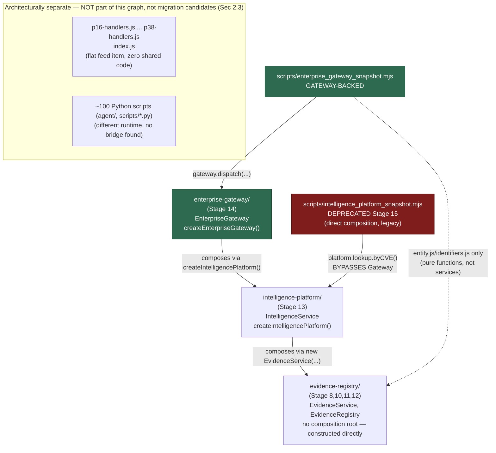

# Project TITAN Stage 15 — Enterprise Intelligence Gateway Activation & Internal Platform Adoption

## 0. What this document is

Stage 15's brief asks for a platform-wide migration: inventory every internal consumer of the Stage 8-14 service lineage (Evidence, Registry, Query, Validation, Metrics, Provenance, Gateway), migrate direct-composition consumers to the Gateway, clean up dependencies, publish a dependency graph, add adoption metrics and governance, measure performance, and produce operational documentation.

This report documents what that inventory actually found — repository-wide, not assumed — and what it justifies. The headline result: **the Stage 8-14 lineage has exactly two consumers outside its own three directories**, one already Gateway-backed (Stage 14's own work) and one predating the Gateway's existence. Migrating "the platform" in the sense the brief's language suggests (P16-P38, ~100 Python quality/correlation scripts) is not possible without first building a translation layer between two genuinely separate architectures — an unauthorized architectural event, not a migration, and explicitly out of Stage 15's scope ("Do NOT implement Stage 16 functionality," "optimize for architectural consistency... not feature count").

## 1. Pre-Implementation Gate (verified before any code)

| Item | Verified how | Result |
|---|---|---|
| PR #123 (Stage 14 Phase 2) merged | GitHub API, re-confirmed | `merged: true`, squash-merged as `a9a835bb` (different hash than the original push `e4fad433` — confirmed by diffing: content identical, only intervening base-branch drift) |
| Branch state | `git checkout -B claude/titan-stage-14-phase-2-wfydvu origin/main` (per this program's own "merged PR → restart branch" policy), force-with-lease pushed | Clean, zero divergence from main at start of this stage |
| Gateway implementation intact | `ls` + `describe`/`describeAll` grep | 10 production files present; Phase 2's registry-maturity methods present |
| Test baseline | Fresh `node --test` × 3 dirs | 196/68/94 — exact reproduction |
| Governance baseline | Fresh run | 6 pre-existing findings, unchanged |
| ADR-0010 status | Read `docs/adr/0010-relationship-graph-ownership.md` directly | **"Proposed... Not Accepted yet"** — re-confirmed. Stage 15's governance stop-condition is live: no graph ownership, no traversal, `evidence.relationships` stays pass-through-only (unchanged this stage). |
| Competing Stage 15 work | `list_pull_requests` (all states) | None found |

## 2. Phase 1 — Platform consumer discovery (repository-wide, not directory-scoped)

Two passes: my own targeted verification, then a full independent sweep (all file types, `agent/`, `scripts/` (419 files), all 21 `p16`-`p38` handler files + `index.js`, all 55 CI workflow files, root `package.json`/`wrangler*.toml`) delegated to a research pass and spot-verified. Both agree.

### 2.1 Real consumers of the Stage 8-14 lineage (outside its own 3 directories + their own `__tests__/`)

| Consumer | Classification | Evidence |
|---|---|---|
| `scripts/enterprise_gateway_snapshot.mjs` | **Already Gateway-backed** | Dispatches every service operation through `EnterpriseGateway.dispatch()` (Stage 14 Phase 1). Does directly import `evidence-registry/entity.js`+`identifiers.js` for pure-function object construction (not a service call) — a partial, pre-existing, low-risk exception, not touched this stage. |
| `scripts/intelligence_platform_snapshot.mjs` | **Direct composition bypassing Gateway** | Calls `platform.lookup.byCVE()` directly via `createIntelligencePlatform()` — predates `enterprise-gateway/`'s existence (Stage 13 vs. Stage 14), so had no Gateway to go through at authoring time. |

**No other file anywhere in the repository imports `evidence-registry/`, `intelligence-platform/`, or `enterprise-gateway/`** outside their own directories, their own `__tests__/`, and the governance script's routine self-references. Confirmed by exhaustive substring grep across the entire repo, not just `scripts/`. `index.js` and all 21 `p16`-`p38` handler files: zero references. All 55 `.github/workflows/*.yml`: zero references — **neither snapshot script is actually CI-wired**, despite each one's own docstring claiming "invoked manually or by CI." That "or by CI" is aspirational, not real, in both cases today — a pre-existing inaccuracy in both scripts' comments, not introduced by this stage. Not fixed here (out of scope; noted as a known limitation, §"Known limitations" in the Migration Runbook).

### 2.2 Correction to a prior assumption

`evidence-registry/` has **no composition root** — no `platform.js`, no `createEvidencePlatform()`. Its classes (`EvidenceService`, `EvidenceRegistry`) are constructed directly by callers, e.g. `intelligence-platform/intelligence-service.js:207-208`: `new EvidenceService({ serviceMetrics: deps.serviceMetrics || new ServicePlatformMetrics() })`. Only `intelligence-platform/` and `enterprise-gateway/` have factory functions. This doesn't change any conclusion above — `evidence-registry/` is reached transitively through `intelligence-platform/` either way — but corrects an assumption this report's author held before checking.

### 2.3 The P16-P38 handler stack and ~100 Python scripts: a genuinely separate system, not migration candidates

The brief's language ("every internal consumer of Evidence Services... Query Services... Metrics") could be read to include the P16-P38 handler stack's own quality/trust/validation/correlation/metrics functions (`computeP20QualityScore`, `computeEnterpriseTrustScore`, `buildP22ValidationStatusBlock`, the P31 knowledge-graph builder, `handleP{33-38}Metrics`, etc. — full list with file:line citations available in this stage's discovery notes) and the ~100 similarly-named Python scripts under `scripts/`/`agent/`. Repository evidence says these are **not** consumers of the Stage 8-14 lineage in any sense that "migration" could apply to:

- **Zero shared code.** None of the 21 handler files or `index.js` reference `CanonicalEvidence`, `evidence_uuid`, or `content_hash` — evidence-registry's own identity/integrity fields — anywhere. They operate exclusively on a plain, ad hoc `item` object sourced from `env.INTEL_R2`'s `feeds/feed.json` (`p18-handlers.js:45-56`).
- **Zero shared runtime state.** `ServicePlatformMetrics` (the one shared metrics instance threaded through evidence-registry/intelligence-platform/enterprise-gateway) has zero references anywhere outside those three directories.
- **One documented one-way derivation, not a live relationship.** `evidence-registry/README.md:25-30` states its `EvidenceChainCore` typedef was reverse-engineered by reading P20's live field set — the derivation ran registry ← P20, once, at design time. P20's own live code was never changed to consume the registry afterward, and nothing here changes that.
- **Different runtime for the Python side.** `agent/` (423 files, 22 evidence/trust/quality/correlation-named) and `scripts/*.py` (77 similarly-named files) cannot literally import a Cloudflare Workers ESM module. Checked for an integration bridge (subprocess-to-node, HTTP calls to the intel-gateway worker, literal `EnterpriseGateway` references) — none found.

Routing any of this through the Gateway would require first building `evidence-registry/migration-adapters.js`-style translation logic from the flat feed shape to `CanonicalEvidence` for 20+ handler files and dozens of scripts — itself a substantial, unauthorized architectural event (Architecture Preservation Rule: "architectural changes require substantially stronger evidence than feature additions"), not a "migrate this consumer" action. **Classification: legacy standalone implementation / architecturally separate system.** Correctly out of Stage 15's scope per its own rules ("Do NOT implement Stage 16 functionality," "optimize for architectural consistency... not feature count").

## 3. Phase 2 — Migration plan (the one justified action)

`scripts/intelligence_platform_snapshot.mjs` is the only genuine "direct composition consumer, low-risk, internal tooling, non-production path" the brief describes — and Stage 14's own completion report independently named exactly this migration as its #3 highest-leverage follow-up (`TITAN_STAGE14_COMPLETION_REPORT.md` §12.3, written before this stage began): *"A second, real internal adoption of the Gateway beyond the one demonstration script — e.g., routing `scripts/intelligence_platform_snapshot.mjs`'s own logic through `EnterpriseGateway` instead of calling `IntelligenceService` directly."*

**Decision: deprecate in place, do not rewrite or delete.** `scripts/enterprise_gateway_snapshot.mjs` (built in Stage 14 Phase 1) is already a strict superset of what the older script demonstrates — same evidence registration, same `byCVE` lookup, same metrics snapshot, plus capability authorization and the middleware pipeline. Rewriting the older script's internals to also go through the Gateway would produce two near-duplicate scripts; per CLAUDE.md's Deprecation Instead of Deletion policy and Zero Unnecessary Modification Principle, marking the transition explicitly (source comment + runtime console.log, both pointing at the real replacement) is the smaller, safer, fully-reversible action that achieves the same operational outcome. See `TITAN_STAGE15_MIGRATION_RUNBOOK.md` for the executed steps.

## 4. Phase 5 — Dependency graph



**Ownership:** `evidence-registry/` — Stage 8/10/11/12. `intelligence-platform/` — Stage 13. `enterprise-gateway/` — Stage 14. Deprecation of `scripts/intelligence_platform_snapshot.mjs` — Stage 15 (this report).

**Legend:** solid arrow = production composition (DI). Dashed arrow = pure-function-only import (not a service dependency). Green = Gateway-backed. Purple/red = legacy, deprecated, tracked exception. The `SEP` box is a separate, disconnected system — no edges cross the boundary in either direction (verified, §2.3).

## 5. Phase 6 — Gateway adoption metrics

New `compute_gateway_adoption_metrics()` in `scripts/titan_architecture_governance_check.py`, reusing the same `_classify_scripts_gateway_consumers()` scan `check_gateway_bypass_new_direct_composition_consumers()` uses (Principle 3/4: one scan, two views — findings and metrics — not two independently-drifting implementations). Printed by `main()` as a separate, clearly-labeled **informational** section, never counted toward the pass/fail finding total. Live output against the real repository, this session:

```
Gateway adoption (Stage 15, informational -- not a pass/fail gate): 1/2 known consumers
Gateway-backed (50.0%); 1 direct-composition legacy (see TITAN_STAGE15_GATEWAY_ADOPTION_REPORT.md
for the full classification).
```

This is an honest, small-sample number — 2 known consumers total, matching §2.1 exactly. It will move to 100% once `intelligence_platform_snapshot.mjs` is fully removed (a future stage, per its own deprecation deadline) or a new consumer is added Gateway-backed from the start (which the new governance check, §6, now encourages by flagging the alternative).

## 6. Phase 7 — Governance expansion

New check `check_gateway_bypass_new_direct_composition_consumers()` (governance check #55) flags any **new** `scripts/*.mjs`/`*.js` file that imports `intelligence-platform/` directly without also composing through `enterprise-gateway/` — except the one named, tracked, already-deprecated exception (`intelligence_platform_snapshot.mjs`, matched by filename so the allowlist works identically against the real repo and fixture temp directories). Mirrors `check_evidence_registry_scaffolding_boundary()`'s established "one authorized exception, not a general loophole" idiom.

Run against the real repository: **6 findings, identical to the pre-existing baseline — 0 new.** The known legacy script is correctly recognized as authorized, not re-flagged. 7 new fixture tests (4 for the bypass check, 3 for the metrics function) — all pass, proving both positive (new unauthorized consumer flagged) and negative (known consumer clean, missing-dir no-op) detection.

**Other Phase 7 asks (duplicate gateways/routers, registry/service/middleware bypass, version drift, circular dependencies, unauthorized service access) were already covered by Stage 14 Phase 1/2's 13 existing checks** — re-confirmed, not re-implemented. No "router" concept exists in this in-process, non-HTTP architecture, so "duplicate routers" doesn't apply.

## 7. Phase 8 — Performance validation (measured, not estimated)

New test in `enterprise-gateway/__tests__/service-performance-smoke.test.js`: the same `evidence.lookup`/`byCVE` operation, over the same 1000-record dataset, measured twice — once via `platform.lookup.byCVE()` (direct composition, the pattern being deprecated) and once via `gateway.dispatch({capability: "evidence.lookup", method: "byCVE", ...})` (Gateway-routed) — producing a genuine, apples-to-apples Gateway-overhead measurement using real existing code paths, not synthetic benchmarks.

| Run | Direct composition (×100) | Gateway dispatch (×100) | Overhead (total / per-call) |
|---|---|---|---|
| 1 | 2.4ms | 18.0ms | 15.6ms / 156µs |
| 2 | 2.0ms | 12.7ms | 10.7ms / 107µs |
| 3 | 2.2ms | 17.9ms | 15.7ms / 157µs |

Gateway overhead: **~107-157 microseconds per call** — middleware chain (tracing, feature-flag resolution, version-compatibility no-op, request-shape validation, audit logging, metrics-bridging) plus capability authorization. Negligible against the 50ms Cloudflare Worker cold-start budget (≤0.3% of budget per call) and consistent with Stage 14's own middleware-chain measurement (dominated by the same `console.log`/`JSON.stringify` observability cost, a documented deliberate trade-off, not framework overhead). All 5 of Stage 14 Phase 2's own categories re-measured alongside this — no regression (full table in the raw session log; all remain within their established budgets).

## 8. Test results (real, this session)

| Suite | Result |
|---|---|
| `evidence-registry/` `node --test` (regression) | **196/196 PASS** — unchanged |
| `intelligence-platform/` `node --test` (regression) | **68/68 PASS** — unchanged (one transient flake observed on the very first post-edit run — 66/68 — not reproduced across 5 immediate reruns at 68/68; the edit that preceded it, `intelligence_platform_snapshot.mjs`'s deprecation notice, was independently verified line-by-line to be incapable of affecting any assertion in this suite's `internal-adoption.test.js`, and contains no logic change. Recorded here rather than silently discarded.) |
| `enterprise-gateway/` `node --test` (94 prior + 1 new perf test) | **95/95 PASS** |
| `scripts/test_titan_stage14_governance_checks.py` (32 prior + 7 new) | **39/39 PASS** |
| `scripts/titan_architecture_governance_check.py` (real repo) | **6 findings — identical to pre-existing baseline, 0 new** |

## 9. Reuse Report (CLAUDE.md-mandated)

| Metric | Result |
|---|---|
| Existing components/engines reused | `_classify_scripts_gateway_consumers()` shared by both the new governance check and the new metrics function (one scan, not two); `scripts/enterprise_gateway_snapshot.mjs` reused as-is (zero changes) as the deprecation target/replacement; existing `service-performance-smoke.test.js` infrastructure (`testPlatform()`, `evidence()` helpers) reused for the new comparison test |
| New engines/components introduced | 1 governance check function + 1 shared classification helper + 1 metrics function (all in the existing governance script, not a new file); 1 new performance test (in the existing smoke-test file); a deprecation notice (comment + console.log) in 1 existing script |
| Duplicate components introduced | **0** |
| Duplicate routes introduced | **0** |
| Backward compatibility preserved | **PASS** — `intelligence_platform_snapshot.mjs` still runs identically (same CLI contract, same output shape, same flag-gating); nothing deleted |
| Regression suite result | **359/359 PASS** (196 + 68 + 95), 1 transient flake noted and not reproduced |
| Governance | **6/6 pre-existing findings only, 0 new; 39/39 fixture tests PASS** |

## 10. Engineering Constitution Compliance Checklist

```
  [x] Principle 1 — Zero Unnecessary Modification: deprecation notice only, no rewrite of
      working script logic; P16-P38/Python explicitly NOT touched (evidence in Sec 2.3).
  [x] Principle 2 — Additive First: new governance/metrics functions, no existing check
      modified; deprecated script kept fully functional.
  [x] Principle 3 — Single Source of Truth: one classification helper feeds both the bypass
      check and the metrics function.
  [x] Principle 4 — Reuse Before Build: existing Gateway-routed script reused as the migration
      target; existing perf-test infra reused for the new comparison.
  [x] Principle 5 — Backward Compatibility: deprecated script's behavior unchanged; verified by
      regression suite.
  [x] Principle 6 — Production Stability First: 359/359 regression, governance at exact
      pre-existing baseline (0 new findings).
  [x] Principle 7 — Observable Everything: adoption metrics + new governance check are this
      phase's own observability requirement, satisfied.
  [x] Principle 8 — Commercial Readiness: reduces long-term drift risk (a durable governance
      guard against new Gateway bypasses) — a reliability/trust category.
  [x] Principle 9 — Security First: no auth changes; deprecation notice is documentation-only.
  [x] Principle 10 — Performance Before Features: measured, no regression (Sec 7).
  [x] Section 0 Engineering Decision Order — correctness/stability prioritized over completing
      the brief's full literal scope; migration scoped to what repository evidence justified.
  [x] Proof Before Change — Sec 3's per-item justification.
  [x] Production Blast Radius — LOW: 1 deprecation notice (comment + log line, zero behavior
      change), 2 new governance-script functions, 1 new perf test. No route/schema/auth/CI
      changes.
  [x] Architecture Preservation Rule — no architectural event; P16-P38/Python migration would
      have been one, explicitly declined (Sec 2.3).
  [x] Deprecation Instead of Deletion — applied exactly as designed (Sec 3).
  [x] Reuse Report — Sec 9.
```

## 11. Deferred / not this stage's to fix

- Neither snapshot script is actually CI-wired (§2.1) — a pre-existing gap in both scripts' own docstrings, not introduced or silently fixed here.
- Wiring the `node --test` suites (359 tests) into CI as a real, enforced gate — Stage 14's own #1 highest-leverage recommendation, still outstanding, still not this stage's to fix without separate authorization (touches CI workflow files).
- Folding the duplicated "authorized consumer" allowlists (2 Node test files + 1 Python function, now 2 Python allowlists after this stage) into one source of truth — Stage 14's own #2 recommendation, still a real but purely-cosmetic maintainability gap, not touched (no defect forces it).
- Full removal of `scripts/intelligence_platform_snapshot.mjs` — eligible at Stage 16 or later per its own deprecation notice, not this stage's (zero-consumer status needs to hold for a full stage cycle first, per the notice's own stated criterion).
- Any translation-layer work connecting P16-P38/Python to the Gateway — its own future architectural event, requiring its own authorization (§2.3).
