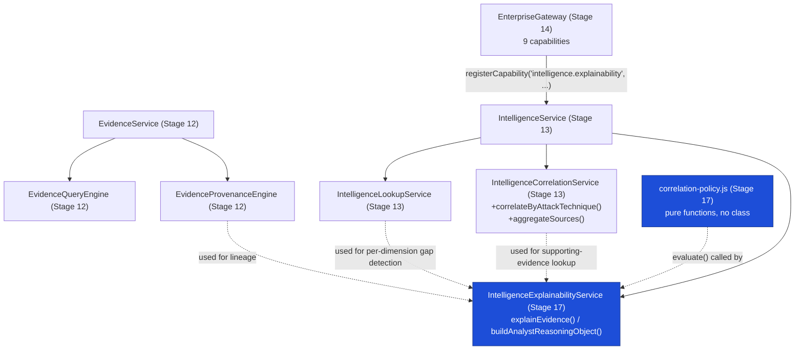

# Project TITAN — Stage 17 Completion Report

## Enterprise Intelligence Correlation & Explainable Intelligence Platform — Track A

**Program:** Project TITAN, Stage 17
**Status:** **Track A implemented and verified. Track B deferred, pending ADR-0007 Acceptance.**
**Date:** 2026-08-06
**Predecessor:** `TITAN_STAGE17_READINESS_REPORT.md` (Pre-Implementation Gate, Correlation Domain
Audit, Dependency Matrix — read that document first for the evidence this report builds on)

---

## 1. Executive Summary

Stage 17's brief asks for an Enterprise Intelligence Correlation & Explainable Intelligence layer.
Repository evidence (readiness report §1, §4) showed ADR-0007 (Canonical Confidence Framework) is
**Proposed, not Accepted**, and that this blocks only the confidence-attribution/weighting/
propagation portions of the brief — not correlation, explainability, provenance surfacing,
structural policy, or Gateway integration generally.

This session implemented every phase's ADR-0007-independent subset ("Track A"):

- 2 new methods on the existing `IntelligenceCorrelationService` (Stage 13)
- 1 new module: `correlation-policy.js` (deterministic, versioned, ADR-independent policies)
- 1 new module: `explainability-engine.js` (`IntelligenceExplainabilityService` — serves both
  Phase 3 "Explainable Intelligence Engine" and Phase 5 "Analyst Reasoning Output" as one
  implementation)
- 1 new Gateway capability (`intelligence.explainability`), registered exactly like the 8 that
  came before it
- 5 new governance checks, including one that makes the ADR-0007 boundary itself mechanically
  enforceable, not just documented in prose
- 41 new tests (400/400 total across the three-directory lineage, 0 regressions)

Confidence propagation, confidence-weighted policies, and confidence-contributor ranking are
**not** implemented — see §9, Deferred Capability Register (Stage 17B).

---

## 2. Proof Before Change

| Field | Entry |
|---|---|
| **Objective** | Evidence-backed correlation and explainable intelligence, composing the existing Evidence Registry/Intelligence Platform/Gateway lineage, without confidence computation |
| **Affected files** | See §4 (2 new production files, 2 existing production files extended additively, 1 governance script extended additively, 6 test files extended/added, 1 test-file-only import fix) |
| **Existing components reused** | `IntelligenceLookupService`, `IntelligenceCorrelationService`, `EvidenceProvenanceEngine`, `EvidenceQueryEngine`, `EnterpriseGateway.registerCapability()`/`_registerDefaultCapabilities()` pattern, `ServicePlatformMetrics.timed()`, `entity.js`'s `VERIFICATION_STATUSES`/`EVIDENCE_RELATIONSHIP_FIELDS`/integrity fields |
| **Evidence modification is required** | Stage 17 brief (Phases 1-10), scoped by the Readiness Report's Dependency Matrix to the ADR-0007-independent subset of each phase |
| **Risk classification** | **LOW** — no schema change, no auth change, no route added to `index.js`, no existing method signature changed, all edits to existing files are pure additions (new import lines, new properties, new methods, new registry entries) |
| **Expected regression risk** | None identified: every existing test still passes unmodified in behavior; the 4 tests that needed literal updates were hardcoded capability-count assertions (8 → 9), a direct and expected consequence of using `EnterpriseGateway`'s own documented extension point |
| **Rollback plan** | Delete `correlation-policy.js`, `explainability-engine.js`, and this report + the readiness report; revert the 9 modified files to their pre-Stage-17 state (`git revert` the Stage 17 commit(s)). Nothing outside `intelligence-platform/`'s own directory and `gateway-service.js`'s one new registration line took a dependency on Track A's output, so rollback has zero blast radius on any other stage |

---

## 3. Production Blast Radius

| Dimension | Assessment |
|---|---|
| **Files** | 2 new (`intelligence-platform/correlation-policy.js`, `intelligence-platform/explainability-engine.js`); 4 existing production files touched, additively only (`correlation-engine.js`, `intelligence-service.js`, `gateway-service.js`, `scripts/titan_architecture_governance_check.py`); 6 test files extended, 2 test files added |
| **Imports** | `intelligence-service.js` gains one import (`explainability-engine.js`); `gateway-service.js` gains zero new imports (uses its existing `createServiceMethodHandler`) |
| **Routes** | **None.** No route added to `index.js`, `p16`-`p38`-handlers.js, or `enterprise-endpoints.js`. `index.js` has zero references to either new file (mechanically enforced by both a new `node:test` assertion and a new governance check — §6, §7) |
| **Dashboards** | None affected — this lineage has no HTML dashboard consumer |
| **CI stages** | None modified. `scripts/titan_architecture_governance_check.py` runs as the existing advisory (non-blocking) step; no new CI workflow step added |
| **Certification reports** | `data/quality/*.json` (P16-P38 lineage) — untouched; this lineage has no certification report of its own (matches Stage 12-16 precedent) |
| **APIs** | No `/api/v1/p*` endpoint's response shape changed |
| **Data schema** | No D1/KV/R2 change. No `CanonicalEvidence` field added, renamed, or removed |
| **Workflows** | No `.github/workflows/*.yml` file touched |
| **Expected risk** | **LOW** |

---

## 4. What Changed

### 4.1 New files

| File | Purpose |
|---|---|
| `workers/intel-gateway/src/intelligence-platform/correlation-policy.js` | Versioned, deterministic Correlation Policy framework (Phase 4, Track A subset only) |
| `workers/intel-gateway/src/intelligence-platform/explainability-engine.js` | `IntelligenceExplainabilityService` — Explainable Intelligence Engine + Analyst Reasoning Object (Phases 1+3+5, Track A subset) |
| `workers/intel-gateway/src/intelligence-platform/__tests__/correlation-policy.test.js` | 19 unit tests |
| `workers/intel-gateway/src/intelligence-platform/__tests__/explainability-engine.test.js` | 13 unit/integration tests |
| `TITAN_STAGE17_READINESS_REPORT.md` | Pre-Implementation Gate, Correlation Domain Audit, Dependency Matrix |
| `TITAN_STAGE17_CORRELATION_EXPLAINABILITY_REPORT.md` | This document |

### 4.2 Modified files (additive only — see diffs for exact lines)

| File | Change |
|---|---|
| `intelligence-platform/correlation-engine.js` | +2 methods: `correlateByAttackTechnique()`, `aggregateSources()`. +1 docstring paragraph. 0 existing lines changed |
| `intelligence-platform/intelligence-service.js` | +1 import, +1 property (`this.explainability`, composed last). 0 existing lines changed |
| `enterprise-gateway/gateway-service.js` | +1 capability registration (`intelligence.explainability`). +1 docstring update (8→9 capabilities). 0 existing lines changed |
| `scripts/titan_architecture_governance_check.py` | +5 new check functions, +1 constant list, +1 existing check's `required_targets` extended (`platform.explainability`, since that check enumerates capabilities by name rather than by count), +1 doc-comment section (checks 56-60), +1 "Clean" message clause. Exactly one existing check function's body was touched (`check_gateway_capabilities_delegate_not_reimplement`), justified because it would otherwise silently stop covering the capability this stage added |
| `intelligence-platform/__tests__/correlation-engine.test.js` | +4 tests for the 2 new methods |
| `intelligence-platform/__tests__/intelligence-service.test.js` | +1 assertion on the existing composition test (`service.explainability instanceof ...`) |
| `intelligence-platform/__tests__/zero-blast-radius.test.js` | +2 filenames added to the existing `index.js` reference sweep |
| `enterprise-gateway/__tests__/gateway-service.test.js` | +2 tests (dispatch end-to-end, authorization enforcement); 3 existing assertions updated 8→9 (capability count); import list gains `UUID_2` |
| `enterprise-gateway/__tests__/internal-adoption.test.js` | 1 existing assertion updated 8→9 |
| `enterprise-gateway/__tests__/service-performance-smoke.test.js` | +1 new measured performance test; +1 docstring note |

### 4.3 Why the 8→9 test updates are not a regression

`EnterpriseGateway.registerCapability()`'s own docstring calls itself "an extension point for a
future capability beyond the 8 pre-registered" — using it as designed necessarily changes the
count four pre-existing tests had hardcoded. This is expected test maintenance for an intentional,
documented extension, not evidence of a design problem; the alternative (not updating them) would
leave four tests permanently and incorrectly red.

---

## 5. Architecture

### 5.1 Composition (mirrors Stage 13's own `ThreatIntelligenceService` pattern exactly)



### 5.2 The ADR-0007 boundary, made structural

Every confidence-adjacent field this implementation touches is read, never computed:

- `explainability-engine.js`'s `_projectConfidenceVerbatim()` copies `canonical_confidence_object`,
  `verification_status`, and `evidence_weight` straight off the evidence record, attaching a note
  that names ADR-0007 explicitly.
- `correlation-policy.js`'s `detectConflicts()` uses `verification_status === "DISPUTED"` — an
  existing enum value `entity.js` already defines for exactly this purpose — never a numeric
  confidence comparison.
- No function anywhere in either new file is named or shaped like a confidence computation. This
  is not just a design intention: `check_no_confidence_computation_introduced_stage17()` (§7)
  greps both files for that exact shape on every governance run.

### 5.3 Second boundary, independent of ADR-0007: still not wired into `index.js`

Every file in `evidence-registry/`, `intelligence-platform/`, and `enterprise-gateway/` has been
unreachable from `index.js` since Stage 8 — including Stage 16's relationship-framework, shipped
the same day its own ADR (ADR-0010) was Accepted. Track A follows the same precedent: composed
into `IntelligenceService` and registered as an internal Gateway capability, exactly like the 8
before it, but **not** added as a live production route. Wiring any part of this lineage into
`index.js` has required its own separate authorization for every stage so far, independent of
whichever ADR was in play, and this report does not treat Stage 17 as the exception.

---

## 6. Correlation Policy Framework (Phase 4, Track A)

`correlation-policy.js` — version `17.1.0`. Six rules, all structural/deterministic, all listed in
`CORRELATION_POLICY_RULES` for auditability:

| Rule | What it checks |
|---|---|
| `evidence-inclusion.has-relationship-or-lineage` | At least one relationship reference or lineage entry exists |
| `provenance-validity.non-empty-lineage-with-source` | Lineage is non-empty and its oldest entry carries attribution |
| `duplicate-evidence.shared-content-hash` | Distinct `evidence_uuid`s sharing the same `content_hash` (Stage 8 integrity field) |
| `conflict-detection.disputed-verification-status` | `verification_status === "DISPUTED"` |
| `conflict-detection.cross-record-status-disagreement` | A correlated set contains both `VERIFIED` and `DISPUTED`/`UNVERIFIED` records |
| `unsupported-evidence.zero-relationships-and-zero-provenance` | Flags (never deletes) evidence with no basis for any conclusion |

`describePolicy()` returns the version, the rule list, and an explicit `deferredRules` array
naming the three ADR-0007-gated rules that are **not** implemented (§9).

---

## 7. Governance Expansion

Five new checks in `scripts/titan_architecture_governance_check.py` (numbered 56-60 in the file's
own header index), following the exact idiom Stage 14-16 established:

1. `check_stage17_files_present_and_isolated()` — both Track A files exist and neither imports a
   live `pNN-handlers.js`/`index.js` file
2. `check_no_duplicate_explainability_engine()` — no other file defines `class IntelligenceExplainabilityService`
3. `check_no_confidence_computation_introduced_stage17()` — **the ADR-0007 boundary itself**, made
   mechanically enforceable: fails if either Track A file defines a new
   `compute*/score*/weight*/rank*Confidence*` function
4. `check_explainability_still_unwired()` — `index.js` has zero references to either new file or
   `IntelligenceExplainabilityService`
5. `check_correlation_policy_versioned()` — `correlation-policy.js` still exports
   `CORRELATION_POLICY_VERSION` and `describePolicy()`

One existing check (`check_gateway_capabilities_delegate_not_reimplement`) was extended with
`platform.explainability` in its `required_targets` list — without this, the check would silently
stop covering the one new capability this stage added.

**Result against the real repository, this session: 6 findings — identical to the pre-existing
baseline recorded in `TITAN_STAGE15_GATEWAY_ADOPTION_REPORT.md`/`TITAN_STAGE16_GOVERNANCE_REPORT.md`.
0 new findings.** All 5 new checks pass clean against Stage 17's own implementation.

---

## 8. Testing — Actual Measured Results

| Suite | Before | After | Delta |
|---|---|---|---|
| `evidence-registry/` `node --test` | 196/196 | 196/196 | 0 (not touched) |
| `intelligence-platform/` `node --test` | 68/68 | **106/106** | +38 |
| `enterprise-gateway/` `node --test` | 95/95 | **98/98** | +3 |
| **Total `node --test`** | **359/359** | **400/400** | **+41, 0 regressions** |
| `python3 scripts/regression_tests.py` | 21/21 | 21/21 | 0 (unrelated to this lineage) |
| `python3 scripts/titan_architecture_governance_check.py` | 6 findings | 6 findings | 0 new |
| `python3 scripts/p33_production_certification.py` | WORLDWIDE_RELEASE, 0 blockers | WORLDWIDE_RELEASE, 0 blockers | unchanged |

New test coverage includes explicit negative/governance-style tests: policy rejection of
unsupported evidence, DISPUTED conflict detection, cross-record status disagreement, collection-gap
detection against a deliberately uncorroborated reference, capability-authorization denial on the
Gateway path, and a direct assertion that the aggregated policy report never serializes
`canonical_confidence_object` (JSON-string search) — a test-level enforcement of the ADR-0007
boundary in addition to the governance-script check in §7.

---

## 9. Performance — Actual Measured Results

New test: `enterprise-gateway/__tests__/service-performance-smoke.test.js`, "full dispatch() of
intelligence.explainability/explainEvidence." Real Gateway dispatch (middleware chain +
capability authorization + real handler) of a compound operation (1 lookup + 1 correlation pass +
3 provenance lineage calls + up to 6 per-dimension collection-gap lookups per call), over 20
samples with deliberately uncorroborated relationship references (so gap-detection's lookup path
is actually exercised, not skipped):

```
[Stage 17 perf] EnterpriseGateway.dispatch("intelligence.explainability"/"explainEvidence")
x20 samples: 6.1ms total (0.30ms/call)
```

Budgeted at 120ms for 20 samples (~20x headroom over the measured value) — deliberately wider than
the single-hop `evidence.lookup` budget (400ms/100 samples, i.e. 4ms/call) since explainEvidence is
a genuinely more expensive, multi-call operation; the budget reflects that honestly rather than
reusing a tighter single-hop number. Negligible against the 50ms Cloudflare Worker cold-start
budget CLAUDE.md sets for the whole request.

---

## 10. Reuse Report (CLAUDE.md-mandated)

| Metric | Result |
|---|---|
| Existing components/engines reused (called, not re-implemented) | `IntelligenceLookupService` (6 `by*` methods for gap detection), `IntelligenceCorrelationService.correlateEvidence()` (supporting evidence), `EvidenceProvenanceEngine` (all 3 lineage kinds used), `EvidenceQueryEngine` (via `correlateByAttackTechnique`'s passthrough), `EnterpriseGateway.registerCapability()`/`createServiceMethodHandler()`, `ServicePlatformMetrics.timed()` (observability, zero new instrumentation code), `entity.js`'s `VERIFICATION_STATUSES`/`EVIDENCE_RELATIONSHIP_FIELDS`/integrity fields |
| Existing API routes extended (not duplicated) | 0 — no `index.js` route exists in this lineage to extend (by design, §5.3) |
| Existing capabilities extended (not duplicated) | `IntelligenceCorrelationService` (2 new methods on the existing class) |
| New engines/components introduced (justified by gap analysis) | `IntelligenceExplainabilityService` (genuine gap — zero prior "explain" implementation anywhere in this lineage, readiness report §2.2), `correlation-policy.js` (genuine gap — no prior Correlation Policy framework existed) |
| Duplicate components introduced | **0** |
| Duplicate routes introduced | **0** |
| Backward compatibility preserved | **PASS** — every existing exported class/function/method signature unchanged; the only test changes were hardcoded-count updates directly caused by using an intentional extension point (§4.3) |
| Certification chain intact | **PASS** — not touched (this lineage has no certification chain of its own; P16-P38's chain is architecturally separate, readiness report §2.1) |
| Regression suite result | **400/400 `node --test`** (196 + 106 + 98), **21/21 `regression_tests.py`**, **6/6 pre-existing governance findings only, 0 new** |

---

## 11. Engineering Constitution Compliance Checklist

```
  [x] Principle 1 — Zero Unnecessary Modification: every existing-file edit is additive (new
      import, new property, new method, new registry entry); the one existing check function
      touched was extended, not rewritten, with a documented reason (Sec 4.2).
  [x] Principle 2 — Additive First: explainability-engine.js and correlation-policy.js import
      from and compose existing Stage 12/13 classes; neither re-implements any existing logic.
  [x] Principle 3 — Single Source of Truth: Phase 3 (Explainability) and Phase 5 (Analyst
      Reasoning) are ONE class (IntelligenceExplainabilityService), not two; confidence fields
      are read from the one existing canonical_confidence_object slot, never recomputed.
  [x] Principle 4 — Reuse Before Build: Sec 2 of the Readiness Report inventoried existing
      correlation/provenance/relationship prior art before any new code was written; two genuine
      gaps (explainability, correlation policy) were built, everything else composes.
  [x] Principle 5 — Backward Compatibility: no existing exported symbol renamed, removed, or
      changed shape; verified by 400/400 regression (0 failures, 0 skipped).
  [x] Principle 6 — Production Stability First: build/tests/governance all green; index.js
      untouched; no schema/auth/route change.
  [x] Principle 7 — Observable Everything: every new call path is wrapped in the existing
      ServicePlatformMetrics.timed() under an explainability.*/correlation.* namespace — zero new
      observability code written, the existing mechanism was reused as-is.
  [x] Principle 8 — Commercial Readiness: explainable, evidence-backed intelligence is the
      trust/certification commercial-value category CLAUDE.md names — a direct input to Tactical
      Dossiers/Executive Reports the Stage 17 brief itself names as downstream consumers.
  [x] Principle 9 — Security First: no auth change, no secret, no new external call (this
      lineage's "no fetch()/no external sink" convention — service-metrics.js's own docstring —
      is preserved by both new files).
  [x] Principle 10 — Performance Before Features: measured, not estimated (Sec 9); no regression
      to any existing operation's budget.
  [x] Section 0 Engineering Decision Order — Level 1 (Correctness) and Level 3 (Backward
      Compatibility) honored over Level 7 (shipping the full literal brief): confidence-dependent
      phases deferred rather than built on an unaccepted ADR.
  [x] Proof Before Change — Sec 2.
  [x] Production Blast Radius — LOW (Sec 3).
  [x] Architecture Preservation Rule — no architectural event: Track A composes existing layers
      exactly as Stage 13→14 already established; the one genuinely new architectural question
      (should this lineage ever be wired into index.js) is explicitly NOT decided here, matching
      Stage 8-16 precedent (Sec 5.3).
  [x] Deprecation Instead of Deletion — not applicable; nothing removed or deprecated.
  [x] Reuse Report — Sec 10.
```

---

## 12. Deferred Capability Register (Stage 17B — blocked on ADR-0007 Acceptance)

Per the Readiness Report's Dependency Matrix (§4), the following are explicitly **not**
implemented. Each becomes implementable the day `docs/adr/0007-canonical-confidence-framework.md`'s
Status column reads **Accepted** (the same evidentiary bar Stage 16 used for ADR-0010) — not
before, and not based on this report's own recommendation:

| Deferred item | Stage 17 phase | Blocked on |
|---|---|---|
| Confidence dimension attribution ("which confidence dimensions influenced this assessment") | Phase 3 | ADR-0007 |
| Confidence propagation across correlated evidence | Phase 4 | ADR-0007 |
| Confidence-weighted evidence inclusion | Phase 4 | ADR-0007 |
| Confidence-weighted conflict resolution | Phase 4 | ADR-0007 |
| Confidence contributor ranking | Phase 5 | ADR-0007 |
| "Confidence is traceable" governance check | Phase 7 | ADR-0007 |
| Explainability-consistency tests asserting confidence-contributor ranking | Phase 10 | ADR-0007 |

**Unblock path**, matching `TITAN_STAGE16_GOVERNANCE_REPORT.md`'s own precedent for ADR-0010: a
future session re-verifies §2.6-equivalent evidence (not this report's date), and proceeds only if
`docs/adr/0007-canonical-confidence-framework.md`'s Status line and `docs/adr/README.md`'s index
both read Accepted, and/or `TITAN_ARCHITECTURE_ACCEPTANCE_RECORD.md` has been updated with an
Accepted disposition for ADR-0007 specifically. At that point, `correlation-policy.js`'s
`describePolicy().deferredRules` and `explainability-engine.js`'s `_projectConfidenceVerbatim()`
are the two existing extension seams to wire a real confidence computation into — not a reason to
build a parallel mechanism.

**Also out of scope (Stage 17 NON-GOALS, unaffected by ADR-0007):** public APIs, customer portal,
external SDKs, autonomous AI agents, knowledge graph visualization, natural-language chat
interfaces, commercial API endpoints, and any wiring of this lineage into `index.js` (§5.3) — all
per the original Stage 17 brief's own "Stage 18 Preview (DO NOT IMPLEMENT)" and NON-GOALS sections.

---

*Project TITAN Stage 17 — Track A complete. Track B (Deferred Capability Register, §12) awaits
ADR-0007 Acceptance.*
