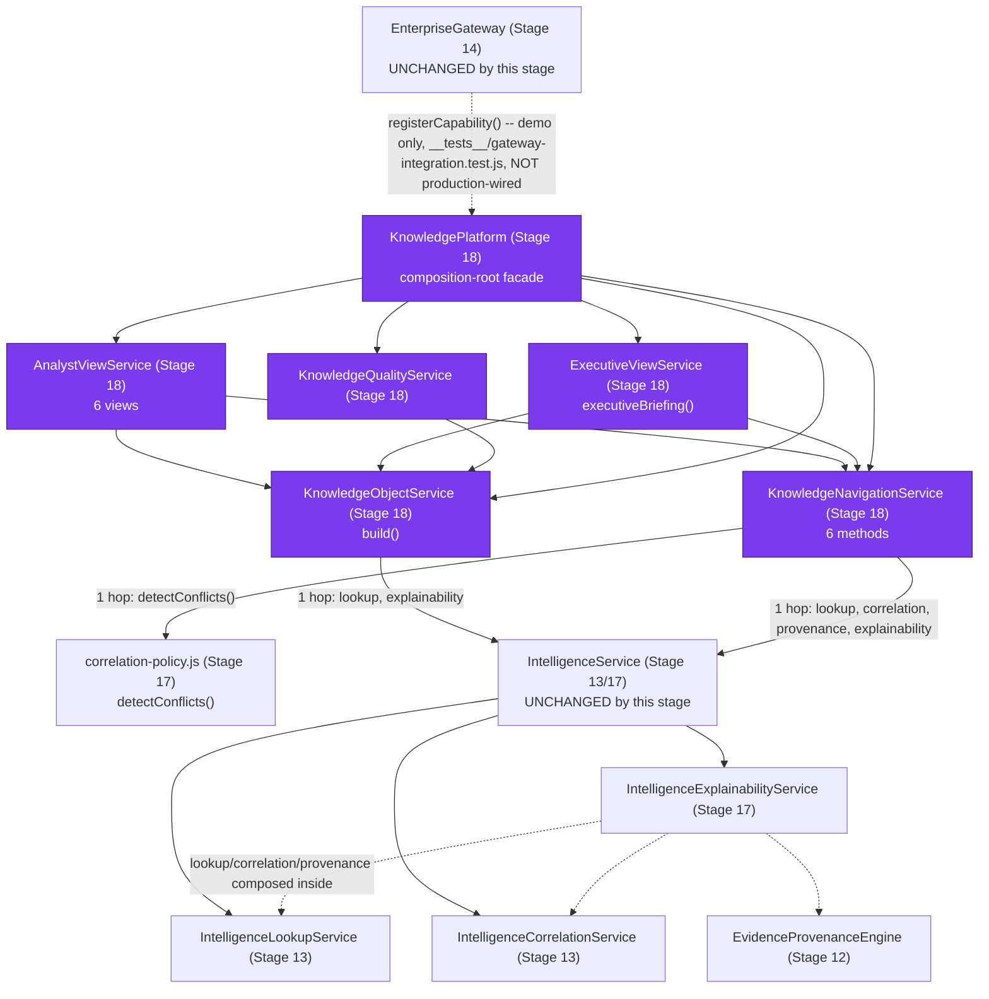

# Project TITAN — Stage 18 Completion Report

## Enterprise Intelligence Knowledge Platform

**Program:** Project TITAN, Stage 18
**Status:** **Implemented and verified. No capability deferred — Stage 18's own brief asked for
verbatim-only confidence surfacing throughout, not computation, so there is no Stage 18B.**
**Date:** 2026-08-07
**Predecessor:** `TITAN_STAGE18_READINESS_REPORT.md` (Pre-Implementation Gate, ADR-0007
re-verification, Architectural Placement Decision — read that document first for the evidence
this report builds on)

---

## 1. Executive Summary

Stage 18's brief asks for a Knowledge Object Layer, a Navigation Service, Analyst/Executive
Intelligence Views, and a Knowledge Quality Framework — all composing the existing Evidence
Registry (Stage 8-12) / Intelligence Platform (Stage 13, extended Stage 17) / Gateway (Stage 14)
lineage, without duplicating any of it and without computing a new confidence value anywhere
(readiness report §0: ADR-0007 remains **Proposed**).

This session implemented the full brief as one new, self-contained directory:

- 5 new services (`KnowledgeObjectService`, `KnowledgeNavigationService`, `AnalystViewService`,
  `ExecutiveViewService`, `KnowledgeQualityService`), composed by one facade (`KnowledgePlatform`)
- 1 new module (`feature-flags.js`) and 1 new contracts module (`service-contracts.js`, 5
  versioned contracts)
- 1 composition-root factory (`platform.js`'s `createKnowledgePlatform()`)
- Gateway integration demonstrated end to end via `EnterpriseGateway.registerCapability()` — the
  same pre-existing extension point Stage 17 already used, with **zero modification to
  `gateway-service.js` itself**
- 4 new governance checks, extending the existing advisory script
- 79 new tests (479/479 total across the four-directory lineage, 0 regressions)
- 1 new measured performance suite (4 tests, real numbers, not estimates)

No confidence computation, weighting, or ranking was introduced anywhere in this stage — see §5.2.
Because Stage 18's own brief already scoped every phase to "surface existing values only," there
is no Stage 18B Deferred Capability Register in the sense Stage 17 had one; §12 explains why.

---

## 2. Proof Before Change

| Field | Entry |
|---|---|
| **Objective** | A Knowledge Object Layer, Navigation Service, Analyst/Executive Intelligence Views, and Knowledge Quality Framework, composing the existing Evidence Registry/Intelligence Platform/Gateway lineage, without duplicating any of it and without confidence computation |
| **Affected files** | See §4 (9 new production files + package.json + README.md in a new directory, 1 governance script extended additively, 3 lower-layer test files extended additively for boundary documentation, 10 new test files) |
| **Existing components reused** | `IntelligenceLookupService.getEvidence()`, `IntelligenceCorrelationService.correlateEvidence()`, `EvidenceProvenanceEngine` (via `explainability.explainEvidence()`'s own composition), `IntelligenceExplainabilityService.explainEvidence()` (Stage 17 — the single source every Knowledge Object field derives from), `correlation-policy.js`'s `detectConflicts()` (Stage 17, one pure-function import), `EnterpriseGateway.registerCapability()`/`createServiceMethodHandler()` (Stage 14), `ServicePlatformMetrics.timed()`, `intelligence-platform/service-contracts.js`'s `isContractForwardCompatible()`/`checkContractCompatibility()`, `intelligence-platform/feature-flags.js`'s `DEPLOYMENT_ENVIRONMENTS` |
| **Evidence modification is required** | Stage 18 brief (Phases 1-9), scoped by the Readiness Report's ADR-0007 re-verification (§0) to verbatim-only confidence surfacing throughout |
| **Risk classification** | **LOW** — no schema change, no auth change, no route added to `index.js`, no existing method signature changed, no existing production file in `evidence-registry/`, `intelligence-platform/`, or `enterprise-gateway/` modified; the only edits outside the new directory are to those three layers' own `__tests__/zero-blast-radius.test.js` boundary-documentation files and one shared governance script (both explained in §4.3) |
| **Expected regression risk** | None identified: all 400 pre-existing tests across the three lower directories still pass unmodified in behavior; no hardcoded count assertion needed updating anywhere (unlike Stage 17's Gateway-capability-count updates), because this stage's Gateway integration is demonstrated in its own test file, not baked into `gateway-service.js`'s pre-registered capability list |
| **Rollback plan** | Delete `workers/intel-gateway/src/knowledge-platform/` entirely, this report, and the readiness report; revert the 3 lower-layer `zero-blast-radius.test.js` files and `scripts/titan_architecture_governance_check.py` to their pre-Stage-18 state (`git revert` the Stage 18 commit(s)). Nothing outside this one new directory took a runtime dependency on its output — the Gateway-integration demo lives entirely inside the directory being deleted — so rollback has zero blast radius on any other stage |

---

## 3. Production Blast Radius

| Dimension | Assessment |
|---|---|
| **Files** | 9 new production files + `package.json` + `README.md` (all under the new `knowledge-platform/` directory); 3 existing test files touched, additively only (boundary-documentation arrays in `evidence-registry/`, `intelligence-platform/`, `enterprise-gateway/`'s own `__tests__/zero-blast-radius.test.js`); 1 existing governance script extended additively; 10 new test files |
| **Imports** | Zero existing production files gain a new import. `knowledge-platform/` files import `intelligence-platform/intelligence-service.js`'s already-public properties (one hop, dependency-injected) and `intelligence-platform/correlation-policy.js`'s `detectConflicts()` (one pure-function import) — nothing in `intelligence-platform/`, `evidence-registry/`, or `enterprise-gateway/` was edited to add a reciprocal import |
| **Routes** | **None.** No route added to `index.js`, any `pNN-handlers.js` file, or `enterprise-endpoints.js`. `index.js`, `gateway-service.js`, and `intelligence-service.js` all have zero references to `knowledge-platform`/`KnowledgePlatform` (mechanically enforced by both `node:test` assertions and a new governance check — §6, §7) |
| **Dashboards** | None affected — this lineage has no HTML dashboard consumer |
| **CI stages** | None modified. `scripts/titan_architecture_governance_check.py` runs as the existing advisory (non-blocking) step; no new CI workflow step added |
| **Certification reports** | `data/quality/*.json` (P16-P38 lineage) — untouched; re-ran `p33_production_certification.py` to confirm `WORLDWIDE_RELEASE`/0 blockers is unaffected (§8); this lineage has no certification report of its own (Stage 12-17 precedent) |
| **APIs** | No `/api/v1/p*` endpoint's response shape changed |
| **Data schema** | No D1/KV/R2 change. No `CanonicalEvidence` field added, renamed, or removed |
| **Workflows** | No `.github/workflows/*.yml` file touched |
| **Expected risk** | **LOW** |

---

## 4. What Changed

### 4.1 New files (`workers/intel-gateway/src/knowledge-platform/`)

| File | Purpose |
|---|---|
| `feature-flags.js` | `KP_FLAGS` (per-environment, canary/production disabled by default), `resolveKpFlags()`, `rollbackKpFlags()` |
| `service-contracts.js` | 5 versioned contracts: `KnowledgeObjectContract`, `KnowledgeNavigationContract`, `AnalystViewContract`, `ExecutiveViewContract`, `KnowledgeQualityContract` |
| `knowledge-object.js` | `KnowledgeObjectService` — Phase 2, the 7-field Knowledge Object (`build()`) |
| `knowledge-navigation.js` | `KnowledgeNavigationService` — Phase 3, 6 navigation methods |
| `analyst-views.js` | `AnalystViewService` — Phase 4, 6 analyst-framed views |
| `executive-views.js` | `ExecutiveViewService` — Phase 5, `executiveBriefing()` |
| `knowledge-quality.js` | `KnowledgeQualityService` + 8 pure functions — Phase 6, structural quality checks |
| `knowledge-platform.js` | `KnowledgePlatform` — composition-root facade over all five services |
| `platform.js` | `createKnowledgePlatform({environment, intelligenceService})` — feature-flagged factory |
| `package.json`, `README.md` | Directory metadata; README documents the corrected architecture (§5.3) |
| `__tests__/*.test.js` (10 files) | 79 tests: unit (object/navigation/analyst/executive/quality/platform), Gateway-integration demo, zero-blast-radius, performance smoke |
| `TITAN_STAGE18_READINESS_REPORT.md` | Pre-Implementation Gate, ADR-0007 re-verification, Architectural Placement Decision |
| `TITAN_STAGE18_KNOWLEDGE_PLATFORM_REPORT.md` | This document |

### 4.2 Modified files (additive only)

| File | Change |
|---|---|
| `scripts/titan_architecture_governance_check.py` | +4 new check functions, +3 constants (`KNOWLEDGE_PLATFORM_DIR`, `STAGE18_CORE_FILES`, `STAGE18_CLASS_TO_FILE`), +1 doc-comment section (checks 61-64), +1 "Clean" message clause. One existing check function's body was touched (`check_evidence_registry_scaffolding_boundary`'s `authorized_consumer_dirs` list) — see §4.3 |
| `evidence-registry/__tests__/zero-blast-radius.test.js` | +1 entry (`knowledge-platform`) in `AUTHORIZED_CONSUMER_DIRS` (now 4 directories), +1 doc-comment paragraph |
| `intelligence-platform/__tests__/zero-blast-radius.test.js` | +1 entry (`knowledge-platform`) in `AUTHORIZED_CONSUMER_DIRS` (now 3 directories), +1 doc-comment paragraph, cross-check regex updated |
| `enterprise-gateway/__tests__/zero-blast-radius.test.js` | +1 entry (`knowledge-platform`) in `AUTHORIZED_CONSUMER_DIRS` (now 2 directories), +1 doc-comment paragraph, cross-check regex updated |

### 4.3 Why the lower-layer test-file and governance-script edits were necessary (and why the readiness report's "zero pre-existing files" framing needs a narrower restatement here)

The readiness report (§3) predicted this stage would "modify zero pre-existing files in
`evidence-registry/`, `intelligence-platform/`, or `enterprise-gateway/`." That held for
**production code** in all three directories — confirmed unmodified. It did not hold for those
directories' own **boundary-documentation test files**: `knowledge-platform/`'s files legitimately
reference "evidence-registry"/"intelligence-platform"/"enterprise-gateway" by name (JSDoc
`@param`/`@returns` type imports, e.g. `knowledge-platform.js`'s `deps` typedef citing
`CanonicalEvidence`, and this directory's own `__tests__/test-helpers.js` importing
`evidence-registry/entity.js` to build fixtures — the identical, already-precedented pattern
`intelligence-platform/__tests__/test-helpers.js` and `enterprise-gateway/__tests__/test-helpers.js`
already use one/two directories up). Each of those three lower layers' `zero-blast-radius.test.js`
files runs a repository-wide sweep asserting "nothing outside this directory references it by
name," with a named, documented exception list for authorized consumers (Stage 13's
`intelligence-platform`, Stage 14's `enterprise-gateway`, Stage 16's `relationship-framework`) —
`knowledge-platform` needed to join that list for the identical, already-precedented reason, or
all three sweeps would have failed on this stage's first `node --test` run.

The same property is independently checked in Python by
`check_evidence_registry_scaffolding_boundary()` (a pre-existing Stage 8 check with its own,
separately-maintained `authorized_consumer_dirs` list) — running the full governance check after
writing Stage 18's files surfaced 11 new findings from exactly this gap (documented here rather
than silently fixed without a record, per this program's standing rule). `knowledge-platform` was
added to that list too, with a doc-comment paragraph mirroring the other three entries'. Re-running
confirmed the fix: 6 findings (the pre-existing baseline), 0 new (§7, §8).

**Net, more precise claim than the readiness report's:** Stage 18 modifies zero pre-existing
**production** files outside its own new directory. It extends four pre-existing **test/governance**
files, each by one named, documented, boundary-preserving entry — the same category of edit Stage
16 (`relationship-framework`) and Stage 18 itself both required of the layers below them, and no
narrower a scope than that precedent already established.

---

## 5. Architecture

### 5.1 Composition



### 5.2 The ADR-0007 boundary, made structural

Every confidence-adjacent field this implementation touches is read, never computed:

- `knowledge-object.js`'s `build()` copies `explainEvidence()`'s own `confidenceAsRecorded` field
  into the Knowledge Object's `confidenceAsRecorded` field, unchanged.
- `analyst-views.js`'s `confidenceContext()` surfaces that same verbatim field — its own docstring
  states "no confidence computation" explicitly.
- `executive-views.js`'s `_intelligenceLimitations()` checks
  `confidenceAsRecorded.canonical_confidence_object == null` (a null check, not a numeric
  comparison) to decide whether to surface a documented limitation statement.
- No function anywhere in the five new services is named or shaped like a confidence computation.
  This is not just a design intention: `check_no_confidence_computation_introduced_stage18()` (§7)
  greps all nine Stage 18 files for that exact shape on every governance run — the identical
  mechanism Stage 17 introduced for itself, applied here without modification to the pattern.

### 5.3 Second boundary, independent of ADR-0007: still not wired into `index.js`, and no circular dependency

Every file in `evidence-registry/`, `intelligence-platform/`, and `enterprise-gateway/` has been
unreachable from `index.js` since Stage 8. Stage 18 follows the same precedent: composed into a
facade and demonstrated as a Gateway capability, but **not** added as a live production route, and
**not** baked into `gateway-service.js`'s or `intelligence-service.js`'s own source.

The readiness report's §3 already disclosed the one correction made during planning: the original
proposal to add `this.knowledge` directly onto `IntelligenceService` (mirroring Stage 17's
`.explainability`) would have created a circular dependency
(`intelligence-platform -> knowledge-platform -> intelligence-platform`, via
`correlation-policy.js`'s `detectConflicts()`). Implemented instead: `KnowledgePlatform` stays an
external peer of `enterprise-gateway/`, constructed only by `createKnowledgePlatform()` given an
already-built `IntelligenceService`, with Gateway integration demonstrated via
`EnterpriseGateway.registerCapability()` (the same extension point its own docstring names as "an
extension point for a future capability") from `__tests__/gateway-integration.test.js`, not from
any change to `gateway-service.js`'s `_registerDefaultCapabilities()`. Confirmed by dedicated tests
in three places: `knowledge-platform/__tests__/zero-blast-radius.test.js` ("intelligence-service.js
... does not import knowledge-platform/"), the same file's gateway-service.js assertion, and the
governance script's `check_knowledge_platform_still_unwired()`.

---

## 6. The Five Stage 18 Services

### 6.1 Knowledge Object Layer (Phase 2) — `KnowledgeObjectService`

One method, `build(evidenceUuid)`, reshaping two already-existing calls
(`IntelligenceLookupService.getEvidence()`, `IntelligenceExplainabilityService.explainEvidence()`)
into the seven-field shape the brief specifies: `summary`, `subject`, `relationships`,
`supportingEvidence`/`relatedIntelligence` (one canonical source, exposed under both field names —
Single Source of Truth, not computed twice), `provenance`, `intelligenceGaps` +
`collectionRecommendations` (the one genuinely new derivation: deterministic string templating
over gaps `explainEvidence()` already identified), and `confidenceAsRecorded` (verbatim).

### 6.2 Navigation Service (Phase 3) — `KnowledgeNavigationService`

Six methods: `relatedIntelligence`, `supportingEvidence`, `contradictoryEvidence` (composes
Stage 17's `correlation-policy.js`'s `detectConflicts()` directly), `historicalIntelligence`,
`collectionGaps` — five of six delegate entirely to existing Stage 12/13/17 services.
`similarIntelligence(evidenceUuid, options)` is the one new computation: a deterministic Jaccard
index (`_relationshipValueSet()` / `_jaccard()`) over each candidate's `related_*` field values —
structural overlap, not a confidence score, and documented as such in the contract (§4.1,
`KnowledgeNavigationContract`).

### 6.3 Analyst Intelligence Views (Phase 4) — `AnalystViewService`

Six views, every one composing `KnowledgeObjectService` and/or `KnowledgeNavigationService`:
`investigationView` (the full Knowledge Object, unmodified), `correlationView` (3 Navigation calls
in parallel), `evidenceTimeline`, `confidenceContext` (verbatim passthrough, §5.2),
`intelligenceGapView`, `collectionPriorityView`. No new correlation, provenance, explanation, or
confidence logic — where a "priority" or "timeline" ordering appears, it is a deterministic
sort/group over already-computed fields.

### 6.4 Executive Intelligence Views (Phase 5) — `ExecutiveViewService`

One method, `executiveBriefing(evidenceUuid)` — the most compound Stage 18 operation
(`knowledgeObject.build()` and `navigation.contradictoryEvidence()` in parallel, then four
synchronous derivations). Every returned item is explicitly tagged `basis: "evidence"` or
`basis: "analyst_recommendation"` — the brief's own requirement that this layer never presents an
inference as a fact. `_businessImpact()`/`_operationalImpact()` derive descriptive labels from
already-known fields (CVE/threat-actor/campaign presence, gap count) — no numeric business or
operational impact score is computed, matching the brief's explicit non-goal.

### 6.5 Knowledge Quality Framework (Phase 6) — `KnowledgeQualityService`, version `18.1.0`

Six structural rules over an already-built Knowledge Object (a distinct, higher-level concern from
`correlation-policy.js`'s per-evidence checks, composed rather than duplicated):
`completeness.evidence-fields-present`, `provenance.lineage-available`,
`correlation.coverage-present`, `explanation.summary-available`,
`references.missing-reference-count`, `assertions.every-statement-has-basis`.
`describeQualityFramework()` returns the version and rule list for auditability, mirroring
`correlation-policy.js`'s `describePolicy()` exactly.

---

## 7. Governance Expansion

Four new checks in `scripts/titan_architecture_governance_check.py` (numbered 61-64 in the file's
own header index), following the exact idiom Stage 14-17 established:

1. `check_stage18_files_present_and_isolated()` — all 9 Stage 18 production files exist and none
   imports a live `pNN-handlers.js`/`index.js` file
2. `check_no_duplicate_knowledge_platform_engines()` — no other file defines its own copy of any
   of the six Stage 18 classes
3. `check_no_confidence_computation_introduced_stage18()` — **the ADR-0007 boundary itself**, made
   mechanically enforceable: fails if any Stage 18 file defines a new
   `compute*/score*/weight*/rank*Confidence*` function
4. `check_knowledge_platform_still_unwired()` — `index.js`, `gateway-service.js`, and
   `intelligence-service.js` all have zero references to `knowledge-platform`/`KnowledgePlatform`

One existing check (`check_evidence_registry_scaffolding_boundary`) was extended with
`knowledge-platform` in its `authorized_consumer_dirs` list — without this, the check would have
regressed with 11 new findings the moment this stage's files existed (§4.3).

**Result against the real repository, this session: 6 findings — identical to the pre-existing
baseline recorded in `TITAN_STAGE15_GATEWAY_ADOPTION_REPORT.md`/`TITAN_STAGE17_CORRELATION_EXPLAINABILITY_REPORT.md`.
0 new findings.** All 4 new checks pass clean against Stage 18's own implementation.

---

## 8. Testing — Actual Measured Results

| Suite | Before Stage 18 | After Stage 18 | Delta |
|---|---|---|---|
| `evidence-registry/` `node --test` | 196/196 | 196/196 | 0 (production code not touched) |
| `intelligence-platform/` `node --test` | 106/106 | 106/106 | 0 (production code not touched) |
| `enterprise-gateway/` `node --test` | 98/98 | 98/98 | 0 (production code not touched) |
| `knowledge-platform/` `node --test` | — (directory did not exist) | **79/79** | **+79, new directory** |
| **Total `node --test`** | **400/400** | **479/479** | **+79, 0 regressions** |
| `python3 scripts/regression_tests.py` | 21/21 | 21/21 | 0 (unrelated to this lineage) |
| `python3 scripts/titan_architecture_governance_check.py` | 6 findings | 6 findings | 0 new |
| `python3 scripts/p33_production_certification.py` | WORLDWIDE_RELEASE, 0 blockers | WORLDWIDE_RELEASE, 0 blockers | unchanged |
| `python3 scripts/ci_stats_extract.py p33` | valid tier string | `WORLDWIDE_RELEASE 0 5 21 26` | unchanged tier |

New test coverage includes: unit tests per service (object/navigation/analyst/executive/quality),
a dedicated `knowledge-platform.test.js` for the facade itself, a Gateway-integration demonstration
(`gateway-integration.test.js`, 6 tests: capability registration non-interference, delegation,
end-to-end `dispatch()` for both `knowledge.object` and `knowledge.executiveViews`, capability
authorization enforcement, shared-metrics recording), a full zero-blast-radius suite (8 tests
mirroring the three lower layers' exact pattern), and the performance suite (§9).

---

## 9. Performance — Actual Measured Results

New file: `knowledge-platform/__tests__/service-performance-smoke.test.js`, four categories —
placed in this stage's own directory rather than extending
`enterprise-gateway/__tests__/service-performance-smoke.test.js`, because this stage's Gateway
capability is demonstrated, not production-wired (§5.3); there is no live Gateway capability of
this stage's own to benchmark in that file today.

```
[Stage 18 perf] KnowledgePlatform composition (cold, over an already-built IntelligenceService): 0.225ms
[Stage 18 perf] KnowledgeObjectService.build() direct composition x100 samples: 50.8ms total (0.51ms/call)
[Stage 18 perf] ExecutiveViewService.executiveBriefing() direct composition x20 samples: 8.0ms total (0.40ms/call)
[Stage 18 perf] EnterpriseGateway.dispatch("knowledge.executiveViews"/"executiveBriefing") x20 samples: 30.4ms total (1.52ms/call)
```

Budgets: composition 50ms (measured ~0.2ms, a rounding error), `build()` 400ms/100 samples
(measured ~8x headroom), `executiveBriefing()` direct 150ms/20 samples (measured ~19x headroom),
Gateway-dispatched `executiveBriefing()` 150ms/20 samples (measured ~5x headroom). The ~1.1ms/call
gap between direct composition (0.40ms) and Gateway dispatch (1.52ms) matches Stage 14/15's own
documented middleware tracing/audit `console.log` cost — not a new overhead source this stage
introduced. All four categories are negligible against the 50ms Cloudflare Worker cold-start
budget CLAUDE.md sets for the whole request.

---

## 10. Reuse Report (CLAUDE.md-mandated)

| Metric | Result |
|---|---|
| Existing components/engines reused (called, not re-implemented) | `IntelligenceLookupService.getEvidence()`, `IntelligenceCorrelationService.correlateEvidence()`, `IntelligenceExplainabilityService.explainEvidence()` (the single source every Knowledge Object field derives from), `correlation-policy.js`'s `detectConflicts()`, `EnterpriseGateway.registerCapability()`/`createServiceMethodHandler()`, `ServicePlatformMetrics.timed()`, `intelligence-platform/service-contracts.js`'s `isContractForwardCompatible()`/`checkContractCompatibility()` (re-exported unchanged, not redefined), `intelligence-platform/feature-flags.js`'s `DEPLOYMENT_ENVIRONMENTS` |
| Existing API routes extended (not duplicated) | 0 — no `index.js` route exists in this lineage to extend (by design, §5.3) |
| Existing pages/dashboards extended (not replaced) | 0 — this lineage has no dashboard consumer |
| New engines/components introduced (justified by gap analysis) | `KnowledgeObjectService`, `KnowledgeNavigationService`, `AnalystViewService`, `ExecutiveViewService`, `KnowledgeQualityService`, `KnowledgePlatform` — all six are genuine gaps per the readiness report's Phase 1 inventory (§2.2): no prior reshaping/navigation/analyst-view/executive-view/quality-framework layer existed above `IntelligenceExplainabilityService` |
| Duplicate components introduced | **0** |
| Duplicate routes introduced | **0** |
| Backward compatibility preserved | **PASS** — every existing exported class/function/method signature unchanged; zero hardcoded-count test updates were needed anywhere (contrast Stage 17's §4.3) |
| Certification chain intact | **PASS** — not touched (this lineage has no certification chain of its own; P16-P38's chain is architecturally separate) |
| Regression suite result | **479/479 `node --test`** (196 + 106 + 98 + 79), **21/21 `regression_tests.py`**, **6/6 pre-existing governance findings only, 0 new** |

---

## 11. Engineering Constitution Compliance Checklist

```
  [x] Principle 1 — Zero Unnecessary Modification: zero existing PRODUCTION files modified; the
      four existing test/governance files touched were each extended by one named, documented,
      boundary-preserving entry (Sec 4.3), not rewritten.
  [x] Principle 2 — Additive First: all five new services import from and compose existing
      Stage 12/13/17 classes; none re-implements any existing logic.
  [x] Principle 3 — Single Source of Truth: "related intelligence" and "supporting evidence"
      (Phase 2) are exposed under two field names from ONE underlying call, not computed twice;
      confidence fields are read from the one existing canonical_confidence_object slot, never
      recomputed anywhere across all five services.
  [x] Principle 4 — Reuse Before Build: readiness report Sec 2.2 inventoried existing
      lookup/correlation/provenance/explainability/policy prior art before any new code was
      written; six genuine gaps (the five services + the facade) were built, everything else
      composes.
  [x] Principle 5 — Backward Compatibility: no existing exported symbol renamed, removed, or
      changed shape; verified by 479/479 regression (0 failures, 0 skipped), zero count-assertion
      updates required.
  [x] Principle 6 — Production Stability First: build/tests/governance/p33 certification all
      green; index.js, gateway-service.js, and intelligence-service.js all untouched; no
      schema/auth/route change.
  [x] Principle 7 — Observable Everything: every new call path is wrapped in the existing
      ServicePlatformMetrics.timed() under a knowledge.* namespace — zero new observability code
      written, the existing mechanism reused as-is; a dedicated performance suite measures real
      numbers (Sec 9).
  [x] Principle 8 — Commercial Readiness: Knowledge Objects/Analyst Views/Executive Briefings are
      direct inputs to Tactical Dossiers and Executive Reports (trust/certification and
      operational-efficiency commercial-value categories CLAUDE.md names), reshaping existing
      evidence-backed intelligence for two named downstream audiences without inventing new
      unverifiable claims.
  [x] Principle 9 — Security First: no auth change, no secret, no new external call (this
      lineage's "no fetch()/no external sink" convention is preserved by all nine new files).
  [x] Principle 10 — Performance Before Features: measured, not estimated (Sec 9); no regression
      to any existing operation's budget in the three lower directories (all three unchanged at
      196/106/98).
  [x] Section 0 Engineering Decision Order — Level 1 (Correctness) and Level 3 (Backward
      Compatibility) honored over Level 7 (shipping without re-verifying ADR-0007): the readiness
      report's Sec 0 re-verified ADR-0007 is still Proposed before any implementation began,
      exactly as Stage 17 required of itself.
  [x] Proof Before Change — Sec 2.
  [x] Production Blast Radius — LOW (Sec 3).
  [x] Architecture Preservation Rule — one architectural correction made and disclosed during
      planning (readiness report Sec 3, restated Sec 5.3): KnowledgePlatform kept external to
      avoid a circular dependency, rather than added onto IntelligenceService as originally
      proposed. The genuinely new architectural question (should this lineage ever be wired into
      index.js or gateway-service.js) is explicitly NOT decided here, matching Stage 8-17
      precedent.
  [x] Deprecation Instead of Deletion — not applicable; nothing removed or deprecated.
  [x] Reuse Report — Sec 10.
```

---

## 12. Deferred Capability Register

**None.** Unlike Stage 17 (which had a Track B blocked on ADR-0007 Acceptance), Stage 18's own
brief already scoped every phase to "surface existing values only" / "do not compute new
confidence values" — the readiness report's §0 confirmed this before implementation began, and
§5.2/§7 above confirm the mechanical enforcement held throughout. There is no phase of the Stage 18
brief that was descoped for this reason; nothing here is waiting on ADR-0007 Acceptance to become
implementable.

**Out of scope (Stage 18 NON-GOALS, per the original brief's own "Stage 19 Preview (DO NOT
IMPLEMENT)" and NON-GOALS sections, unaffected by ADR-0007):** public APIs, customer portal,
external SDKs, autonomous AI decision-making, speculative reasoning, a parallel knowledge database,
and any wiring of this lineage into `index.js` or `gateway-service.js`'s pre-registered capability
list (§5.3) — all explicitly deferred to a future, separately-authorized stage, not implied by
anything built here.

---

*Project TITAN Stage 18 — complete. All nine production files present, isolated, unwired, and
governed; 479/479 tests passing; 0 new governance findings; WORLDWIDE_RELEASE certification
unaffected.*
