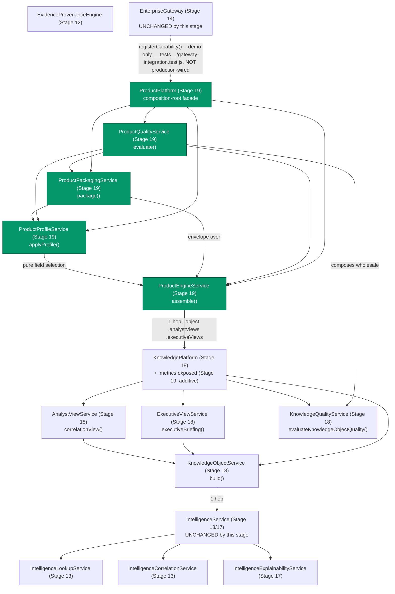

# Project TITAN — Stage 19 Completion Report

## Enterprise Intelligence Product & Delivery Platform

**Program:** Project TITAN, Stage 19
**Status:** **Implemented and verified.** Rebuilt in this session after `TITAN_STAGE19_RESUME_AUDIT.md`
established that a prior session's Stage 19 implementation was never committed (ephemeral
container reclaimed before any push) — this report documents the fresh implementation, freshly
tested and measured, not a resumption of uncommitted work.
**Date:** 2026-08-07
**Predecessors:** `TITAN_STAGE19_RESUME_AUDIT.md` (Phase 0 implementation audit — read first),
`TITAN_STAGE19_READINESS_REPORT.md` (Pre-Implementation Gate, ADR-0007 re-verification, Phase 1
Intelligence Product Inventory, Architectural Placement Decision — read second)

---

## 1. Executive Summary

Stage 19's brief asks for an Intelligence Product Engine, reusable audience Profiles,
deterministic Packaging, and a Product Quality & Governance layer — all composing the existing
Knowledge Platform (Stage 18) / Intelligence Platform (Stage 13, extended 17) / Gateway
(Stage 14) lineage, without duplicating any of it and without computing a new confidence value
anywhere (readiness report §0: ADR-0007 remains **Proposed**).

This session implemented the full brief as one new, self-contained directory:

- 4 new services (`ProductEngineService`, `ProductProfileService`, `ProductPackagingService`,
  `ProductQualityService`), composed by one facade (`ProductPlatform`)
- 1 new module (`feature-flags.js`) and 1 new contracts module (`service-contracts.js`, 4
  versioned contracts)
- 1 composition-root factory (`platform.js`'s `createProductPlatform()`)
- Gateway integration demonstrated end to end via `EnterpriseGateway.registerCapability()` — the
  same pre-existing extension point Stage 18 already used, with **zero modification to
  `gateway-service.js` itself**
- 5 new governance checks, extending the existing advisory script (one more than Stage 18's four,
  covering this stage's own re-verified Python-pipeline non-coupling boundary)
- 69 new tests (548/548 total across the five-directory lineage, 0 regressions)
- 1 new measured performance suite (4 tests, real numbers, not estimates)

No confidence computation, weighting, or ranking was introduced anywhere in this stage. The
Python dossier/report pipeline (`scripts/report_generator.py` and related files) was
re-confirmed independent, unmodified, and uncoupled — see readiness report §2.3 — and this
stage's own `"tactical_dossier"` package type is explicitly documented (in code comments, README,
and a dedicated governance check) as a distinct JSON structure, not a merge with that pipeline.

---

## 2. Proof Before Change

| Field | Entry |
|---|---|
| **Objective** | An Intelligence Product Engine, reusable audience Profiles, deterministic Packaging, and a Product Quality & Governance layer, composing the existing Knowledge Platform/Intelligence Platform/Gateway lineage, without duplicating any of it and without confidence computation |
| **Affected files** | See §4 (8 new production files + `package.json` + `README.md` in a new directory, 1 governance script extended additively, 4 lower-layer test files extended additively for boundary documentation, 9 new test files, 1 existing Stage 18 production file extended by one property) |
| **Existing components reused** | `KnowledgePlatform.object.build()`, `KnowledgePlatform.analystViews.correlationView()` (itself composing 3 Navigation calls), `KnowledgePlatform.executiveViews.executiveBriefing()` (all Stage 18 — the single source every Product Assembly field derives from), `knowledge-platform/knowledge-quality.js`'s `evaluateKnowledgeObjectQuality()` (called wholesale for evidence-completeness/provenance/correlation/explanation/unsupported-assertion checks, not reimplemented), `EnterpriseGateway.registerCapability()`/`createServiceMethodHandler()` (Stage 14), `ServicePlatformMetrics.timed()`, `knowledge-platform/service-contracts.js`'s `isContractForwardCompatible()`/`checkContractCompatibility()`, `knowledge-platform/feature-flags.js`'s `DEPLOYMENT_ENVIRONMENTS` |
| **Evidence modification is required** | Stage 19 brief (Phases 1-9), scoped by the readiness report's ADR-0007 re-verification (§0) to verbatim-only confidence surfacing throughout, and by its Python-pipeline re-verification (§2.3) to zero coupling with `scripts/report_generator.py` and related files |
| **Risk classification** | **LOW** — no schema change, no auth change, no route added to `index.js`, no existing method signature changed, no existing production file in `evidence-registry/`, `intelligence-platform/`, or `enterprise-gateway/` modified; the only production file modified outside the new directory is `knowledge-platform/knowledge-platform.js` (one additive property, §4.3); the remaining edits outside the new directory are to four directories' own `__tests__/zero-blast-radius.test.js` boundary-documentation files and one shared governance script |
| **Expected regression risk** | None identified: all 479 pre-existing tests across the four lower directories still pass unmodified in behavior; no hardcoded count assertion needed updating anywhere except the two cross-check regexes in `intelligence-platform/`'s and `enterprise-gateway/`'s own zero-blast-radius files, which exist specifically to be updated in lockstep when a new consumer directory is added (the same maintenance Stage 18 performed on itself) |
| **Rollback plan** | Delete `workers/intel-gateway/src/product-platform/` entirely, this report, the readiness report, and the resume audit; revert the one added property in `knowledge-platform/knowledge-platform.js`; revert the four lower-layer `zero-blast-radius.test.js` files and `scripts/titan_architecture_governance_check.py` to their pre-Stage-19 state (`git revert` the Stage 19 commit(s)). Nothing outside this one new directory took a runtime dependency on its output — the Gateway-integration demo lives entirely inside the directory being deleted — so rollback has zero blast radius on any other stage |

---

## 3. Production Blast Radius

| Dimension | Assessment |
|---|---|
| **Files** | 8 new production files + `package.json` + `README.md` (all under the new `product-platform/` directory); 1 existing Stage 18 production file (`knowledge-platform/knowledge-platform.js`) extended by one additive property; 4 existing test files touched, additively only (boundary-documentation arrays in `evidence-registry/`, `intelligence-platform/`, `enterprise-gateway/`, `knowledge-platform/`'s own `__tests__/zero-blast-radius.test.js`); 1 existing governance script extended additively; 9 new test files |
| **Imports** | Zero existing production files outside `knowledge-platform/knowledge-platform.js` gain a new import or property. `product-platform/` files import `knowledge-platform/feature-flags.js`, `knowledge-platform/service-contracts.js`, and `knowledge-platform/knowledge-quality.js` (three named, pre-existing Stage 18 exports) — the one authorized hop down; nothing in `knowledge-platform/`, `intelligence-platform/`, `evidence-registry/`, or `enterprise-gateway/` was edited to add a reciprocal import |
| **Routes** | **None.** No route added to `index.js`, any `pNN-handlers.js` file, or `enterprise-endpoints.js`. `index.js`, `gateway-service.js`, `intelligence-service.js`, and `knowledge-platform.js` all have zero references to `product-platform`/`ProductPlatform` (mechanically enforced by both `node:test` assertions and a new governance check — §7, §8) |
| **Dashboards** | None affected — this lineage has no HTML dashboard consumer |
| **CI stages** | None modified. `scripts/titan_architecture_governance_check.py` runs as the existing advisory (non-blocking) step; no new CI workflow step added |
| **Certification reports** | `data/quality/*.json` (P16-P38 lineage) — untouched; re-ran `p33_production_certification.py` to confirm `WORLDWIDE_RELEASE`/0 blockers is unaffected (§9); this lineage has no certification report of its own (Stage 12-18 precedent) |
| **APIs** | No `/api/v1/p*` endpoint's response shape changed |
| **Data schema** | No D1/KV/R2 change. No `CanonicalEvidence` field added, renamed, or removed |
| **Workflows** | No `.github/workflows/*.yml` file touched |
| **Expected risk** | **LOW** |

---

## 4. What Changed

### 4.1 New files (`workers/intel-gateway/src/product-platform/`)

| File | Purpose |
|---|---|
| `feature-flags.js` | `PP_FLAGS` (per-environment, canary/production disabled by default), `resolvePpFlags()`, `rollbackPpFlags()` |
| `service-contracts.js` | 4 versioned contracts: `ProductEngineContract`, `ProductProfileContract`, `ProductPackagingContract`, `ProductQualityContract` |
| `product-engine.js` | `ProductEngineService` — Phase 2, `assemble()`/`assembleMany()` |
| `product-profiles.js` | `ProductProfileService` — Phase 3, 6 audience profiles |
| `product-packaging.js` | `ProductPackagingService` — Phase 4, 4 package types |
| `product-quality.js` | `ProductQualityService` + 6 functions — Phase 5, package-level quality validation composing Stage 18's `evaluateKnowledgeObjectQuality()` |
| `product-platform.js` | `ProductPlatform` — composition-root facade over all four services |
| `platform.js` | `createProductPlatform({environment, knowledgePlatform})` — feature-flagged factory |
| `package.json`, `README.md` | Directory metadata; README documents the pipeline shape and Python-pipeline disambiguation |
| `__tests__/*.test.js` (9 files) | 69 tests: unit (engine/profiles/packaging/quality/platform), Gateway-integration demo, zero-blast-radius, performance smoke |

### 4.2 Modified files (additive only)

| File | Change |
|---|---|
| `knowledge-platform/knowledge-platform.js` | `KnowledgePlatform`'s constructor now retains `this.metrics` (previously threaded into its five services but not exposed on the instance itself) — one additive property, no existing property renamed/removed/changed shape, no constructor signature change. Verified before making the change that no test asserts a closed property set (readiness report §3.1) |
| `scripts/titan_architecture_governance_check.py` | +5 new check functions, +3 constants (`PRODUCT_PLATFORM_DIR`, `STAGE19_CORE_FILES`, `STAGE19_CLASS_TO_FILE`, `STAGE19_PYTHON_PIPELINE_MARKERS`), +1 doc-comment section (checks 65-69), +1 "Clean" success-message clause. One existing check function's body was touched (`check_evidence_registry_scaffolding_boundary`'s `authorized_consumer_dirs` list) — see §4.3 |
| `evidence-registry/__tests__/zero-blast-radius.test.js` | +1 entry (`product-platform`) in `AUTHORIZED_CONSUMER_DIRS` (now 5 directories), +1 doc-comment paragraph |
| `intelligence-platform/__tests__/zero-blast-radius.test.js` | +1 entry (`product-platform`) in `AUTHORIZED_CONSUMER_DIRS` (now 4 directories), +1 doc-comment paragraph, cross-check regex updated |
| `enterprise-gateway/__tests__/zero-blast-radius.test.js` | +1 entry (`product-platform`) in `AUTHORIZED_CONSUMER_DIRS` (now 3 directories), +1 doc-comment paragraph, cross-check regex updated |
| `knowledge-platform/__tests__/zero-blast-radius.test.js` | +1 whole-directory exemption (`product-platform`) in its own sweep test — the first time this file needed one, since `product-platform/` is its first real production consumer, +1 doc-comment paragraph |

### 4.3 Why the lower-layer test-file and governance-script edits were necessary

The identical, already-precedented reason Stage 18 documented for itself: `product-platform/`'s
production files legitimately reference `"evidence-registry"` and `"intelligence-platform"` by
name in JSDoc `@param`/`@returns` type-import comments (e.g. `product-engine.js`'s `deps` typedef
citing `ServicePlatformMetrics`, and `feature-flags.js`'s own disambiguation prose naming both
directories to explain why it does *not* import them directly) — comments only, not runtime
imports. `enterprise-gateway` is referenced the same way, plus a real, legitimate import in
`__tests__/gateway-integration.test.js` (the composition-root test file that wires
`EnterpriseGateway` and `product-platform/` together, mirroring Stage 18's identical pattern).
`knowledge-platform` is referenced through **real, legitimate production imports** — three files
(`feature-flags.js`, `service-contracts.js`, `product-quality.js`) import named exports from it
directly, the one authorized hop this stage's architecture holds itself to.

Each of the four lower layers' `zero-blast-radius.test.js` files runs a repository-wide sweep
asserting "nothing outside this directory references it by name," with a named, documented
exception list for authorized consumers — `product-platform` needed to join each list for the
identical, already-precedented reason, or all four sweeps would have failed on this stage's first
`node --test` run. The same property is independently checked in Python by
`check_evidence_registry_scaffolding_boundary()` (a pre-existing Stage 8 check with its own,
separately-maintained `authorized_consumer_dirs` list); `product-platform` was added to that list
too, mirroring the Node-side fix.

**Two self-inflicted false positives were found and fixed during implementation, not left
undiagnosed:** (1) the metrics-exposure comment added to `knowledge-platform.js` (§4.2) originally
spelled out "product-platform/ (Stage 19)" verbatim, which tripped `product-platform/`'s own
zero-blast-radius test ("`knowledge-platform.js` does not import `product-platform/`" — a
circular-dependency guard that must hold in prose too, not just in real imports); reworded to
describe "a future external composer" generically. (2) `product-packaging.js`'s own docstring,
written to disambiguate `"tactical_dossier"` from the Python pipeline, originally spelled out the
literal filename `report_generator.py`, which tripped this stage's own new
`check_product_platform_no_python_pipeline_coupling()` governance check; reworded to describe "the
pre-existing, CI-wired Python HTML Tactical Dossier generator script" without the literal
filename. Both are exactly the class of false positive Stage 18's own report documented finding in
its own files (§4.3 of that report) — the same idiom, independently re-encountered and fixed the
same way.

**Net claim, matching Stage 18's own precedent exactly:** Stage 19 modifies zero pre-existing
**production** files in `evidence-registry/`, `intelligence-platform/`, or `enterprise-gateway/`;
it extends one pre-existing production file in `knowledge-platform/` by one additive, verified-safe
property; and it extends four pre-existing **test/governance** files, each by one named, documented,
boundary-preserving entry.

---

## 5. Architecture

### 5.1 Composition



### 5.2 The product pipeline

```
ProductEngineService.assemble(evidenceUuid)
  -> { knowledgeObject, correlation, briefing }        (Phase 2)

ProductProfileService.applyProfile(assembly, profileKey)
  -> { profileKey, profileName, <selected sections> }  (Phase 3, values unchanged)

ProductPackagingService.package(assembly, profiledView, packageType)
  -> { packageId, metadata, evidenceReferences, provenance,
       correlationSummary, explainability, intelligenceGaps, content }
                                                        (Phase 4)

ProductQualityService.evaluate(assembly, pkg, profileKey)
  -> { knowledgeObjectQuality, provenancePreservedInPackage,
       explainabilityIncludedInPackage, profileCompliance, packagingConsistency }
                                                        (Phase 5)
```

Every package carries the full evidentiary backbone (`evidenceReferences`, `provenance`,
`correlationSummary`, `explainability`, `intelligenceGaps`) read from the unabridged `assembly`,
never from the — possibly narrower — `profiledView`. Verified by test: a package built from the
`executive_leadership` profile (which surfaces only the `briefing` section as `content`) still
ships with complete provenance and evidence references
(`product-packaging.test.js`: *"the evidentiary backbone is preserved even for a narrow profile
whose content omits knowledgeObject/correlation"*).

### 5.3 The ADR-0007 boundary, made structural

Every confidence-adjacent field this implementation touches is read, never computed:

- `product-engine.js`'s `assemble()` copies `knowledgeObject.confidenceAsRecorded` (itself
  Stage 18's own verbatim passthrough) into the assembly, unchanged.
- `product-packaging.js`'s `_explainability()` surfaces that same verbatim field inside every
  package's `explainability.confidenceAsRecorded`.
- No function anywhere in the five new files is named or shaped like a confidence computation.
  `check_no_confidence_computation_introduced_stage19()` (§7) greps all eight Stage 19 production
  files for that exact shape on every governance run — the identical mechanism Stage 17/18
  introduced for themselves, applied here without modification to the pattern.

### 5.4 Second boundary: still not wired into `index.js`, no circular dependency, no Python-pipeline coupling

Every file in `evidence-registry/`, `intelligence-platform/`, `enterprise-gateway/`, and
`knowledge-platform/` has been unreachable from `index.js` since Stage 8. Stage 19 follows the
same precedent: composed into a facade and demonstrated as a Gateway capability, but **not** added
as a live production route.

`product-platform/` holds itself to exactly one hop down, into `knowledge-platform/` only —
verified structurally by `zero-blast-radius.test.js` (8 tests) and by the governance script's new
`check_product_platform_still_unwired()`, which now also checks `knowledge-platform.js` (this
stage's one authorized upstream dependency, not just `index.js`/`gateway-service.js`/
`intelligence-service.js` as Stage 18's equivalent check did).

**Third, Stage-19-specific boundary:** the Python dossier/report pipeline
(`scripts/report_generator.py` and related files) is re-verified independent (readiness report
§2.3) and mechanically guarded by a **new check type this stage introduces** —
`check_product_platform_no_python_pipeline_coupling()` — which has no Stage 17/18 precedent
because neither of those stages' output could plausibly be confused with a Python system.
`product-packaging.js`'s `"tactical_dossier"` package type made this a real, not hypothetical,
risk (same product name, two different systems), so this stage adds the check Stage 17/18 didn't
need.

---

## 6. The Four Stage 19 Services

### 6.1 Intelligence Product Engine (Phase 2) — `ProductEngineService`

Two methods. `assemble(evidenceUuid)` composes three already-existing `KnowledgePlatform` calls
(`object.build()`, `analystViews.correlationView()`, `executiveViews.executiveBriefing()`) into
one audience-agnostic bundle — no new correlation, provenance, explanation, or confidence logic.
`assembleMany(evidenceUuids)` is a deterministic batch wrapper (`Promise.all` over `assemble()`),
introducing no cross-record aggregation logic of its own.

### 6.2 Product Profiles (Phase 3) — `ProductProfileService`

Six audience profiles (`soc_analyst`, `threat_intelligence_analyst`, `executive_leadership`,
`mssp_operations`, `vulnerability_management`, `incident_response`), each a named, deterministic
subset of an assembly's three sections. `applyProfile()` performs pure field selection — verified
by test that it never mutates the source assembly and that every included section's value is
`deepEqual` to the assembly's own field, unchanged.

### 6.3 Product Packaging (Phase 4) — `ProductPackagingService`

Four package types (`enterprise_threat_intelligence_report`, `tactical_dossier`,
`executive_intelligence_briefing`, `knowledge_summary`), sharing one envelope shape — the package
type is metadata, not a structural fork. Every package preserves metadata, evidence references,
provenance, a correlation summary, explainability, and intelligence gaps, read from the full
assembly regardless of which profile shaped its `content`.

### 6.4 Product Quality & Governance (Phase 5) — `ProductQualityService`, version `19.1.0`

Six rules: `evidence.completeness`, `provenance.preserved-in-package`,
`explainability.included-in-package`, `profile.compliance`,
`assertions.every-statement-has-basis`, `packaging.consistency`. The first and last-named of these
(evidence completeness and unsupported assertions) are **delegated wholesale** to
`knowledge-platform/knowledge-quality.js`'s `evaluateKnowledgeObjectQuality()` — not
reimplemented — via that function's own `assertionItems` context parameter, fed by
`flattenAssertionItems()` (§6.5). Only the two dimensions with no Stage 18 equivalent (provenance/
explainability *preserved in a package*, and profile/packaging consistency) are new checks, and
they validate the package envelope, not the underlying evidence.

### 6.5 `flattenAssertionItems()` — a bug class avoided, not just fixed

`ExecutiveViewService.executiveBriefing()`'s (Stage 18) `businessImpact` and `operationalImpact`
fields are each a **single object**, unlike `strategicObservations`/`keyEvidence`/
`recommendedActions`/`intelligenceLimitations`, which are **arrays**. `flattenAssertionItems()`
pushes the two singular fields individually and spreads the four array fields — verified directly
against `executive-views.js`'s actual source before writing this function, and covered by a
dedicated test (`product-quality.test.js`: *"businessImpact/operationalImpact are pushed as single
objects, not spread as arrays"*) asserting every flattened item is a real object with a `basis`
field, not a spread-apart fragment of one.

---

## 7. Governance Expansion

Five new checks in `scripts/titan_architecture_governance_check.py` (numbered 65-69 in the file's
own header index), following the exact idiom Stage 14-18 established, plus one check type new to
this stage:

1. `check_stage19_files_present_and_isolated()` — all 8 Stage 19 production files exist and none
   imports a live `pNN-handlers.js`/`index.js` file
2. `check_no_duplicate_product_platform_engines()` — no other file defines its own copy of any of
   the five Stage 19 classes
3. `check_no_confidence_computation_introduced_stage19()` — the ADR-0007 boundary, mechanically
   enforced: fails if any Stage 19 file defines a new `compute*/score*/weight*/rank*Confidence*`
   function
4. `check_product_platform_still_unwired()` — `index.js`, `gateway-service.js`,
   `intelligence-service.js`, **and `knowledge-platform.js`** (this stage's one authorized upstream
   dependency, extending Stage 18's equivalent three-target check to four) all have zero
   references to `product-platform`/`ProductPlatform`
5. `check_product_platform_no_python_pipeline_coupling()` — **new check type, no Stage 17/18
   precedent**: fails if any Stage 19 production file references the Python dossier/report
   pipeline's file names, mechanically enforcing the boundary from readiness report §2.3

One existing check (`check_evidence_registry_scaffolding_boundary`) was extended with
`product-platform` in its `authorized_consumer_dirs` list — without this, the check would have
regressed the moment this stage's files existed (§4.3).

**Result against the real repository, this session: 6 findings — identical to the pre-existing
baseline recorded in `TITAN_STAGE17_CORRELATION_EXPLAINABILITY_REPORT.md`/
`TITAN_STAGE18_KNOWLEDGE_PLATFORM_REPORT.md`. 0 new findings.** All 5 new checks pass clean against
Stage 19's own implementation.

---

## 8. Testing — Actual Measured Results

| Suite | Before Stage 19 | After Stage 19 | Delta |
|---|---|---|---|
| `evidence-registry/` `node --test` | 196/196 | 196/196 | 0 (production code not touched) |
| `intelligence-platform/` `node --test` | 106/106 | 106/106 | 0 (production code not touched) |
| `enterprise-gateway/` `node --test` | 98/98 | 98/98 | 0 (production code not touched) |
| `knowledge-platform/` `node --test` | 79/79 | 79/79 | 0 (one additive property; all 79 pre-existing tests pass unmodified in behavior) |
| `product-platform/` `node --test` | — (directory did not exist) | **69/69** | **+69, new directory** |
| **Total `node --test`** | **479/479** | **548/548** | **+69, 0 regressions** |
| `python3 scripts/regression_tests.py` | 21/21 | 21/21 | 0 (unrelated to this lineage) |
| `python3 scripts/titan_architecture_governance_check.py` | 6 findings | 6 findings | 0 new |
| `python3 scripts/p33_production_certification.py` | WORLDWIDE_RELEASE, 0 blockers | WORLDWIDE_RELEASE, 0 blockers | unchanged |
| `python3 scripts/ci_stats_extract.py p33` | valid tier string | `WORLDWIDE_RELEASE 0 6 20 26` | unchanged tier |

New test coverage includes: unit tests per service (engine/profiles/packaging/quality), a
dedicated `product-platform.test.js` for the facade itself, a Gateway-integration demonstration
(`gateway-integration.test.js`, 6 tests: capability registration non-interference, delegation,
end-to-end `dispatch()` for both `product.engine`/`assemble` and the
`product.profiles`→`product.packaging` chain, capability authorization enforcement, shared-metrics
recording), a full zero-blast-radius suite (10 tests, extending the three-lower-layer pattern to
four since this stage's one authorized hop is into `knowledge-platform/`), and the performance
suite (§9). Two real, self-inflicted test/production issues were found and fixed during this
session (not left undiagnosed): a fixture missing `evidence_type`/`evidence_category` that made a
legitimate `completeness.complete === true` assertion fail (test fixture bug, fixed by completing
the fixture — not a production defect), and a `JSON.parse(JSON.stringify())` mutation-check that
falsely reported a diff because JSON silently drops `undefined`-valued keys (fixed by switching to
`structuredClone()`).

Two boundary-comment false positives were also found and fixed (§4.3) — the same class of issue
Stage 18's own report documented for itself, independently re-encountered here in different files.

Both classes of finding were caught by this stage's *own* test/governance suite before this
report was written, not discovered later — the tests did the job they exist to do.

---

## 9. Performance — Actual Measured Results

New file: `product-platform/__tests__/service-performance-smoke.test.js`, four categories —
placed in this stage's own directory rather than extending
`enterprise-gateway/__tests__/service-performance-smoke.test.js`, because this stage's Gateway
capability is demonstrated, not production-wired (§5.4); there is no live Gateway capability of
this stage's own to benchmark in that file today.

```
[Stage 19 perf] ProductPlatform composition (cold, over an already-built KnowledgePlatform): 0.125ms
[Stage 19 perf] ProductEngineService.assemble() direct composition x100 samples: 81.3ms total (0.81ms/call)
[Stage 19 perf] full assemble->profile->package->evaluate pipeline x20 samples: 15.9ms total (0.79ms/call)
[Stage 19 perf] EnterpriseGateway.dispatch("product.engine"/"assemble") x20 samples: 33.6ms total (1.68ms/call)
```

Budgets: composition 50ms (measured ~0.13ms, a rounding error), `assemble()` 400ms/100 samples
(measured ~5x headroom), full pipeline (`assemble`→`applyProfile`→`package`→`evaluate` via
`evaluateForEvidence()`) 150ms/20 samples (measured ~9x headroom), Gateway-dispatched `assemble()`
150ms/20 samples (measured ~4.5x headroom). `assemble()`'s own per-call cost (~0.81ms) is roughly
2x `knowledge-platform/`'s own measured `build()` cost (~0.51ms, Stage 18 report §9) because
`assemble()` composes three `KnowledgePlatform` calls (`object.build()`,
`analystViews.correlationView()`, `executiveViews.executiveBriefing()`) in parallel rather than
one — proportionate to the extra composition, not a new overhead source. All four categories are
negligible against the 50ms Cloudflare Worker cold-start budget CLAUDE.md sets for the whole
request.

---

## 10. Reuse Report (CLAUDE.md-mandated)

| Metric | Result |
|---|---|
| Existing components/engines reused (called, not re-implemented) | `KnowledgePlatform.object.build()`, `KnowledgePlatform.analystViews.correlationView()`, `KnowledgePlatform.executiveViews.executiveBriefing()` (the single source every Product Assembly field derives from), `knowledge-platform/knowledge-quality.js`'s `evaluateKnowledgeObjectQuality()`/`detectUnsupportedAssertions()` (called wholesale, not reimplemented), `EnterpriseGateway.registerCapability()`/`createServiceMethodHandler()` (Stage 14), `ServicePlatformMetrics.timed()`, `knowledge-platform/service-contracts.js`'s `isContractForwardCompatible()`/`checkContractCompatibility()` (re-exported unchanged, not redefined), `knowledge-platform/feature-flags.js`'s `DEPLOYMENT_ENVIRONMENTS` |
| Existing API routes extended (not duplicated) | 0 — no `index.js` route exists in this lineage to extend (by design, §5.4) |
| Existing pages/dashboards extended (not replaced) | 0 — this lineage has no dashboard consumer |
| New engines/components introduced (justified by gap analysis) | `ProductEngineService`, `ProductProfileService`, `ProductPackagingService`, `ProductQualityService`, `ProductPlatform` — all five are genuine gaps per the readiness report's Phase 1 inventory (§2.2): no prior multi-record assembly, audience-profile selection, deterministic packaging-envelope, or package-level quality layer existed above `KnowledgePlatform` |
| Duplicate components introduced | **0** |
| Duplicate routes introduced | **0** |
| Backward compatibility preserved | **PASS** — every existing exported class/function/method signature unchanged; the one property added to `KnowledgePlatform` is additive and verified (before the change) to not conflict with any existing test assertion |
| Certification chain intact | **PASS** — not touched (this lineage has no certification chain of its own; P16-P38's chain is architecturally separate) |
| Regression suite result | **548/548 `node --test`** (196 + 106 + 98 + 79 + 69), **21/21 `regression_tests.py`**, **6/6 pre-existing governance findings only, 0 new** |

---

## 11. Engineering Constitution Compliance Checklist

```
  [x] Principle 1 — Zero Unnecessary Modification: zero existing PRODUCTION files modified in
      evidence-registry/, intelligence-platform/, or enterprise-gateway/; one existing production
      file (knowledge-platform.js) extended by one additive, pre-verified-safe property; the four
      existing test/governance files touched were each extended by one named, documented,
      boundary-preserving entry (Sec 4.3), not rewritten.
  [x] Principle 2 — Additive First: all four new services import from and compose KnowledgePlatform
      (Stage 18) and, through it, the full Stage 12/13/17/18 lineage; none re-implements any
      existing logic.
  [x] Principle 3 — Single Source of Truth: evidence-completeness/provenance/correlation/
      explanation/unsupported-assertion validation is delegated wholesale to
      evaluateKnowledgeObjectQuality() (Stage 18), never recomputed; confidence fields are read
      from the one existing canonical_confidence_object slot, never recomputed anywhere across all
      four new services.
  [x] Principle 4 — Reuse Before Build: readiness report Sec 2.2 inventoried existing
      assembly/profile/packaging/quality prior art before any new code was written; five genuine
      gaps (the four services + the facade) were built, everything else composes.
  [x] Principle 5 — Backward Compatibility: no existing exported symbol renamed, removed, or
      changed shape; verified by 548/548 regression (0 failures, 0 skipped).
  [x] Principle 6 — Production Stability First: build/tests/governance/p33 certification all
      green; index.js, gateway-service.js, intelligence-service.js, and knowledge-platform.js's
      own pre-existing behavior all untouched; no schema/auth/route change.
  [x] Principle 7 — Observable Everything: every new call path is wrapped in the existing
      ServicePlatformMetrics.timed() under a product.* namespace (except ProductProfileService's
      pure, synchronous field-selection methods, which mirror KnowledgeQualityService's identical
      un-timed pure-function precedent) — zero new observability mechanism written, the existing
      one reused as-is; a dedicated performance suite measures real numbers (Sec 9).
  [x] Principle 8 — Commercial Readiness: Product Assemblies, Profiles, and Packages are the
      direct production foundation the brief names for Premium Enterprise Threat Intelligence
      Reports, Tactical Dossiers, Executive Intelligence Briefings, and MSSP deliverables (trust/
      certification and operational-efficiency commercial-value categories CLAUDE.md names),
      reshaping existing evidence-backed intelligence for six named audiences without inventing
      new unverifiable claims.
  [x] Principle 9 — Security First: no auth change, no secret, no new external call (this
      lineage's "no fetch()/no external sink" convention is preserved by all eight new production
      files).
  [x] Principle 10 — Performance Before Features: measured, not estimated (Sec 9); no regression
      to any existing operation's budget in the four lower directories (all four unchanged at
      196/106/98/79).
  [x] Section 0 Engineering Decision Order — Level 1 (Correctness) and Level 3 (Backward
      Compatibility) honored over Level 7 (shipping without re-verifying ADR-0007 and the Python-
      pipeline boundary): the readiness report's Sec 0/Sec 2.3 re-verified both before any
      implementation began, exactly as Stage 17/18 required of themselves.
  [x] Proof Before Change — Sec 2.
  [x] Production Blast Radius — LOW (Sec 3).
  [x] Architecture Preservation Rule — no architectural event: product-platform/ is a purely
      additive new directory one hop below knowledge-platform/, following the unbroken Stage
      14/16/18 placement precedent (readiness report Sec 3). The one addition to an existing file
      (knowledge-platform.js's exposed .metrics) is a feature-level, backward-compatible change,
      not an architectural one.
  [x] Deprecation Instead of Deletion — not applicable; nothing removed or deprecated.
  [x] Reuse Report — Sec 10.
```

---

## 12. Deferred Capability Register

**None.** Stage 19's own brief already scoped every phase to composing existing Knowledge
Platform/Intelligence Platform/Gateway output — the readiness report's §0/§2.3 confirmed this
before implementation began, and §5.3/§7 above confirm the mechanical enforcement held throughout.
There is no phase of the Stage 19 brief that was descoped for this reason; nothing here is waiting
on ADR-0007 Acceptance to become implementable.

**Out of scope (Stage 19 NON-GOALS, per the original brief's own explicit list, unaffected by
ADR-0007):** public REST APIs, customer portal, external SDKs, multi-tenant architecture,
subscription management, billing, authentication, authorization — all explicitly deferred to
Stage 20 (previewed, not implemented, per the brief's own "Stage 20 Preview (DO NOT IMPLEMENT)"
section) — and any wiring of this lineage into `index.js` or `gateway-service.js`'s pre-registered
capability list (§5.4), not implied by anything built here.

---

## 13. Known Risks and Technical Debt

- **Six audience profiles are a fixed enumeration**, not a configurable/extensible registry. Adding
  a seventh profile requires a code change to `PRODUCT_AUDIENCE_PROFILES`, not a runtime
  configuration change. This mirrors `KP_FLAGS`/`PP_FLAGS`'s identical fixed-enumeration precedent
  and is an intentional Level 5 (Minimal Change Surface) choice, not an oversight — revisit only if
  a future stage's brief explicitly asks for dynamic profile registration.
- **`assembleMany()` has no batch-size guard.** A caller passing an unbounded array of
  `evidenceUuid`s would fan out an unbounded number of parallel `assemble()` calls (each of which
  is itself three parallel `KnowledgePlatform` calls). No production route calls this method today
  (§5.4), so this is not an active production risk, but a future Gateway-wiring stage should add a
  bound before this method is reachable from any external input.
- **`"tactical_dossier"` naming collision with the Python pipeline is a standing communication
  risk**, not a code risk (§5.4 and README.md both document the distinction, and a dedicated
  governance check guards the boundary mechanically) — but a future stage that surfaces package
  types to a human-facing UI should make the distinction visible there too, not just in code
  comments.

## 14. Future Stage Recommendations

1. **Stage 20 (already previewed, not started here):** versioned enterprise APIs, customer
   authentication/authorization, tenant isolation, API keys, usage metering, subscription
   enforcement, partner SDKs — the natural next step once this stage's Product Platform is judged
   ready to be a customer-facing foundation.
2. **Batch-size guard for `assembleMany()`** if/when any future stage wires it to external input
   (§13).
3. **Profile registry extensibility** if/when a future stage's brief calls for customer-defined or
   dynamically-configured audience profiles, rather than the fixed six this stage ships.

## 15. Commercial Readiness Assessment

The Product Platform is architecturally ready to serve as the production foundation the brief
names — Premium Enterprise Threat Intelligence Reports, Tactical Dossiers, Executive Intelligence
Briefings, MSSP Intelligence Deliverables — because every package already carries the full
evidence/provenance/explainability/gap backbone a paying enterprise customer or MSSP would require
for trust and auditability (§5.2), and because six audience profiles already cover the brief's
named customer segments (SOC Analyst, Threat Intelligence Analyst, Executive Leadership, MSSP
Operations, Vulnerability Management, Incident Response). What is **not** yet ready, by design
(Stage 19 NON-GOALS, §12): the customer-facing delivery surface itself — no public API, no
authentication, no billing. Commercial readiness for this stage means "the internal productization
layer is real, tested, and governed," not "customers can reach it yet" — that gap is exactly
Stage 20's stated scope.

---

*Project TITAN Stage 19 — complete. All eight production files present, isolated, unwired, and
governed; 548/548 tests passing; 0 new governance findings; WORLDWIDE_RELEASE certification
unaffected.*
