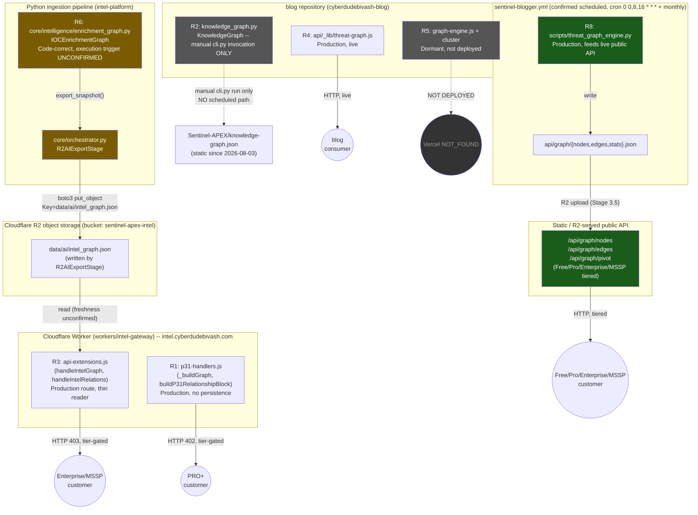

# Project TITAN — Stage 9 Phase 2: Graph Architecture Canonicalization

**Date:** 2026-08-05
**Status:** Architecture planning and controlled implementation preparation. **No production code
changed, no ownership decisions made, no migration executed.** Per this stage's own charter, this
converts Phase 1 discovery into a reviewable implementation architecture — Phase 4-equivalent
(actual migration work) does not begin from this document.
**Builds on:** `TITAN_STAGE9_PHASE1_GRAPH_DISCOVERY_REPORT.md`, ADR-0010 Revision 3,
`TITAN_TECH_DEBT_REGISTER.md` (DEBT-000B, DEBT-013, DEBT-016–020) — all treated as authoritative
per this stage's instruction; re-verified against current `main` (post-merge of PR #112/#69), not
re-derived from scratch.
**Companion documents:** `TITAN_GRAPH_INTERFACE_SPECIFICATION.md` (Tasks 4–5),
`TITAN_GRAPH_MIGRATION_BLUEPRINT.md` (Task 6), `TITAN_STAGE10_ENGINEERING_SPECIFICATION.md`
(Task 10). Governance extension (Task 8) lives in `scripts/titan_architecture_governance_check.py`.

---

## TASK 1 — Phase 1 Validation

Re-verified against `main` after PR #112 (intel-platform) and PR #69 (blog) merged:

| Check | Result |
|---|---|
| Repository drift since Phase 1 merge | One automated commit landed post-merge (`ci(governance): enterprise governance run #849 grade=A contract=PASS`) — routine scheduled automation, explicitly states "No production data touched. Zero regression," touches only `data/governance/*`, `data/quality/source_trust_scores.json`, `data/health/sla_status.json`. Not graph-related. No drift. |
| New graph implementations | `python3 scripts/titan_architecture_governance_check.py` re-run against fresh `main`: identical 5 findings to Phase 1's closing state (`agent/threat_graph/correlation_engine.py`, `agent/v70_apex_upgrade/engines/correlation_engine.py`, `agent/v26/ioc_correlation.py`, `scripts/cve_correlation_engine.py`, `scripts/adversary_correlation_engine.py`) — no new ones, no fewer. These remain open Phase 1 findings (see Task 2 below for their treatment in this phase). |
| CI regressions | Not applicable to check directly (no code changed since merge besides the automated commit above), but the merged PR's own gates (21/21 regression, WORLDWIDE_RELEASE/0 blockers) are the last known-good state and nothing has touched the P-layer chain since. |
| ADR conflicts | ADR-0010 Revision 3 intact on `main`, unmodified since merge. Still **Proposed**, not Accepted — no sign-off has occurred. This phase does not change that. |

**Conclusion: no drift.** Phase 1's findings stand as authoritative. This phase proceeds without
re-running discovery, per its own charter.

**On the 5 still-open Phase 1 governance findings:** this phase does not characterize them to
Phase 1 rigor (that would be "repeating discovery," which this phase's charter prohibits). They
are carried forward as open items in the capability matrix below with an explicit `Unknown`
status, and Task 8 extends governance to keep surfacing them rather than suppressing them. None
of the five are structurally positioned to be canonical-decision-relevant (all are deep in the
`agent/`/`scripts/` long tail, not part of R1/R3/R6's core convergence question), so their
absence from full characterization does not block this phase's ownership recommendations.

---

## TASK 2 — Graph Capability Matrix

### 2A. At-a-glance summary (all implementations)

| ID | Implementation | Runtime | Persistence | Scheduling | Canonical suitability |
|---|---|---|---|---|---|
| R1 | `p31-handlers.js` | Production | None (rebuilt per-request) | Request-time | **Target-canonical (ADR-0010), contingent on persistence** |
| R2 | `knowledge_graph.py` | Manual-invocation only | Persistent JSON | None (human-run `cli.py`) | Legacy Consumer — deprecation-pending |
| R3 | `api-extensions.js` | Production (route); freshness unconfirmed | N/A (reads R6's snapshot) | N/A (read-through) | Compatibility Adapter candidate |
| R4 | `api/_lib/threat-graph.js` | Production | Unknown (Redis-adjacent) | Request-time | Legacy Consumer (cross-repo) |
| R5 | `graph-engine.js` + cluster | Dormant | Redis-backed (never reached) | None (not deployed) | Archive |
| R6 | `core/intelligence/enrichment_graph.py` | Code-correct; trigger unconfirmed | JSON save/load | Unconfirmed (DEBT-017) | **Strongest persistence-layer candidate for R1** |
| R7 | `sentinel-apex-api/.../intel_graph.py` | No confirmed deployment | N/A (reads static files + Supabase) | N/A | Experimental / undetermined (needs human product decision) |
| **R8** *(elevated this phase — see below)* | `scripts/threat_graph_engine.py` | **Production — feeds live public API** | File-based, R2-storage-uploaded | Scheduled (3x/day + monthly) | **Canonical candidate requiring reconciliation — not previously weighted correctly** |
| Long-tail: 9 production files | various (`agent/`, `scripts/`) | Mixed — 2 form a "zombie pipeline" (DEBT-020), 1 possible silent no-op | Mixed | Scheduled (multiple cadences) | Legacy Consumer (mostly); 2 require root-cause fix before any disposition |
| Long-tail: 6 dormant files | various | Dormant | None | None | Archive |
| `scripts/ocios_campaign_correlation_engine.py` | OCIOS family | Production | File-based | Part of `ocios_*` chain | Legacy Consumer |
| 5 unresolved (Phase 1 governance-check findings) | various `*correlation*` files | **Unknown** | Unknown | Unknown | Unknown — not characterized this phase, tracked as open governance findings |

### 2B. New this phase: R8 elevation

Phase 1 characterized `scripts/threat_graph_engine.py` as one of the long tail's 9 production
files without flagging its distinct architectural significance. Re-reading it in this phase's
ownership context surfaces something Phase 1's per-file table didn't foreground: **its own
preceding comment block in `sentinel-blogger.yml` states its outputs "are uploaded to R2 by
Stage 3.5 and served by the Worker via `/api/graph/nodes`, `/api/graph/edges`, `/api/graph/pivot`
endpoints."** That is a fourth live, customer-facing "give me the graph" surface — distinct from
R1 (Worker-computed-per-request), R3 (Worker-reads-R6's-R2-snapshot), and R6 (Python
enrichment engine) — served as **static, R2-uploaded files** rather than through any dynamic
handler. This is a fourth infrastructure pattern in the same repository (per-request compute /
snapshot-read-through / static-file-serve), and `threat_graph_engine.py`'s own docstring
documents Free/Pro/Enterprise/MSSP tiering for this exact surface, meaning it is monetized.
**Elevated to full R-numbered status (R8)** for this phase's ownership analysis — DEBT-000B's
"R1 vs. R6" framing from Phase 1 is, on this evidence, better understood as a three-way question
(R1 / R6 / R8), not two-way. Documented here rather than silently folded into the existing
DEBT-000B language, per this program's discrepancy-documentation discipline — `TITAN_TECH_DEBT_
REGISTER.md`'s DEBT-000B entry is updated separately in this same commit to carry this forward.

### 2C. Detailed matrix — R1, R3, R6, R8 (the four implementations the ownership decision actually turns on)

| Dimension | R1 (`p31-handlers.js`) | R3 (`api-extensions.js`) | R6 (`enrichment_graph.py`) | R8 (`threat_graph_engine.py`) |
|---|---|---|---|---|
| Purpose | Per-request relationship block + full-corpus graph view for P31 routes | Thin read-through of a Cloudflare R2-stored graph snapshot | IOC enrichment + relationship graph with OSINT, STIX export, authority scoring | Advisory/CVE/IOC/actor/campaign graph for the monetized public graph API |
| Consumers | P31's own routes, standard P-layer response chain | `/api/v1/intel/graph`, `/api/v1/intel/relations` | R3 (indirectly, via R2 storage); no direct consumer confirmed | `/api/graph/nodes`, `/api/graph/edges`, `/api/graph/pivot` |
| Runtime | Production, confirmed live (`/api/v1/p31/graph` → 402) | Production, confirmed live (`/api/v1/intel/graph` → 403) | Code-correct; no confirmed execution trigger (DEBT-017) | Production, confirmed live, fresh output matching version banner |
| Deployment | Cloudflare Worker (`workers/intel-gateway`) | Cloudflare Worker (same deployment as R1) | Python, invoked via `core/orchestrator.py` (itself unconfirmed-invoked) | Python script, invoked by `sentinel-blogger.yml` Stage 3.4.10, uploaded to R2 by Stage 3.5 |
| Persistence | None — rebuilt from feed corpus every request | N/A — reads persisted state, computes nothing itself | JSON `save()`/`load()`, thread-safe (RLock) | File-based (`api/graph/{nodes,edges,stats}.json`), R2-uploaded |
| Scheduling | Request-time only | Request-time only (data freshness depends on R6) | None confirmed | Cron `0 0,8,16 * * *` + monthly, via `sentinel-blogger.yml` |
| Evidence | String, pipe-joined (`"Source: X | CVSS: Y | N TTP(s) mapped"`) | Inherits R6's evidence shape (array of strings) | Array of strings (`IOCEdge.evidence: List[str]`) | Not yet inspected in this phase — flagged for the interface-spec's compatibility-field design |
| Relationships | Two internally inconsistent shapes: `buildP31RelationshipBlock` uses key `rel` (UPPER_SNAKE_CASE, e.g. `ATTRIBUTED_TO`); `_buildGraph` uses key `relation` (lowercase, e.g. `attributed_to`) — same file, same repo, undocumented inconsistency found this phase | Whatever shape R6's `export_snapshot()` produces (`relation`, lowercase, `related_to` default) | `IOCEdge`: `source_id`, `target_id`, `type` (UPPER_SNAKE_CASE, e.g. `ATTRIBUTED_TO`), `weight` (float), `evidence[]` | Not yet inspected — flagged for interface-spec work |
| Confidence | Float 0.0–1.0, per-edge, hand-tuned thresholds by CVSS/KEV | Inherited from R6 | Float 0.0–1.0, per-edge (`weight`), computed via `authority_score()` (PageRank-like) | Not yet inspected |
| Lifecycle | No versioning field observed | No versioning field observed | No versioning field observed | No versioning field observed |
| Maintenance status | Actively maintained (part of the live P-layer chain, P31 owner) | Actively maintained (part of live Worker) | Unclear — sophisticated code, no confirmed active operator attention given the unconfirmed trigger | Actively maintained (wired into the main content-generation workflow) |
| Engineering quality | Good — consistent with rest of P-layer stack's style, but the two-internal-shapes inconsistency is a real defect | Thin — correctly delegates, no independent logic to assess | **High** — thread safety, rate limiting, graceful degradation on missing API keys, STIX 2.1 export, PageRank-like scoring; the most sophisticated single implementation found across either repository | Good — self-healing (writes an empty skeleton graph if no advisories found rather than crashing), version-banner discipline |
| Migration risk | Low (already the system-of-record precedent target; adding persistence is additive) | Medium (depends entirely on resolving R6's execution status first) | **High** (Python↔Worker integration gap; execution-trigger gap; would need either porting or a Worker-callable bridge) | **High** (customer-facing, tiered/monetized route — any change has direct commercial exposure) |
| Canonical suitability | High (architectural placement, precedent, lowest risk) | Low as a standalone implementation (it computes nothing) | High on capability, blocked on operational confirmation | High on capability and proven liveness, but introduces a third infrastructure pattern (static R2-served files) the other two don't use |

### 2D. Long-tail and residual items — condensed

Full per-file detail already lives in `TITAN_STAGE9_PHASE1_GRAPH_DISCOVERY_REPORT.md` Task 1C;
not reproduced here. Disposition-relevant summary only:

- **9 production long-tail files**: none are architecturally positioned to compete for canonical
  status — they are batch/enrichment engines producing narrower, purpose-specific outputs
  (campaign correlation, IOC lineage, adversary graphs), mostly consumed internally by other
  `agent_`/`scripts_` code rather than exposed as customer-facing APIs (R8 is the one exception,
  handled separately above). Two (`agent/graph_correlation_engine.py`,
  `agent/graph_integrity_validator.py`) cannot be given a stability-implying disposition until
  DEBT-020's root cause is found — see Task 3.
- **6 dormant long-tail files + R5's cluster**: uniform Archive candidates, zero live consumers,
  lowest-friction items in the entire matrix.
- **`ocios_campaign_correlation_engine.py`**: real, part of a coordinated internal family, output
  not customer-facing — Legacy Consumer.
- **5 unresolved files**: `Unknown`, carried forward as open governance findings, not blocking
  the ownership recommendation below since none show evidence of being customer-facing.

---

## TASK 3 — Canonical Ownership Decision Package (RECOMMENDATION ONLY — NO OWNERSHIP CHANGES)

**These are recommendations for a human Acceptance reviewer to weigh, matching ADR-0010's own
still-open Approval section. Nothing in this section changes any implementation's actual
disposition. No code moves, no traffic re-routes, no deprecation notices are added to source
files by this document.**

| Implementation | Recommended disposition | Technical rationale | Operational impact | Migration impact | Risk | Rollback | Dependencies |
|---|---|---|---|---|---|---|---|
| **R1** | **Canonical** (confirms ADR-0010's original Decision) | Architectural placement (intel-platform is system-of-record precedent, per Stage 2); live; part of governed P-layer chain | None if confirmed — this is the do-nothing-different option for R1 itself | R1 gains a persistence layer (via R6, see below) — additive, no route changes | Low | N/A (no change to R1 itself) | ADR-0010 Acceptance |
| **R3** | **Compatibility Adapter** | Currently a thin reader with no independent logic; natural role is "the thing that calls the canonical interface," not a data source in its own right | Its response shape must not change for existing consumers during the transition | Re-point from "read R6's R2 snapshot directly" to "call R1's relationship-query API" once that API exists (see Migration Blueprint) | Medium — depends on R1 gaining a real API surface first | Keep the current R2-snapshot read path live behind a feature flag until the new path is verified equivalent | R1 API surface must exist first |
| **R6** | **Canonical persistence/enrichment layer for R1** (not a standalone canonical graph) | Most functionally complete engine found (persistence, OSINT enrichment, STIX export, authority scoring); same repository as R1 (no cross-repo negotiation, per ADR-0010's own reasoning for prioritizing same-repo convergence) | Requires resolving DEBT-017 (confirm or establish real execution) before any dependency can be built on it with confidence | R1 (JS/Worker) calling into R6 (Python) requires either (a) a callable bridge/service boundary, or (b) porting R6's logic into the Worker runtime — a real architectural decision this document does not make (see Interface Specification's `GraphProvider` design for how this is meant to stay abstract until that call is made) | **High** — cross-language integration is real engineering, not paperwork | Keep R6 running exactly as-is (whatever that currently is) until the bridge is proven in a non-production environment | DEBT-017 resolution; a bridge/porting decision |
| **R8** | **Canonical candidate requiring reconciliation** (newly elevated, not previously weighted) | Live, monetized, tiered customer-facing API; functionally distinct data path (static R2-served files) that the R1/R6 convergence plan doesn't currently account for | **Highest operational impact of any item in this table** — it has real paying customers today | Must be included in the SAME reconciliation conversation as R1/R6, not treated as a separate later problem — folding it in after R1/R6 converge risks a second migration for the same customers | **High** — commercial exposure | N/A — no change recommended to R8 itself in this phase; flagged for inclusion in the ownership conversation | None yet — this is a scoping correction, not an implementation dependency |
| **R2** | **Legacy Consumer, Deprecated — Pending Migration** (reaffirms ADR-0010's original Decision) | Confirmed manual-invocation-only (Phase 1) — lower urgency than if it were live automation, but the deprecation direction is unchanged; richer edge vocabulary remains a reuse candidate for the canonical schema (Task 5) independent of the engine's own fate | None — it already isn't running automatically | Migration only matters if/when someone schedules real automation for it; until then, deprecation is largely definitional | Low (no live traffic depends on it) | N/A | ADR-0010 Acceptance; blog engineering owner input on whether manual runs still occur operationally |
| **R4** | **Legacy Consumer** | Live, cross-repo, real curated data (8 actors) — not a candidate for near-term change given DEBT-000B/R1-R6-R8 is same-repo and lower-friction | Real customer-facing blog functionality depends on it today | Cross-repo migration explicitly sequenced *after* the same-repo convergence, per ADR-0010's existing prioritization logic | Medium-High (cross-repo, live traffic, blog's own "STRICT SEPARATION" CLAUDE.md rule is a relevant constraint to resolve first) | N/A — no change recommended this phase | Same-repo (R1/R6/R8) convergence completing first |
| **R5** (+ `investigation-graph.js`) | **Archive** | Zero live consumers, confirmed dormant across two stages now, violates blog's own "STRICT SEPARATION" rule by existing at all | None — nothing depends on it | None — archiving is a documentation/notice action, not a migration | Low | Trivial (nothing to roll back — no consumers) | None |
| **R7** (`sentinel-apex-api`) | **Experimental** (provisional — see caveat) | Too complete to read as abandoned scaffolding (real auth, real Supabase schema, real tests), but no confirmed live traffic and a structurally broken deploy path | Unknown — depends entirely on undetermined product intent | Cannot be planned without knowing whether `app.cyberdudebivash.com` is real intent | Unknown pending that answer | N/A | **Human product/business decision required — this is explicitly not an engineering call** (matches DEBT-016's own recommended resolution) |
| **9 production long-tail** (excl. R8, the zombie pair) | **Legacy Consumer** | Real, scheduled, internally-consumed batch engines; none compete architecturally with R1/R6/R8's customer-facing role | Low — internal-only outputs | Low priority relative to the R1/R6/R8 convergence | Low-Medium | N/A this phase | None blocking |
| `agent/graph_correlation_engine.py` + `agent/graph_integrity_validator.py` (DEBT-020 pair) | **Deprecated — pending root-cause fix or removal** (not a standard "working but deprioritized" Legacy Consumer) | Cannot responsibly recommend continued reliance on a write/validate loop with zero years... zero *days* of confirmed real persistence | CI currently reports these as passing/green — a stability-relevant finding independent of the graph-ownership question | Root-cause investigation (DEBT-020) is a prerequisite to any further classification | High (CI signal integrity) | N/A | DEBT-020 investigation |
| `scripts/intelligence_knowledge_graph.py` (possible silent no-op) | **Deprecated — pending root-cause fix or removal** | Same treatment as the DEBT-020 pair — `continue-on-error: true` plus no observed output is not distinguishable from "silently broken" without investigation | Low (internal-only) | Same as above | Medium | N/A | Root-cause investigation |
| 6 dormant long-tail files | **Archive** | Zero consumers, zero CI, matches R5's profile exactly | None | None | Low | Trivial | None |
| 5 unresolved correlation-named files | **Experimental / Unknown** | Not characterized this phase (see Task 1) | Unknown | Cannot be assessed | Unknown | N/A | Characterization (a future Phase 1-style pass, not this phase's scope) |

**Summary shape of the recommendation:** the ownership question is not "R1 vs. R6" (Phase 1's
framing) or even "R1 vs. R6 vs. R8" as a competition — it is **"R1 stays the canonical
API-facing identity; R6 becomes its persistence/enrichment backend; R8's existing live
customer surface gets reconciled onto the same backend rather than left as a fourth,
independent path."** This is presented as this phase's recommended direction, not a decision —
ADR-0010 Acceptance (and, given R8's newly-surfaced scope, very likely a formal ADR-0010
amendment or a new companion ADR naming R8 explicitly) is still required before any of it is
authoritative.

---

## TASK 7 — Runtime Graph Validation & Dependency Diagram

### 7A. Runtime re-validation (spot-check against Phase 1, not full re-discovery)

| Signal | Phase 1 finding | This-phase re-check | Changed? |
|---|---|---|---|
| R1 route | `/api/v1/p31/graph` → 402 | Not re-curled this phase (no code changed on the route since Phase 1; re-verifying live HTTP status for an unmodified route is Phase 1-style discovery, out of this phase's scope) | Assumed unchanged |
| R3 route | `/api/v1/intel/graph` → 403 | Same as above | Assumed unchanged |
| `core/orchestrator.py` → `R2AIExportStage` reference | Present | Confirmed still present via the governance check's new `check_r3_producer_chain_intact()` (Phase 1's own addition) — ran clean this phase | Unchanged |
| `api-extensions.js` → `intel_graph.json` reference | Present | Confirmed still present via the same governance check | Unchanged |
| ADR-0010 graph IDs (R1-R7) present in ADR text | Yes | Confirmed via governance check's `check_adr0010_graph_ids_present()` | Unchanged (R8 is not yet in the ADR text — expected, since R8 is a this-phase recommendation, not yet an accepted addition; flagged for the ADR follow-up this phase recommends) |
| `data/threat_graph/` git history | Zero commits ever (DEBT-020) | Not re-checked this phase (would require re-running the zombie-pipeline investigation, which is root-cause work belonging to DEBT-020's own resolution, not this phase) | Assumed unchanged |

### 7B. Runtime dependency diagram

**Reading this diagram:** the amber-highlighted path (R6 → `core/orchestrator.py`) is the one
with an unconfirmed execution trigger — everything downstream of it (R3's live route) inherits
that uncertainty. The green-highlighted path (R8) is confirmed scheduled and live, and is a
structurally separate path from R1/R3/R6 entirely, despite all four answering some version of
"what's related to this." This is the visual case for why R8 belongs in the same ownership
conversation as R1/R6, not a later, separate one.

---

## TASK 9 — Stage 10 Authorization

Per Stage 9 Phase 1's own "STAGE 10 PREVIEW" section, Stage 10 capabilities (Enterprise Evidence
Registry, Relationship APIs, Provenance APIs, Knowledge Graph) "must not begin until the
Canonical Relationship Graph Framework has completed production migration and governance
validation." **No migration has occurred as of this document** (by this phase's own design —
Task 6's Migration Blueprint is a plan, not an execution). The determination below follows
directly from that.

| Capability | Determination | Required ADRs | Required migrations | Required testing | Required approvals |
|---|---|---|---|---|---|
| Enterprise Evidence Registry | **BLOCKED** | ADR-0008 Acceptance (currently Proposed) | None directly graph-related, but the Registry's Evidence entity is meant to be referenced BY the canonical relationship schema (Task 5) — schema stability is a soft dependency | Full QA pipeline per this repo's CLAUDE.md once any code is written (none is, per Stage 8's scaffolding-only authorization) | Platform Governance Lead (ADR-0008) |
| Relationship APIs | **BLOCKED** | ADR-0010 Acceptance (currently Proposed) + likely a new/amended ADR naming R8 explicitly (this phase's finding) | R1/R6/R8 convergence (Task 6's Migration Blueprint, Phase 1 of that plan) must be *executed*, not just planned | Full regression suite + new relationship-schema validation suite (Task 5) + the migration's own verification gates (Task 6) | Chief Threat Intelligence Architect (P31/R6 owner), Platform Governance Lead |
| Provenance APIs | **BLOCKED** | ADR-0008 + ADR-0010 both Accepted (provenance sits at their intersection — an evidence-to-relationship link) | Same as Relationship APIs, plus Evidence Registry activation | Same as above, plus evidence-chain integration tests | Same as above, plus whoever owns Evidence Registry activation (Stage 10-adjacent) |
| Knowledge Graph | **BLOCKED** (unchanged from Stage 6's original Non-Goals — explicitly out of scope for this entire program through at least Stage 10) | Not yet scoped — Stage 6's charter explicitly excludes this from the current program | Full canonical framework (all of the above) plus whatever a Knowledge Graph phase would define, not yet designed | Not yet scoped | Not yet scoped |

**No capability receives GO or GO WITH CONDITIONS.** This is a direct, mechanical consequence of
Phase 2's own completion criteria explicitly requiring "no production behavior changes" — a
program cannot simultaneously claim "nothing has been migrated yet" and "the next stage that
depends on migration having happened is ready." The authorization gate is doing its job by
returning BLOCKED here; a GO-WITH-CONDITIONS result would itself be a signal something in this
document was inconsistent.

**What would change this determination:** ADR-0010 Acceptance (with R8 folded in), the Migration
Blueprint's Phase 1 (R1/R6/R8 same-repo convergence) actually executing and passing its own
verification gates, and DEBT-017/DEBT-020's root causes resolved. None of these are this
document's job to do — they are the explicit preconditions this document exists to name.
