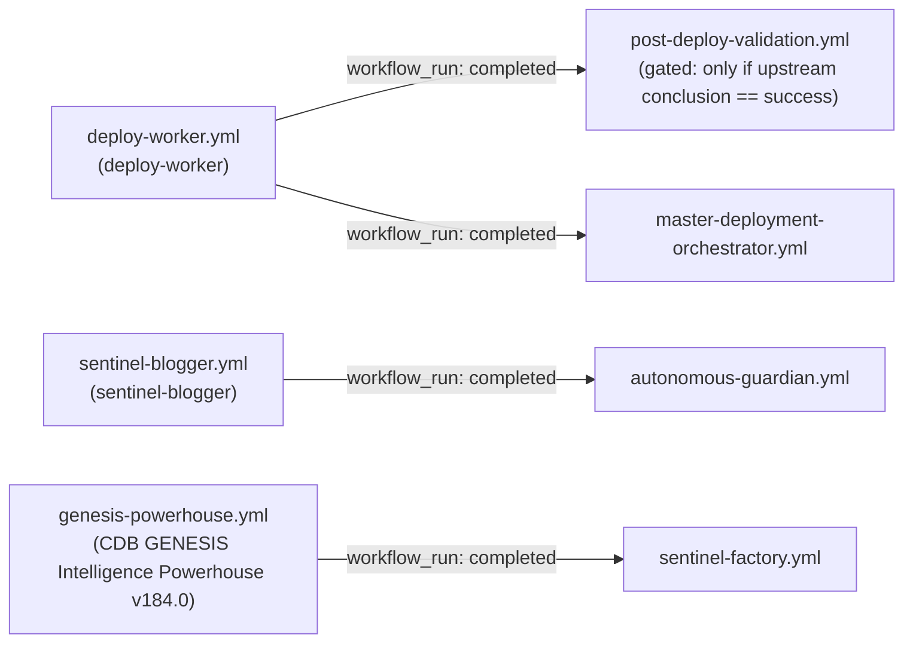
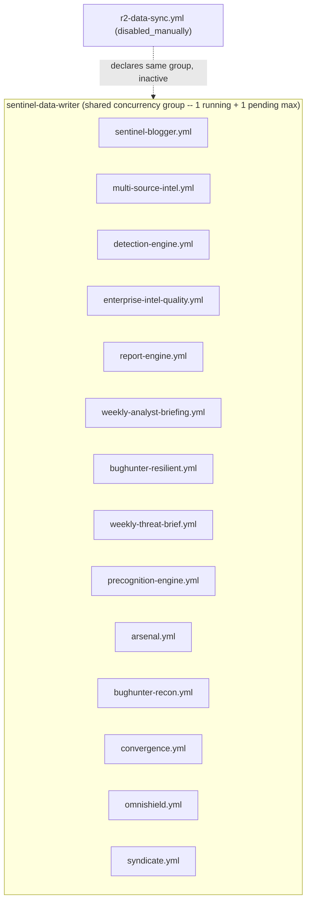

# Workflow Dependency Graph

**Program:** Enterprise Release Readiness Program — Phase 5
**Scope:** Every cross-workflow trigger relationship (`workflow_run`, `repository_dispatch`) and every
shared-concurrency-group coupling among the 55 repository-committed workflows.
**Method:** `workflow_run.workflows: [...]` values extracted verbatim and cross-checked against the actual
`name:` field of the referenced workflow (via the GitHub API, not assumed from filename) to confirm each
chain actually resolves — a wrong `name:` string is a silent, non-erroring misconfiguration in GitHub
Actions, so this check matters. All four found chains resolve correctly.

---

## 1. Direct trigger chains (`workflow_run`)

Only four workflows are triggered by another workflow's completion. All four were verified to reference the
upstream workflow's real `name:` field correctly:

| Upstream | Downstream | Trigger condition | Notes |
|---|---|---|---|
| `deploy-worker.yml` | `post-deploy-validation.yml` | `types: [completed]`, gated by `if: github.event_name == 'workflow_dispatch' \|\| github.event.workflow_run.conclusion == 'success'` | Explicitly does **not** run post-deploy checks against a failed deploy — correct fail-safe design. Both files carry a "v184.0 FIX: corrected workflow name" comment noting this chain was previously broken (wrong `name:` string) and was fixed; current state re-verified correct by this review, not just trusted from the comment. |
| `deploy-worker.yml` | `master-deployment-orchestrator.yml` | `types: [completed]` (no success-only gate found in the trigger block itself — the orchestrator's own jobs, e.g. `deployment-integrity`, `sla-evaluation`, presumably branch internally on conclusion, not verified in this pass) | Same "v184.0 FIX" precedent as above; also re-verified correct. |
| `sentinel-blogger.yml` | `autonomous-guardian.yml` | `types: [completed]` | In-file comment: "sync-dashboard removed — it is DISABLED (merged into sentinel-blogger). Only sentinel-blogger triggers guardian post-run checks" — confirms this chain was deliberately simplified from a previously-wider set of upstream triggers. |
| `genesis-powerhouse.yml` | `sentinel-factory.yml` | `types: [completed]` | No success-only gate found in the trigger block; not further verified in this pass. |

**Fan-out point:** `deploy-worker.yml` is the only workflow with two independent downstream consumers
(`post-deploy-validation.yml` and `master-deployment-orchestrator.yml`), both firing in parallel on the same
completion event. They run in different concurrency groups (`sentinel-post-deploy-validation` and
`sentinel-production` respectively — see `WORKFLOW_CONCURRENCY_REVIEW.md` §4), so this fan-out carries no
collision risk; it is two independent consumers of one event, not a race.

**No chain longer than two hops was found.** None of the four downstream workflows
(`post-deploy-validation`, `master-deployment-orchestrator`, `autonomous-guardian`, `sentinel-factory`)
themselves trigger any further `workflow_run` consumer — each chain terminates after one hop.

## 2. External triggers (`repository_dispatch`)

One workflow accepts an external, non-GitHub-Actions trigger:

| Workflow | Event types | Source |
|---|---|---|
| `revenue-orchestrator.yml` | `gumroad_purchase`, `stripe_subscription_update` | External webhook (Gumroad / Stripe), dispatched via the GitHub API from outside the Actions system entirely — not traceable further within this repository's own workflow graph. |

This is the platform's only external-system entry point into the workflow graph and therefore its only
customer-purchase-triggered automation path — see `WORKFLOW_INVENTORY.md` for its full permissions/secrets
profile given its direct line to revenue fulfillment.

## 3. The dominant coupling: shared concurrency, not shared triggers

The `workflow_run` graph above is sparse (4 edges). The **real** dependency structure in this platform is
the shared-concurrency-group coupling documented in full in `WORKFLOW_CONCURRENCY_REVIEW.md`: 14 active
workflows implicitly serialize behind the single `sentinel-data-writer` group even though none of them
triggers another via `workflow_run`. This is an *implicit* dependency — each member's effective start time
depends on whichever other member is currently occupying the group — and it is the one this program's
Phase 3/4 work identified as the platform's most consequential structural coupling:

## 4. Secondary coupling: shared secrets (informational only, not a graph edge)

Several secrets are consumed by many otherwise-unrelated workflows — `CDB_JWT_SECRET` (24 workflows,
verified by exact grep count, not estimated), `GITHUB_TOKEN` (implicit/automatic, most workflows), the
`CF_R2_*` / `CF_ACCOUNT_ID` family (8 workflows), `TELEGRAM_BOT_TOKEN`/`TELEGRAM_CHAT_ID` (9 workflows). This is **not** a run-time dependency (rotating one
of these secrets does not create an ordering constraint the way a `workflow_run` or concurrency group
does), but it is a blast-radius fact worth recording here rather than nowhere: a single secret rotation or
revocation event has a wide simultaneous impact surface across the graph. Full per-workflow secret lists
are in `WORKFLOW_INVENTORY.md`; this section exists only to flag that the *coupling* is real even though it
is not depicted in the graphs above.

## 5. What this graph does not include

Reusable workflows (`workflow_call`) — none were found anywhere in the 55 files; this platform does not use
composite/reusable workflow YAML, only composite *actions* referenced via `uses:` at the step level (e.g.
`docker/build-push-action`, `github/codeql-action/upload-sarif`), which is a different mechanism and not a
workflow-to-workflow dependency. This was confirmed by the same `grep` sweep that found the four
`workflow_run` chains and the one `repository_dispatch` consumer — `workflow_call:` produced zero matches
across all 55 files.
