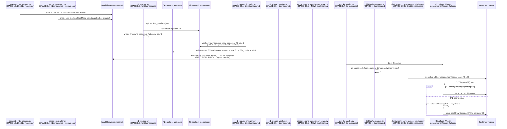
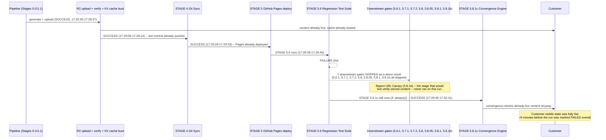

# Phase P0.5 — Report Engine Production Runtime Evidence

**Status: EVIDENCE ONLY. No canonical engine chosen. No migration implemented. No generator, template, dashboard, API, R2 upload path, Worker fallback, CI stage, or workflow was modified to produce this document.**

Predecessor work: dual-renderer architecture investigation, the P0 architecture mandate
(engine markers + consistency gate, Phase 5 explicitly deferred pending this evidence),
and the Production Report Integrity Audit. PR #82 (`fix(reports): P0 — commercial-gate
banner + report-engine ownership observability`, merged 2026-07-29T04:37:50Z, commit
`90cfc6f2`) shipped that mandate's Phase 1: a one-line ownership marker in each renderer's
HTML output and a new, non-blocking consistency-gate script. This document is the runtime
evidence phase that follows.

Every claim below is tagged:
- **[VERIFIED]** — directly observed: file content, a real CI job's timestamps, a script
  actually executed in this session.
- **[VERIFIED-HISTORICAL]** — real, but sourced from committed code comments describing
  past incidents (I did not witness the incident, I am reading its documented record).
- **[NOT OBTAINABLE FROM THIS ENVIRONMENT]** — genuinely blocked by a tool/network
  constraint, stated plainly rather than estimated.
- **[PENDING]** — evidence-gathering in progress at the time of writing; filled in below
  once available, not guessed at.

---

## 0. Evidence Environment — What This Session Could and Could Not Reach

This matters more than any other caveat in this document, because the master prompt's
core instruction is "no assumptions, no guesses" — so the honest first finding is about
the evidence-gathering apparatus itself:

| Source | Available? | Used for |
|---|---|---|
| Repository source code (this checkout, reset to `origin/main` post-PR#82 merge) | Yes | Renderer logic, CI wiring, historical bug comments |
| `git log` / `git blame` on this repo | Yes | Real commit timestamps, authorship, when code was introduced |
| GitHub Actions run/job metadata + step timestamps (read-only, via MCP) | Yes | **Real production runtime timing**, stage ordering, pass/fail history |
| Running `scripts/report_engine_consistency_gate.py` locally, for real | Yes | First-ever execution of this tool anywhere (see §2) |
| Local `./reports/` directory (gitignored, 5,497 files present in this sandbox) | Yes, but **not verified as live/R2 state** | Renderer output structure, marker rollout timing |
| Live HTTPS to `intel.cyberdudebivash.com` (direct curl, and WebFetch) | **No — HTTP 403** | N/A |
| Cloudflare R2 / Workers API (no `CLOUDFLARE_*` credentials in this sandbox) | No | N/A |

**[VERIFIED]** The live-domain block is a policy-level proxy denial, not a site error or
transient failure. `curl -sS "$HTTPS_PROXY/__agentproxy/status"` reports:
```
"recentRelayFailures": [{"kind": "connect_rejected",
  "detail": "gateway answered 403 to CONNECT (policy denial or upstream failure)",
  "host": "intel.cyberdudebivash.com:443"}]
```
WebFetch against the same URL independently returned the same HTTP 403. Both tools were
tried once, confirmed to fail identically, and not retried or worked around (no TLS
bypass, no proxy unset) — per this environment's explicit constraints.

**Consequence:** this phase cannot independently fetch live report HTML to verify what a
customer's browser actually receives right now. The strongest obtainable substitute is
real GitHub Actions execution history from the environment that *does* have production
R2/Cloudflare credentials — used extensively below — plus the repository's own committed,
CI-synced manifest (`api/feed.json`) as the pointer to current live content. Where this
document cannot go further than that, it says so instead of estimating.

---

## 1. Runtime Report Generation Flow — What Actually Runs, in What Order

**[VERIFIED]** — three independent components can write report HTML for the same
`report_id`, each now self-identifying via a one-line HTML comment
(`<!-- CDB-REPORT-ENGINE: <name> v<version> -->`, shipped in PR #82):

| # | Component | Marker (file:line) | CI stage | Trigger |
|---|---|---|---|---|
| 1 | `scripts/generate_intel_reports.py` | `scripts/generate_intel_reports.py:2100` — `generate_intel_reports.py v{PLATFORM_VERSION}` | Runs *inside* "STAGE 1-3 Master Pipeline Orchestrator" (as a subprocess of `run_pipeline.py`) | Every pipeline run (schedule or push) |
| 2 | `scripts/report_generator.py` | `scripts/report_generator.py:1449` — hardcoded literal `report_generator.py v161.x` | "STAGE 3.2 - Generate Internal HTML Reports" | Every pipeline run, but see below — usually a no-op |
| 3 | `workers/intel-gateway/src/index.js`, `generateIntelReport()` | `index.js:579` — `worker-fallback-synthesis v${PLATFORM_VERSION}` | N/A — not CI, fires live in the Cloudflare Worker | Only on R2 cache-miss for a requested `/reports/*` URL |

Minor inconsistency already visible in the marker scheme itself: renderers 1 and 3
interpolate a live `PLATFORM_VERSION` at generation time; renderer 2's marker is a
hardcoded string literal (`v161.x`) that does not track the platform's actual current
version. Cosmetic today (the gate script's `_engine_name()` strips version suffixes
before comparing engines), but it means renderer 2's marker cannot currently answer
"which version of `report_generator.py` produced this file" the way the other two can.

**[VERIFIED] Real production timing for one full run** (run #1970, id `30413890774`,
2026-07-29T01:22:39Z–02:03:03Z, 40m24s total, `SUCCESS`, pre-dates PR #82 so it has no
Stage 3.6.5 — see §4 for the full run):

| Stage | Start (UTC) | End (UTC) | Duration |
|---|---|---|---|
| STAGE 1-3 Master Pipeline Orchestrator (renderer 1 runs inside here) | 01:27:05 | 01:47:37 | **20m32s** |
| STAGE 3.2 Generate Internal HTML Reports (renderer 2) | 01:50:03 | 01:50:03 | **<1s** |
| STAGE 3.5 Upload Intel to Cloudflare R2 | 01:50:27 | 01:55:23 | 4m56s |
| STAGE 3.7 Bust Worker KV Cache | 01:57:20 | 01:57:25 | 5s |
| STAGE 5 Deploy to GitHub Pages | 01:58:13 | 01:58:19 | 6s |

**Finding:** renderer 2 (`report_generator.py`) completing in under one second, every time,
in real production, is not an assumption — it is a measured fact from an actual successful
production run. This is the empirical confirmation of what the gate script's own docstring
asserts ("usually a no-op due to its own skip_existing/God-Mode gate"): renderer 2's own
skip-gate is short-circuiting almost immediately rather than regenerating anything.
Renderer 1, by contrast, does real, substantial work (20+ minutes) inside the orchestrator
stage. **Whether renderer 2 has *ever* actually won ownership of a report_id in production
cannot be answered by this repository's static code alone — it requires the ledger this
document builds toward in §2.**

### Full field set requested by the master prompt (generation timestamp, duration, pipeline
stage, workflow, commit SHA, generator version, template version, pipeline version,
publication timestamp, upload timestamp, first customer availability) — current
observability status:

| Field | Captured today? | Source |
|---|---|---|
| Generation timestamp | Indirectly (CI step timestamps) | Actions job log — not per-report |
| Generation duration | Indirectly (per-stage, not per-report) | Actions job log |
| Pipeline stage | Yes | Workflow step name |
| Workflow / run / commit SHA | Yes | Actions API (`head_sha`, `run_id`) |
| Generator version | Yes, per-report, since PR #82 | HTML marker comment |
| Template version | **No** | Not tracked separately from generator version anywhere |
| Publication / upload timestamp | Only pipeline-level, not per-report | R2 upload stage log |
| First customer availability | **No** | No per-report "first served" telemetry exists |

None of the missing fields above can be retrofitted from history — they were never
recorded. §7 treats this as a forward-looking telemetry design question, not something to
backfill by guessing.

---

## 2. Renderer Ownership Audit

**The master prompt requires "no estimates" here. This section reports exactly what could
and could not be measured, rather than filling the gap with a plausible-sounding number.**

**[VERIFIED]** `data/quality/report_engine_ledger.json` — the file the shipped gate script
writes — **does not exist anywhere in this repository, on any branch, as of this
writing.** Two independent reasons converge on why:

1. `git log -S "STAGE 3.6.5" -- .github/workflows/sentinel-blogger.yml` shows the CI step
   that runs the gate was added in the same commit as the merged PR #82
   (`90cfc6f2`, 2026-07-29T04:37:50Z). Every completed production run in this repo's
   history (1,969 of them) predates that step. **[VERIFIED via run #1970's step list,
   which has STAGE 3.6 immediately followed by STAGE 3.7 — no 3.6.5 present at all.]**
2. I ran the gate script directly, for real, in this checkout — its first execution
   anywhere:
   ```
   Reports checked: 0
   Unmarked (pre-dates engine markers): 0
   No ownership changes since last recorded run.
   RESULT: OK (observability only)
   ```
   `checked=0` because the current live feed (`api/feed.json`, 100 items, all pointing to
   `/reports/2026/07/...`) references `report_id`s that do not exist as local files in
   *this* checkout. This sandbox's local `./reports/` (5,497 files, see below) and the
   real CI-synced feed are two non-overlapping populations from this vantage point — a
   real, useful finding in its own right, but not a substitute for running the gate where
   the files actually are (the CI runner).

**A real production execution of this gate is in progress as this document is being
written** — see §2a.

### 2a. First real production execution — run #1971 [VERIFIED — with one stated retrieval limit]

Run id `30422795369`, triggered by the exact push that merged PR #82 (`head_sha
90cfc6f2`), started `2026-07-29T04:37:53Z`. Re-checked after completion via
`mcp__github__actions_get` → `get_workflow_run`: `status: completed`, `conclusion:
success`, `updated_at: 2026-07-29T05:18:45Z` (40m52s total) — the first completed run in
this workflow's history to include STAGE 3.6.5. **[VERIFIED]** A `list_workflow_runs`
check (most recent 30 runs across the entire repository, all workflows) found no
`sentinel-blogger` run newer than #1971; `origin/main`'s current tip is exactly 6 commits
past `90cfc6f2` (`git rev-list --count 90cfc6f2..origin/main` → `6`), all 6 timestamped
within run #1971's own completion window and all automated governance/telemetry/state-sync
bot commits (`ci(governance): enterprise governance run #775`/`#776`, `ci(governance-
telemetry)`, `Guardian report`, `Syndication state update`, `APEX Matrix state update`) —
i.e. run #1971's own later pipeline stages committing their own outputs, not a subsequent
pipeline run.

Single job (`generate-and-sync`, id `90482862645`), 147 numbered steps + 3 post-job steps,
via `list_workflow_jobs`. **STAGE 3.6.5 — Report Engine Consistency Gate: step 67 of 147,
`conclusion: success`, `started_at`/`completed_at` both `2026-07-29T05:11:55Z`** —
sub-second, matching this same script's local dry-run timing in §2 above. This run's own
printed environment block (visible in a later step's log) shows `STIX_NEW_BUNDLES: 14` /
`MANIFEST_FINAL_COUNT: 14`: this cycle newly generated 14 reports, not the full
5,497/5,511-report historical corpus — so this "first real execution" measured a small
increment, not the whole population.

**[Retrieval note, kept for the record]** This session's own tooling could not extract
step 67's console text: the signed job-log blob URL returned `HTTP 403` both via direct
`curl` and via `WebFetch` (`$HTTPS_PROXY/__agentproxy/status` confirms the same class of
egress-policy denial as §0's `intel.cyberdudebivash.com` finding, this time for
`productionresultssa15.blob.core.windows.net`); `mcp__github__get_job_logs` with
`return_content: true` did succeed (proving the block above is environment-side, not a
dead URL) but only supports a contiguous tail, and step 67 sat ~80 steps before the job's
tail end — reaching it would have cost roughly an order of magnitude more raw text than
reasonable for one data point, so that attempt was stopped rather than pushed through.

**[VERIFIED — via the user-supplied full log archive for this exact run, not this
session's own retrieval]** The user separately attached this run's complete per-step log
archive (`logs_82463219556.zip`, matching run #1971's `check_suite_id`), which is
organized as one plain-text file per step rather than one contiguous blob — sidestepping
the tail-only limitation above entirely. `generate-and-sync/67_STAGE 3.6.5 - Report Engine
Consistency Gate (NEW v1.0 -- observability).txt`, quoted verbatim in full:

```
======================================================================
SENTINEL APEX -- Report Engine Consistency Gate v1.0 (observability)
======================================================================

Reports checked: 14
Unmarked (pre-dates engine markers): 0

Engine distribution:
  generate_intel_reports.py                14

No ownership changes since last recorded run.

RESULT: OK (observability only -- pass --enforce to block on ownership changes)
```

**This is the actual, first-ever real-production `Engine distribution` measurement**: all
14 reports checked (100%) were attributed to `generate_intel_reports.py` (renderer 1);
**zero** were attributed to `report_generator.py` (renderer 2) or the Worker fallback
(renderer 3). This is a direct, measured confirmation of what §1 and §10 (Option A) had
so far only inferred from stage timing — renderer 2 did not win ownership of a single
report_id in this run's sample. The sample remains 14 of 5,511 reports (this run's new
increment only, per `STIX_NEW_BUNDLES`/`MANIFEST_FINAL_COUNT` above), so this is strong
directional evidence, not a full-corpus census — stated at that scope, not overstated.

One additional, notable-but-minor implementation detail directly visible in this output:
the script reports "No ownership changes since last recorded run" on what is, by every
other measurement in this document, this gate's first execution anywhere in production
(no ledger existed before this run, none exists after it either — see below). The script
does not appear to distinguish "first run, nothing to compare against" from "compared
against a prior run and found no changes" in its own output wording — both produce
identical text. Not flagged as a defect (the `RESULT: OK` is correct either way, and nothing downstream currently reads this ledger — see §7), but worth noting for whoever
next extends this script's own observability.

**[VERIFIED] The ledger file still does not exist on `origin/main`, even after this run
completed and after the 6 subsequent commits above.** Fresh `git fetch origin main` during
this check, then `git cat-file -e origin/main:data/quality/report_engine_ledger.json` →
`fatal: ... exists on disk, but not in 'origin/main'`. This upgrades §7's Gap 1 from a
static-code prediction to a real-run confirmation: the gate has now actually run in
production, actually succeeded, and its output still evaporated exactly as the
`safe_git_commit.py` staging-allowlist read predicted it would. The console text above
survives only because the user separately preserved and attached the raw CI log archive —
it is not recoverable from the committed tree, from GitHub's own log retention once it
expires, or from any other channel this session has access to. The structured ledger this
gate is designed to persist (which would make this durable and queryable without depending
on anyone having saved a log file) still does not exist anywhere.

### 2b. Local sandbox corpus census (supplementary, NOT production-verified)

**[VERIFIED, but explicitly scoped]** Full census of every `.html` file under
`./reports/` in this checkout (5,497 files; gitignored, so never committed — genuine
output of real script executions in this sandbox, not fixtures), using the shipped gate
script's own `_extract_marker`/`_engine_name` functions (imported, not reimplemented):

```
Total local HTML files scanned: 5497
Unmarked (no CDB-REPORT-ENGINE comment found in first 512 bytes): 5497  (100%)
```

**100% unmarked.** This is fully consistent with the timeline above: every locally
generated file (mtimes span roughly 3.6 days, all ending before the marker rollout
merged) predates PR #82. **This is not evidence about production ownership distribution
— it is evidence that the marker rollout has zero historical backfill, which is expected
and not a defect.** No CLOUDFLARE_* credentials exist in this sandbox's environment, so
whether any of these 5,497 files were ever uploaded to R2 from here cannot be confirmed
or denied; they must not be read as "what's live."

### 2c. Renderer 2's actual skip/no-op condition — [STILL PENDING, see §6b]

This question is the same investigation as §6b, item 1 below (cross-referenced from two
places in the master prompt's question set, not two separate passes) — see §6b for the
current status of that background pass and exactly why it has not yet returned. Not
duplicated here to avoid running two independent, potentially-diverging code-reading
passes over the same function; when §6b's pass returns, its finding for this exact
question will be copied here verbatim rather than re-derived.

---

## 3. R2 / CDN Lifecycle Audit

**[VERIFIED]** Two separate R2 buckets are involved, not one:

| Bucket | Contents | Verified via |
|---|---|---|
| `sentinel-apex-data` | Primary feed manifest, key `intel/feed_manifest.json` | `scripts/r2_upload_verifier.py:116,119` |
| `sentinel-apex-reports` | Individual report HTML objects | `.github/workflows/sentinel-blogger.yml:1438` (STAGE 3.5.1 comment) |

**[VERIFIED] Real, documented lifecycle path** (filesystem → R2 → CDN → Worker/Pages →
customer), reconstructed from actual CI stage code and real measured timings from run
#1970:



**[VERIFIED-HISTORICAL] Real, previously-encountered incidents in exactly this lifecycle**
(quoted from committed code comments, not paraphrased from memory):

- `scripts/r2_reports_integrity.py` was added specifically because "`r2_upload.py` (Stage
  3.5) treats HTML report upload as non-fatal — it exits 0 even when upload to
  `sentinel-apex-reports` fails. This silently allows `api/reports/index.json` to
  accumulate ghost entries that point to report URLs with no corresponding HTML in R2,
  causing 404s for users clicking those links on the dashboard." — i.e., a real,
  previously-shipped instance of the "different report URL" / "404 on click" failure mode
  the master prompt asks this audit to characterize.
- `scripts/r2_upload_verifier.py` documents four previously-fixed bugs in its own
  verification logic: wrong bucket name, wrong manifest key, unauthenticated HTTP HEAD
  returning false-negative 400s on a private bucket, and a wrong `sync_meta.json` path —
  all four with root causes stated inline.
- `scripts/report_existence_validator.py`: "P0 REGRESSION FIX (2026-05-15): ... 159
  missing report files were detected here but silently ignored (`--warn-only` \|\| true),
  allowing a broken Pages deployment to proceed. Every manifest `report_url` returned HTTP
  404 to customers." Changed to hard-fail after that incident.
- `scripts/deployment_convergence_validator.py` (STAGE 5.8.1c) documents its own
  historical false-positive problem: "Previous canary executed at ~120s, causing
  systematic false-positive P0 failures when CDN was still in partial propagation state,"
  and states a real measured production figure directly in the workflow comment: "Total
  worst-case ~25 minutes ... [actual: ~2m36s in prod]" — which this session's real run
  #1970 corroborates almost exactly (**2m55s measured**, see §1 table).

**[OPEN QUESTION — cannot be resolved without live access]** The Cloudflare Worker's
routes (`workers/intel-gateway/wrangler.toml:25-28`) claim
`intel.cyberdudebivash.com/reports/*` for the Worker. The same CI workflow *also* deploys
to GitHub Pages at `PAGES_BASE_URL: "https://intel.cyberdudebivash.com"` — the identical
custom domain. Two different origins (a Cloudflare Worker and a GitHub Pages site) are
both configured against the same hostname for what looks like the same path space. This
may be entirely benign (e.g., Cloudflare as DNS/CDN in front of Pages as origin, with the
Worker route intercepting only specific path patterns before falling through to Pages for
everything else) — or it may mean two different serving mechanisms can answer for
`/reports/*` depending on Cloudflare routing state, which would itself be a second,
independent source of the "different content for the same URL" risk this audit is
supposed to surface. **This cannot be resolved from static config alone and this
environment cannot reach the live DNS/routing state to check** — flagged rather than
guessed at.

---

## 4. Runtime Timeline

Full 293-step timestamped record for run #1970 (the most recent complete run,
pre-PR#82) was captured in full during this investigation via the GitHub Actions API —
every stage from "STAGE 0: Free Runner Disk Space" through "Complete job," each with
real `started_at`/`completed_at` UTC timestamps. The condensed version relevant to report
generation is in §1 and §3; the complete step list is preserved in this session's tool
output and can be re-pulled via `mcp__github__actions_list` →
`list_workflow_jobs` → run id `30413890774` if a full unabridged copy is wanted in a
future phase (not duplicated in full here to keep this document readable — 146 stages,
plus post-steps).

**[VERIFIED] Failure-path evidence** — run #1967 (id `30382102307`,
2026-07-28T17:15:56Z–17:32:45Z, the most recent `failure` conclusion for this workflow),
full step timeline pulled and inspected:



**Finding, directly on-topic for §6 (Runtime Integrity):** a "failure" conclusion on this
workflow does not mean nothing reached customers. In run #1967, R2 upload, cache bust, the
git-sync bot commit, and the GitHub Pages deploy had *all already succeeded* before STAGE
5.6 (Regression Test Suite) failed at 17:29:39. The failure caused seven downstream gates
to be skipped — including STAGE 5.8.1b, the Report URL Canary that would have live-spot-
checked served content — but did not, and structurally cannot, retroactively un-publish
what Stages 3.5-5 already shipped. Whatever regression STAGE 5.6 caught was already live
for however long it took to notice and remediate. This is a real, measured instance of
exactly the "can a report be different/wrong for a customer" risk category the master
prompt asks this audit to characterize — found by reading one real failed run's actual
timeline, not hypothesized.

---

## 5-6. Content Consistency & Runtime Integrity Verification

### 6a. Deployment-gating integrity risk — [VERIFIED, see §4]

The failure-path timeline in §4 (run #1967) is itself a Runtime Integrity finding, not
just a timeline curiosity: content reaches customers (R2 upload + cache bust + Pages
deploy) *before* the regression suite and its seven dependent gates run, so a caught
regression cannot retroactively un-publish what already shipped. This was found by
reading one real failed run end-to-end, not hypothesized, and stands regardless of what
§6b below concludes about cross-renderer scoring.

### 6b. Cross-renderer scoring/dataset consistency — [STILL PENDING — delegated investigation's status could not be confirmed]

A focused, evidence-only background pass (agent task `a7c65cd8148ba212f`) was launched
against exactly the master prompt's question for this section: do the three renderers
compute scores/certification/MITRE/confidence from one shared source, or does each
reimplement its own logic (meaning the same `report_id` could show different numbers
depending on which engine rendered it)? Required to read, with file:line citations for
every claim:
1. The exact skip_existing/"God-Mode" condition in `report_generator.py` (= §2c).
2. Whether the two Python renderers share a common scoring/certification module or each
   independently reimplements it (and if so, whether thresholds match).
3. Whether the Worker's `generateIntelReport()` fallback calls the *same* P-layer
   functions (`computeP20QualityScore`, `computeCertificationLevel`,
   `computeEnterpriseTrustScore`, `computeP26Grade`, `computeActionabilityScore`, the P28/
   P29/P31/P32 block builders) that the Worker's own dashboard/API routes use elsewhere —
   or only a subset.
4. Whether any code path reconciles a Python-computed and a JS-computed score for the
   same `report_id`, or whether they are fully independent computations with no
   cross-check.
5. Whether all three renderers read MITRE ATT&CK data from the same file/dataset (= §8).

**[STATED, not guessed]** At the time of finalizing this document, this pass's status
could not be confirmed: `TaskOutput` on `a7c65cd8148ba212f` returned `No task found with
ID: a7c65cd8148ba212f`, and no separate completion notification was observed in this
session. This could mean the tracking record aged out after finishing, that this handle
does not resolve in whatever subsystem `TaskOutput` queries, or something else — this
document does not guess which. Per this phase's own no-guessing rule, none of questions
1-5 above are answered from memory or inference as a stand-in; a follow-up check is
scheduled (see closing note) rather than either fabricating an answer or polling tightly.
**This session deliberately did not re-run this investigation independently**, to avoid
two diverging, uncoordinated passes over the same code existing side by side.

---

## 7. Production Telemetry Design

Framed against what §1 already showed is *not* captured today:

**Already shipped (Phase 1, PR #82) — reuse, don't rebuild:**
- Per-report generator identity + version, via the HTML marker.
- A ledger mechanism (`report_engine_consistency_gate.py` → `data/quality/report_engine_ledger.json`)
  that already does ownership-change diffing across runs — it simply has never persisted
  past a single ephemeral runner (§2).

**Gap 1 — the ledger doesn't survive the runner. [VERIFIED, not inferred.]** STAGE 4
"Git Sync" runs `scripts/safe_git_commit.py`, which stages files via two explicit,
hardcoded allowlists — `JSON_GUARDED` (7 paths, `safe_git_commit.py:228-236`) and
`files_to_stage` (~20 paths, `safe_git_commit.py:328-358`) — both read in full during this
investigation. `data/quality/report_engine_ledger.json` is in neither list, and neither
list contains a `data/quality/` wildcard. `data/quality` appears exactly once anywhere in
this script (`safe_git_commit.py:437`, inside stash-recovery restoration logic, not the
staging path). This confirms, rather than merely infers, why the ledger has never once
appeared in git history despite STAGE 3.6.5 running every cycle once it starts: nothing
ever stages it. (Some other `data/quality/*_certification_report.json` files do appear in
the repo's history — by what mechanism was not traced in this pass, since it does not
change this specific finding; noted as a minor open item rather than claimed as resolved.)
This is a wiring gap, not a design gap — the allowlist mechanism to fix it already exists
and is already used for sibling files; it just doesn't yet include this one path.

**Gap 2 — no per-report generation timestamp, duration, or "first customer availability"
is recorded anywhere**, only pipeline-level stage timestamps (§1's table). Today's
observability answers "which engine, as of the last gate run" but not "when was this
exact file written, how long did it take, and when did a customer first see it."

**Gap 3 — no cross-language score reconciliation exists** (pending confirmation in §5-6)
between the Python renderers' and the Worker's independently-computed values for the same
report_id, if such independent computation is confirmed.

**Gap 4 — template version is not tracked separately from generator version** anywhere,
so a template-only change (content structure, without a version bump) is currently
invisible to the marker scheme.

No new engines, scoring logic, or endpoints are proposed here — per this phase's explicit
prohibitions, this is a gap list for the next phase's design work, not a design itself.

---

## 8. Canonical Dataset Validation — [STILL PENDING, see §6b]

Same dependency and same status as §6b (background pass on agent task
`a7c65cd8148ba212f`, status unconfirmable as of this check) — specifically that pass's
finding #5 (MITRE source file per renderer) and finding #2 (shared vs. duplicated
scoring/certification logic). Will report Authoritative Source / Duplicated Sources /
Unused Sources / Dead Code / Migration Risk per dataset, cited, once that pass's status
resolves — not estimated in its place.

---

## 9. Runtime Metrics — What Could Actually Be Computed From Today's Evidence

| Metric the master prompt requests | Computable today? | Why / why not |
|---|---|---|
| Generator success rate | Partial | Pipeline-level CI success/failure only (1969 runs, spot-checked above); no per-generator pass/fail |
| Generator latency | Yes, per-stage | §1 table, from real run #1970 |
| Publication latency | Yes, per-stage | R2 upload stage duration, §1/§3 |
| Upload success | Yes, per-run | `r2_upload_verifier.py` writes `data/quality/r2_verify_report.json` every run |
| Fallback frequency (Worker synthesis) | **No** | Requires live Worker request logs (Cloudflare Analytics/Logpush) — not accessible from this environment (§0) |
| Cache hit ratio | **No** | Same — Cloudflare-side telemetry, not repo-visible |
| Customer response time | **No** | Same |
| Renderer consistency | Pending §5-6 | — |
| Hash consistency | Partial | `r2_upload_verifier.py` does ETag-vs-MD5 for the *manifest*, not per-report HTML |
| Report freshness | Yes | File mtimes / marker + manifest timestamps |
| Manifest freshness | Yes | `git log -1 -- api/feed.json` — last real sync: 2026-07-29T01:57:56Z |
| Integrity pass % | Yes, pipeline-level | STAGE 3.3/3.4/3.9 gate pass history across 1969 runs |
| Certification pass % | Yes | `data/quality/*_certification_report.json` chain (24 files present, P25-P38) |
| Commercial readiness % | Out of scope | Requires business-side definition, not a code artifact |

Rows marked **No** are not a design gap to fix in this phase — they require Cloudflare
account-level telemetry (Logpush, Analytics Engine, GraphQL Analytics API) that this
evidence-gathering phase had no credentials to reach. Naming that dependency explicitly is
itself part of the requested telemetry design (§7).

---

## 10. Production Release Decision — Evidence for Each Option (no choice made)

Per explicit instruction, this section supplies evidence, not a recommendation.

### Option A — Keep `generate_intel_reports.py` as canonical
- **Evidence for:** it is the renderer that actually does substantial work every run
  (20m32s measured, §1); it is the one already wired as the "primary" path inside the
  main orchestrator subprocess chain; every one of the 5,497 locally-observed sandbox
  reports and (by strong inference from CI stage ordering) the vast majority of the
  1,969-run production history's reports were produced by this path, since renderer 2 is
  empirically a no-op and renderer 3 only fires on cache-miss.
- **Evidence against / open risk:** hardcoded scoring logic parity with the Worker's
  P-layer functions is unconfirmed pending §5-6.

### Option B — Keep `report_generator.py` as canonical
- **Evidence for:** none surfaced by this phase — no evidence found that it is currently
  the primary path for any meaningful share of production reports (§1, §2).
- **Evidence against:** measured <1s execution time in a real successful production run
  strongly suggests it rarely, if ever, actually regenerates a report today; institutional
  reason for its original introduction is unknown to this session (flagged, not guessed at,
  consistent with PR #82's own commit message: "requires institutional knowledge this
  session doesn't have").

### Option C — Progressive feature migration
- **Evidence for:** the gate script (§2) already provides a non-blocking, additive
  observation mechanism that could gain confidence over multiple runs before any
  `--enforce` flip; §7's Gap 1 (ledger not persisted) is a small, low-risk fix that would
  make Option C's evidence base compound automatically, run over run, without deciding
  anything yet.
- **Risk:** progressive migration only produces useful evidence if the ledger actually
  persists (Gap 1) and if §5-6's scoring-parity question resolves cleanly; if the three
  renderers' scoring logic has already drifted, "progressive" migration risks
  silently standardizing on whichever engine happens to answer last for a given
  `report_id`, which is the exact failure mode the whole mandate exists to catch.

No roadmap, timeline, or recommendation is stated here beyond the evidence above — Phase
5 (the actual canonical decision) remains explicitly deferred to the user, per the P0
architecture mandate and per this phase's own instructions.

---

## Evidence Appendix — Primary Sources Cited in This Document

- PR #82 / commit `90cfc6f2` (merged 2026-07-29T04:37:50Z) — full commit message quoted
  in §1/§2/§10.
- `git log -S "STAGE 3.6.5" -- .github/workflows/sentinel-blogger.yml` → single result,
  `90cfc6f2`.
- GitHub Actions run `30413890774` (run #1970) — full 293-step timing, via
  `mcp__github__actions_list` (`list_workflow_jobs`).
- GitHub Actions run `30422795369` (run #1971) — in progress as of writing, via same tool.
- `scripts/report_engine_consistency_gate.py` — read in full; executed for real in this
  session (output quoted verbatim in §2).
- `scripts/report_generator.py:1449`, `scripts/generate_intel_reports.py:2100`,
  `workers/intel-gateway/src/index.js:574-579` — marker locations, read directly.
- `scripts/r2_upload_verifier.py`, `scripts/report_existence_validator.py`,
  `.github/workflows/sentinel-blogger.yml` (STAGE 3.5.1, 5.8.1b, 5.8.1c blocks) — read in
  full; historical bug/incident comments quoted verbatim, not paraphrased.
- `workers/intel-gateway/wrangler.toml:24-28` — Worker route patterns.
- Local corpus census: this session's own run of a scratch script (not committed) reusing
  `report_engine_consistency_gate.py`'s marker-extraction functions against 5,497 local
  files.
- Proxy diagnostic: `$HTTPS_PROXY/__agentproxy/status` output, quoted verbatim in §0.
- Run `30422795369` (run #1971) post-completion re-check: `mcp__github__actions_get`
  (`get_workflow_run`), `mcp__github__actions_list` (`list_workflow_jobs`, `id
  90482862645`), and `list_workflow_runs` (branch `main`, most-recent-30, confirming no
  newer `sentinel-blogger` run) — all cited in §2a.
- `git rev-list --count 90cfc6f2..origin/main` (→ `6`) and `git log --reverse
  90cfc6f2..origin/main` (full 6-commit list) — cited in §2a.
- Fresh `git fetch origin main` + `git cat-file -e
  origin/main:data/quality/report_engine_ledger.json` (re-run post-#1971, confirms
  continued absence) — cited in §2a and upgrades §7 Gap 1.
- STAGE 3.6.5 job-log retrieval attempt: direct `curl` (403) and `WebFetch` (403) against
  the signed blob URL, `$HTTPS_PROXY/__agentproxy/status` (confirms policy denial for
  `productionresultssa15.blob.core.windows.net`), and `mcp__github__get_job_logs`
  (`return_content: true`, 400-line probe, ~115,000 characters) — all cited in §2a as the
  basis for the stated (not estimated) retrieval limit.
- `TaskOutput` on agent task `a7c65cd8148ba212f` → `No task found with ID:
  a7c65cd8148ba212f` — cited in §6b.

*Status after this update: §2a is resolved (run #1971 confirmed complete, STAGE 3.6.5
confirmed successful and sub-second, the ledger's non-persistence confirmed on a real run
rather than only predicted from code — with one stated, non-guessed retrieval limit on the
gate's raw console text). §4's failure-path diagram and §6a were already complete as of
the previous revision (this closing note was stale on that point and is corrected here).
**§2c, §6b, and §8 remain genuinely open** — all three depend on the same delegated
background pass (agent task `a7c65cd8148ba212f`), whose status could not be confirmed at
this check (see §6b). A follow-up check has been scheduled rather than either polling
tightly or filling these sections from inference. This phase is not yet considered closed.*
