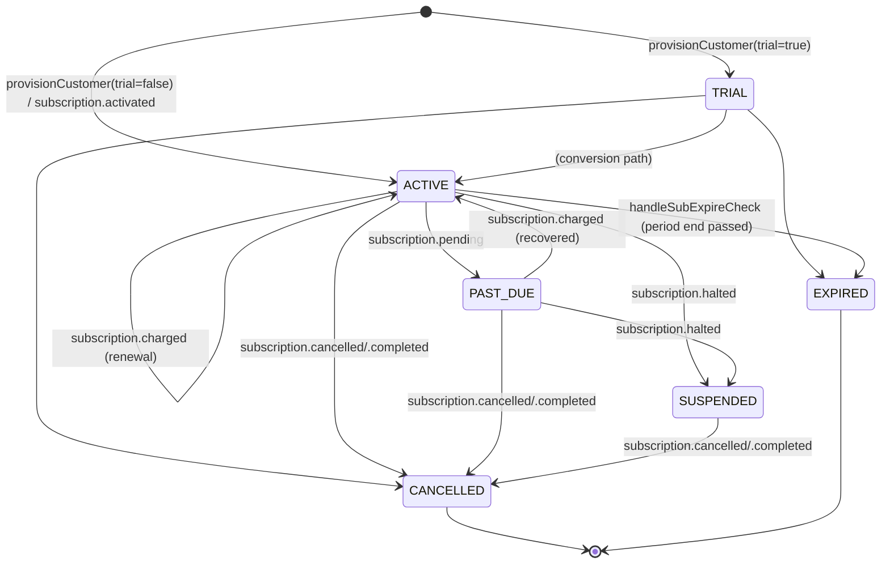

# Phase 2 — Subscription Foundation

**Date:** 2026-08-03
**Scope (locked):** Subscription aggregate, subscription repository-equivalent, lifecycle state machine, webhook persistence, idempotency. Subscription domain only — no entitlement logic, no pricing consolidation, no authorization changes, no customer-visible behavior change.
**Builds on:** `docs/BILLING_ENTITLEMENT_ARCHITECTURE_AUDIT.md` (Phase 0) and the Phase 1 revenue-leak fix, both already in `main`.

---

## 1. Architecture changes

Before this phase, subscription lifecycle logic was duplicated across three call sites with no shared validation:

- `provisionCustomer()` (index.js) — creates `sub:{id}` / `sub:email:{email}` records inline.
- `handleSubExpireCheck()` (index.js) — its own inline `REVENUE_CRM_KV.put` calls to expire subscriptions and send reminders.
- `patchInternalSub()` (subscription-engine.js) — a third, *not exported*, near-identical read-modify-write, used only by the Subscriptions webhook handler.

None of the three validated that a status change was legal. `patchInternalSub` and the inline `handleSubExpireCheck` writes also never updated `subscriptions:index`, so that list silently drifted out of sync with the individual records it's supposed to summarize — confirmed by code inspection, not assumption (see §5).

**After this phase:**

- A new `subscription-domain.js` module defines the `Subscription` aggregate and the evidence-based transition graph (`getSubscriptionTransitions()`).
- `patchInternalSub()` is fixed (keeps `subscriptions:index` in sync) and exported, becoming the one place that writes a subscription patch.
- A new `tryTransition()` wraps it with validation against the transition graph, and is now the only way any status-changing write happens (used by both the webhook handler and the cron).
- `handleSubExpireCheck()` now calls these shared functions instead of its own duplicate inline logic.

No new storage layer. No new KV namespace. No new D1 table. `REVENUE_CRM_KV` remains the store, confirmed in Phase 0 as the live system (the D1 `subscriptions` table is unused by any live code path).

## 2. Files changed

| File | Change |
|---|---|
| `workers/revenue-engine/src/subscription-domain.js` | **New.** `Subscription` aggregate, `SubscriptionTransitionError`, evidence-based transition graph (`getSubscriptionTransitions()`). |
| `workers/revenue-engine/src/subscription-engine.js` | `patchInternalSub()` fixed (index sync) and exported; `getProviderLink`/`putProviderLink`/`alreadyProcessed`/`markProcessed` exported (were private, duplicated in spirit elsewhere); new `tryTransition()`; the 4 status-changing webhook cases (`charged`, `pending`, `halted`, `cancelled`/`completed`) now call it instead of patching blindly; webhook idempotency marker now also stores the raw payload. |
| `workers/revenue-engine/src/index.js` | Import line extended (`patchInternalSub`, `tryTransition`); `handleSubExpireCheck()`'s two inline `REVENUE_CRM_KV.put` sites replaced with calls to the shared functions. |

## 3. Subscription dependency graph

```
provisionCustomer()  ──creates──▶  sub:{id} / sub:email:{email} / subscriptions:index
        │
        ▼
handleBillingSubscriptionCreate()  (checkout entry point, /api/v2/billing/subscriptions/create)
        │
        ▼
Razorpay Subscriptions API  ──webhooks──▶  handleBillingWebhook()
                                                  │
                                     ┌────────────┼─────────────────────┐
                                     ▼            ▼                     ▼
                          subscription.activated  .charged/.pending/.halted/.cancelled/.completed
                                     │                       │
                              provisionCustomer()      tryTransition()  ──▶  patchInternalSub()
                                                                                    │
                                                                     ┌──────────────┼───────────────┐
                                                                     ▼              ▼                ▼
                                                              sub:{id}     sub:email:{email}   subscriptions:index
                                                                                    │
                                                                                    ▼
                                                                      patchApiKeyEntitlement()  ──▶  API_KEYS_KV
                                                                                                       (read by intel-gateway's resolveAuth())

handleSubExpireCheck()  (daily cron, 9am UTC)
        │  reads subscriptions:index + sub:{id}
        ▼
tryTransition() / patchInternalSub()  (same shared path as the webhook)
```

Every write to a subscription record now goes through the same two functions (`tryTransition` for status changes, `patchInternalSub` for everything else), regardless of whether the trigger was a webhook or the cron.

## 4. State machine

Evidence-based — every transition below is one actually performed by existing code today (traced by grepping every `SUB_STATUS.*` assignment across both files); nothing here was invented from design intent.



**Two of the eight declared `SUB_STATUS` values are dead code** — `EXPIRING` and `RENEWED` are never assigned anywhere in either revenue-engine source file (confirmed by exhaustive grep, zero matches for `SUB_STATUS.EXPIRING` / `SUB_STATUS.RENEWED` as an assignment). "Expiring soon" is a computed condition (`days_remaining <= 14 && status === ACTIVE`), not a stored state; a renewal sets status back to `ACTIVE`, not to a distinct `RENEWED` value. Per the Phase 2 lock ("do not invent future states that have no implementation today"), neither appears in the graph above or in `getSubscriptionTransitions()`.

**No code path today reactivates a `SUSPENDED` subscription** — Razorpay's "halted" is effectively terminal short of cancellation in the current implementation. Recovery/resume is explicitly Phase 5 (Subscription Automation) territory, not invented here.

## 5. Storage changes

None. Same KV namespace (`REVENUE_CRM_KV`), same key patterns (`sub:{id}`, `sub:email:{email}`, `subscriptions:index`, `razorpay_sub:{providerId}`, `rzp_sub_event:{idempKey}`). One real behavior change to that storage: **`patchInternalSub` now keeps `subscriptions:index` in sync**, which it never did before. This is a bug fix, not a schema change — `revenueDashboard()`'s tier/status counts (which filter directly off the index) were silently wrong for any subscription that had ever been patched after creation; they'll now be correct.

## 6. Feature flags

**None added for this phase**, and this is a deliberate choice, not an oversight: every change here is either (a) a straight refactor of 3 duplicate call sites into 1 shared implementation, behavior-preserving by construction since the transition graph was built *from* what those call sites already do, or (b) a bug fix (the stale-index sync) with no code anywhere currently depending on the broken behavior. Unlike Phase 1's `SUBSCRIPTION_EXPIRY_ENABLED` (a genuine behavior change gated for safety), there's no new behavior here to gate — the state machine can only *reject* a transition that was never being validated before, and by construction it doesn't reject any transition the real call sites currently perform.

## 7. Migration strategy

None needed. No data shape changes. Existing `sub:{id}` records are read and written in the exact same shape.

## 8. Rollback strategy

- `git revert` — every change is localized to 3 files, all additive/refactor, no destructive edits.
- If `tryTransition` somehow rejects a real transition that evidence missed: the old `patchInternalSub` (now just the write half, still exported) remains callable directly, and the specific case can be added to `getSubscriptionTransitions()` in `subscription-domain.js` without touching anything else.

## 9. Security review

- No auth logic touched. `resolveAuth()` unmodified (same as Phase 1).
- HMAC signature verification on the webhook is unchanged and unaffected by this refactor.
- Idempotency: unchanged mechanism (`rzp_sub_event:{idempKey}`, claimed before processing), now additionally persists the raw payload for audit/replay — no new attack surface, same KV namespace already bound to this Worker.
- `tryTransition`'s fail-safe design (log + skip on invalid transition, never throw uncaught) means a malformed or out-of-order webhook event can't corrupt subscription state or crash the handler — it can only fail to apply a change, which is always the safer default for billing state.
- Known, explicitly-scoped-out limitation: `tryTransition` protects the `status` field specifically. The surrounding side effects in each webhook case (`patchApiKeyEntitlement`, `putProviderLink` calls) still execute unconditionally after it, matching pre-existing behavior — they are not yet gated on transition validity. Tightening that coupling is Gateway Enforcement / Entitlement Engine territory (Phase 3/4), not Subscription Foundation, and is called out here rather than silently left unmentioned.
- Cloudflare KV has no multi-key transactions; `patchInternalSub`'s three writes (`sub:{id}`, `sub:email:{email}`, index) are sequential, not atomic. A crash mid-sequence could leave the index momentarily inconsistent with the individual records — the same class of limitation `provisionCustomer` already documents for its own ~10-write sequence (SEC-2026-07-18 comment). Not solvable within Workers KV; noted as an accepted limitation, not silently ignored.

## 10. Performance impact

Negligible. `patchInternalSub`'s new index-sync step is one additional KV read + conditional write, inside a function already doing 2 KV writes — same order of magnitude, not a new round of network calls. `tryTransition` adds one KV read (to build the `Subscription` instance) before the write that was already happening — for cases where a `link` object is already available (all 4 webhook cases), this is a genuinely new read; for `handleSubExpireCheck`, the record was already being read on the same loop iteration, no new read there.

## 11. Test evidence

- [x] Reproduced and confirmed a real circular-import hazard before it shipped: `subscription-domain.js`'s transition graph originally computed object keys from `SUB_STATUS.*` at module top level; given the `index.js` ↔ `subscription-engine.js` ↔ `subscription-domain.js` import cycle, this would have thrown `ReferenceError: Cannot access 'SUB_STATUS' before initialization` at Worker startup. Reproduced in an isolated 3-module repro, confirmed the fix (lazy construction inside a function) resolves it, then verified the **real files** load cleanly end-to-end via `node --input-type=module -e "await import('./index.js')"` — full export list confirmed present, zero errors.
- [x] `node --check` on all 3 touched/new files.
- [x] `python3 scripts/regression_tests.py` — 21/21 PASS.
- [x] No conflict markers.
- [x] Manual trace of all 4 webhook cases + the cron's 2 write sites confirming each now routes through `tryTransition`/`patchInternalSub` with matching arguments to what was previously inlined.
- [ ] **Not done, flagged rather than hidden**: no live Razorpay Subscription webhook has been fired against this code (would require a real Subscription object and Razorpay test/live webhook delivery). The transition graph and idempotency logic are verified by code inspection and the module-load test, not by an actual webhook round-trip.

## 12. Production validation checklist

- [x] Regression suite green
- [x] Full module graph loads without error (circular-import hazard specifically re-verified against the real files, not just the isolated repro)
- [x] No behavior change for any transition currently performed by production code (transition graph derived from those exact call sites)
- [x] `subscriptions:index` staleness bug fixed as a byproduct of consolidation, not a separate risky change
- [ ] Owner/team: consider watching `subscription_invalid_transition` events (now tracked via `trackEvent`) for the first few real subscription webhooks once Phase 5 wires real checkout to this path, as a sanity check that the graph holds under real traffic

## 13. Deferred work (explicitly out of scope for this phase)

- Entitlement Engine, Authorization Shadow Mode, Gateway Enforcement — Phases 3/4 per the roadmap.
- Pricing consolidation (the 4-way pricing conflict from Phase 0 remains unresolved, needs a business decision).
- Customer / Trial / Usage / Payment repositories, feature policy engine, partner provisioning, multi-domain repository pattern, cross-platform service layer — all explicitly out of scope per the Phase 2 lock.
- Tightening `patchApiKeyEntitlement`/`putProviderLink` to also respect transition validity (currently unconditional side effects alongside the now-validated status write) — noted in §9, deferred to Phase 3/4.
- SUSPENDED → ACTIVE recovery (no code path implements this today; would need real evidence/design before adding, not invented here).
